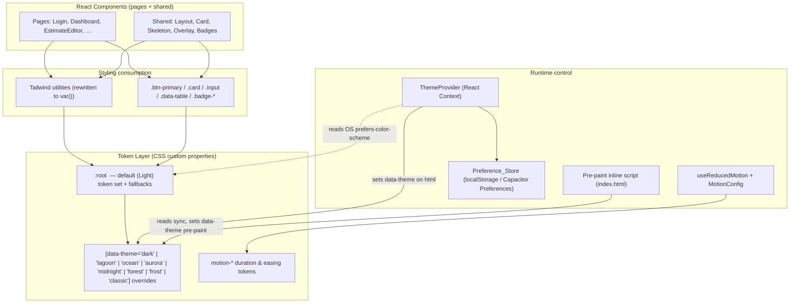
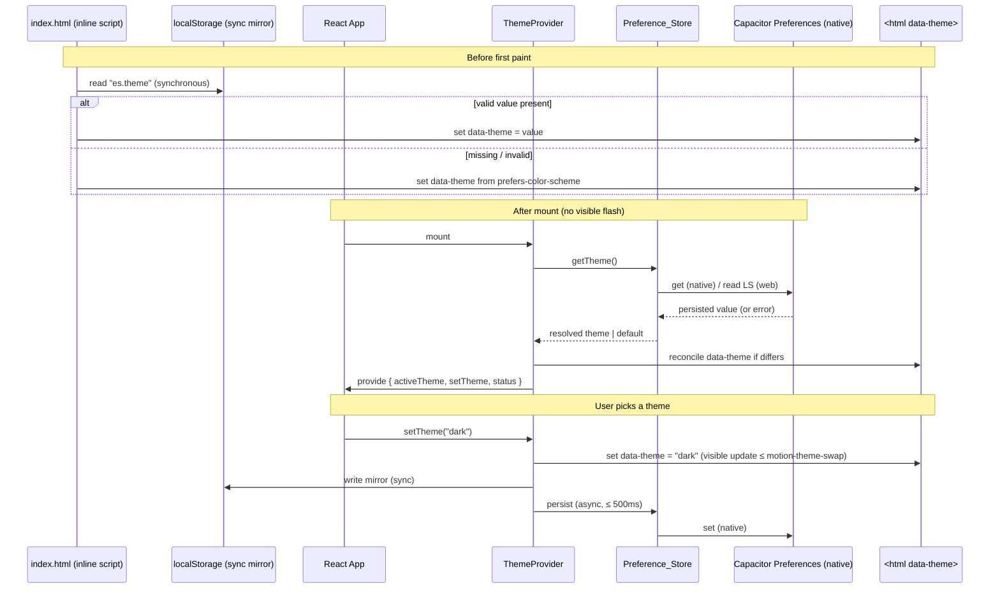

# Design Document

## Overview

This design specifies the implementation of the Estimation Studio (ES) UI/UX revamp: a visual and interaction-layer effort that introduces a centralized design-token foundation, a user-selectable theme system (Light, Dark, and accent themes), modern motion and micro-interactions, livelier cards, polished loading states, and smooth scrolling — **without changing a single route, data flow, form behavior, or stored result.**

The architecture rests on three cooperating subsystems layered on top of the existing React 18 + Vite 5 + Tailwind 3 app:

1. **Token Layer** — a CSS custom-property layer (`:root` + `[data-theme="…"]` scoping) that exposes every color, spacing, radius, shadow, and typography value as a `Design_Token`. Tailwind and the `index.css` component classes are rewritten to consume these variables instead of literals.
2. **Theme System** — a React context (`ThemeProvider`) that selects an `Active_Theme`, applies it by toggling a single `data-theme` attribute on `<html>`, and persists it through a `Preference_Store` abstraction (localStorage on web, Capacitor Preferences on native). A pre-paint inline script prevents theme flash.
3. **Motion System** — a token-driven motion layer built on CSS transitions + the Web Animations API (WAAPI), governed globally by a `useReducedMotion` hook and a `prefers-reduced-motion` media query that zeroes motion-duration tokens. A reusable overlay/focus-trap primitive provides accessible modal/sheet/drawer behavior.

The guiding constraint throughout: **the revamp is additive and substitutive at the presentation layer only.** Component logic, props, routing, validation, and persistence of business data are untouched. Where a hardcoded color is replaced by a token, the resolved value is byte-identical to the original (Requirement 1.4) unless contrast rules force an accessible substitution (Requirement 5.6).

### Design Goals

- **Single source of truth for visual values** — every themeable value resolves to exactly one token (R1).
- **Zero functional regression** — routes, forms, calculations, and data displays are preserved verbatim (R12, and the per-page preservation criteria in R13–R25).
- **Accessibility by construction** — every theme meets WCAG AA contrast; overlays are keyboard-operable with focus trapping and return-focus (R5, R25.8–11).
- **Motion that respects the user** — all animation is token-timed, compositor-friendly, and fully suppressible via reduced-motion (R6, R7, R8).
- **No flash, no layout shift** — theme is resolved before first paint; skeleton→content transitions keep CLS ≤ 0.1 (R4.2, R10.4).
- **Density preserved** — the existing `html { font-size: 90% }` density is retained (R1.7).

### Requirements Coverage Map (high level)

| Subsystem | Primary Requirements |
|-----------|----------------------|
| Token Layer | R1, R9.1, and the "themeable Design_Token" clause of every page requirement |
| Theme System | R2, R3, R4, R5, R23.4 |
| Motion System | R6, R7, R8, R10.2–3, R24.2–3, R25.3–5 |
| Overlay / Focus primitive | R25.8–11, R24.2 |
| Migration & preservation | R11, R12, R13–R25 preservation clauses |

## Architecture

### Layering

The revamp introduces a strict dependency direction: components depend on Tailwind utilities and `index.css` component classes; those depend on the Token Layer; the Token Layer is switched by the Theme System; motion is applied by the Motion System which reads motion tokens from the same layer.



The key architectural decision is that **theme application is a single DOM mutation**: setting `document.documentElement.dataset.theme`. Because every themeable value is a CSS variable resolved at paint time, changing that one attribute re-resolves all variables for every element on every route simultaneously — including offscreen routes — with no component re-render required (satisfying R2.3, R2.4, R3.4, and the per-page "without a full page reload" clauses). React re-renders are needed only for components that branch on `activeTheme` in JS (e.g., the switcher's selected indicator), not for styling.

### Theme application data flow



### Overlay focus lifecycle

```mermaid
stateDiagram-v2
    [*] --> Closed
    Closed --> Opening: trigger (existing open behavior)
    Opening --> Open: enter animation (motion-overlay) completes
    note right of Opening
        capture previously focused element
        move focus into overlay
        activate focus trap (Tab / Shift+Tab confined)
    end note
    Open --> Closing: Escape key OR existing close trigger
    Closing --> Closed: exit animation (motion-overlay) completes
    note right of Closing
        deactivate focus trap
        return focus to captured element
    end note
    Open --> Open: Tab wraps within overlay; all controls keyboard-operable
```

### Technology decisions

**Animation approach: CSS transitions + Web Animations API (WAAPI), not Framer Motion.**

| Criterion | Framer Motion | CSS + WAAPI + `useReducedMotion` (chosen) |
|-----------|---------------|-------------------------------------------|
| Bundle size | ~40–50 KB gzipped added to a Capacitor mobile bundle | ~0 KB runtime; a small (~2–3 KB) internal helper module |
| Capacitor / mobile perf | Adds JS-driven layout work; fine but heavier on low-end devices | Compositor-driven (transform/opacity) by default; minimal main-thread cost |
| React 18 compatibility | Compatible | Native; no library coupling |
| Route transitions | `AnimatePresence` is convenient | A thin `<RouteTransition>` wrapper keyed on `location.pathname` using CSS enter/exit classes covers `motion-page` |
| Reduced motion | Has `useReducedMotion`, but motion still imported | Single media-query token override zeroes everything globally; nothing to import |
| Token alignment | Durations passed per-component in JS | Durations live in CSS vars consumed by both CSS and WAAPI — one source |

Justification: the revamp's motion needs (entrance fades/slides, hover elevation, staggered grids, overlay slide/scale, page cross-fades) are all expressible with `transform`/`opacity` transitions and short WAAPI sequences. Framer Motion's strengths (layout animation, gesture physics, shared-element transitions) are not required. Avoiding it keeps the Capacitor bundle lean and guarantees compositor-only animation (R8.2) by construction. A small set of internal helpers provides the ergonomics:

- `useReducedMotion()` — subscribes to `matchMedia('(prefers-reduced-motion: reduce)')` and to a runtime override, returning a boolean (R7.1, R7.2).
- `useEntrance(ref, options)` — applies an entrance class/WAAPI animation on mount, no-op under reduced motion (R6.1, R9.2).
- `useStagger(count)` — yields per-item `--stagger-index` custom properties for staggered grids (R15.3, R19.4).
- `<RouteTransition>` — wraps `<Outlet/>` content and cross-fades on path change within `motion-page` (R6.3).
- `<Overlay>` — portal + scrim + focus-trap + WAAPI enter/exit for modals, BottomSheet, and the drawer (R25, R24.2).

**Theme scoping: `data-theme` attribute on `<html>`.** Chosen over class toggling because a single attribute is trivially read/written by the inline pre-paint script and reads cleanly in CSS selectors (`[data-theme="dark"]`). The default (Light) token set lives in `:root` so that an absent/unknown attribute still yields a fully resolved theme (supports R3.7, R4.5 fallback).

**Persistence: `Preference_Store` abstraction.** A single async interface with two implementations selected at runtime via Capacitor platform detection. Web uses `localStorage`; native uses `@capacitor/preferences` (already a dependency). Both also write a synchronous `localStorage` mirror so the pre-paint inline script has a value to read even on native (Capacitor WebViews expose `localStorage`). This resolves the "Capacitor Preferences is async → cannot read pre-paint" problem (R4.2, R4.7).

## Components and Interfaces

### Token Layer (`index.css`)

Tokens are declared as space-separated RGB channel triplets so Tailwind can apply opacity via `<alpha-value>`. Non-color tokens (spacing, radius, shadow, motion) are declared as ready-to-use values.

```css
@layer base {
  :root {
    /* ---- color: surfaces ---- */
    --color-surface-base: 244 245 247;     /* slate  #F4F5F7 */
    --color-surface-raised: 255 255 255;   /* white  #FFFFFF */
    --color-surface-sunken: 244 245 247;   /* table header tint base */
    --color-surface-overlay: 255 255 255;  /* modal / sheet body */
    --color-scrim: 0 0 0;                  /* used at low alpha */
    /* ---- color: text ---- */
    --color-text-primary: 26 29 35;        /* ink   #1A1D23 */
    --color-text-secondary: 138 142 151;   /* mist  #8A8E97 */
    --color-text-inverse: 255 255 255;
    --color-text-on-accent: 255 255 255;
    /* ---- color: brand + accent ---- */
    --color-brand: 15 31 61;               /* navy  #0F1F3D */
    --color-accent: 200 150 42;            /* gold  #C8962A (decorative) */
    --color-accent-text: 122 88 0;         /* gold-accessible #7A5800 (text) */
    --color-focus-ring: 200 150 42;        /* defaults to accent */
    /* ---- color: borders ---- */
    --color-border: 226 228 232;           /* #E2E4E8 */
    --color-border-strong: 200 203 209;
    /* ---- color: state ---- */
    --color-success: 26 127 90;            /* #1A7F5A */
    --color-warning: 184 130 10;           /* #B8820A */
    --color-danger: 192 57 43;             /* #C0392B */
    /* ---- color: badge surfaces (per status) ---- */
    --color-badge-draft-bg: 254 249 195;   --color-badge-draft-fg: 133 77 14;
    --color-badge-quote-bg: 244 245 247;   --color-badge-quote-fg: 15 31 61;
    --color-badge-sent-bg: 219 234 254;    --color-badge-sent-fg: 30 64 175;
    --color-badge-won-bg: 220 252 231;     --color-badge-won-fg: 22 101 52;
    --color-badge-lost-bg: 254 226 226;    --color-badge-lost-fg: 153 27 27;

    /* ---- spacing scale (rem; scales with 90% root) ---- */
    --space-1: 0.25rem; --space-2: 0.5rem; --space-3: 0.75rem;
    --space-4: 1rem;    --space-6: 1.5rem; --space-8: 2rem;
    /* ---- radius scale ---- */
    --radius-sm: 0.375rem; --radius-md: 0.5rem; --radius-lg: 0.75rem;
    --radius-xl: 1rem;     --radius-full: 9999px;
    /* ---- shadow / elevation ---- */
    --elevation-0: none;
    --elevation-1: 0 1px 2px 0 rgb(0 0 0 / 0.05);
    --elevation-2: 0 4px 12px -2px rgb(0 0 0 / 0.10);
    --elevation-3: 0 12px 28px -6px rgb(0 0 0 / 0.18);
    /* ---- typography (exactly three families — R1.3) ---- */
    --font-sans: 'Inter', sans-serif;
    --font-display: 'DM Sans', sans-serif;
    --font-mono: 'JetBrains Mono', monospace;

    /* ---- motion: durations ---- */
    --motion-micro: 160ms;
    --motion-enter: 280ms;
    --motion-stagger-step: 60ms;
    --motion-overlay: 240ms;
    --motion-page: 320ms;
    --motion-theme-swap: 180ms;
    /* ---- motion: easing ---- */
    --ease-micro: cubic-bezier(0.22, 1, 0.36, 1);
    --ease-enter: cubic-bezier(0.16, 1, 0.3, 1);
    --ease-overlay: cubic-bezier(0.32, 0.72, 0, 1);
    --ease-page: cubic-bezier(0.16, 1, 0.3, 1);
  }
}
```

**Fallback strategy (R1.6).** Two complementary mechanisms guarantee no unstyled/transparent output:

1. The `:root` block above is *complete* — it defines every token used anywhere. Since `:root` always matches, a token can never be missing at the root scope; theme scopes only *override* a subset, never remove.
2. Critical structural tokens are additionally referenced with an inline literal fallback in the component classes, e.g. `background-color: rgb(var(--color-surface-raised, 255 255 255))`. If a future theme omits a value and the variable somehow fails to resolve, the literal default renders rather than `transparent`.

A build/test-time **token-completeness check** (see Testing Strategy) asserts every theme scope defines the full key set, catching omissions before runtime.

### Tailwind config rewrite

Colors map to the channel triplets via `rgb(var(--…) / <alpha-value>)`, preserving Tailwind opacity utilities (`bg-surface-base/40`, `text-accent-text`, etc.). The legacy names (`navy`, `gold`, `slate`, `ink`, `mist`, `border`, `success`, `warning`, `danger`, `gold-accessible`) are retained as aliases pointing at the same tokens so existing utility classes keep working during migration.

```js
// tailwind.config.js (excerpt)
const rgb = (v) => `rgb(var(${v}) / <alpha-value>)`;
export default {
  content: ["./index.html", "./src/**/*.{js,ts,jsx,tsx}"],
  theme: {
    extend: {
      colors: {
        // semantic tokens
        'surface-base':   rgb('--color-surface-base'),
        'surface-raised': rgb('--color-surface-raised'),
        'surface-overlay':rgb('--color-surface-overlay'),
        'text-primary':   rgb('--color-text-primary'),
        'text-secondary': rgb('--color-text-secondary'),
        brand:            rgb('--color-brand'),
        accent:           rgb('--color-accent'),
        'accent-text':    rgb('--color-accent-text'),
        border:           rgb('--color-border'),
        success:          rgb('--color-success'),
        warning:          rgb('--color-warning'),
        danger:           rgb('--color-danger'),
        // legacy aliases (kept until migration completes)
        navy:             rgb('--color-brand'),
        gold:             rgb('--color-accent'),
        'gold-accessible':rgb('--color-accent-text'),
        slate:            rgb('--color-surface-base'),
        ink:              rgb('--color-text-primary'),
        mist:             rgb('--color-text-secondary'),
      },
      fontFamily: {
        sans:    'var(--font-sans)',
        display: 'var(--font-display)',
        mono:    'var(--font-mono)',
      },
      borderRadius: { sm:'var(--radius-sm)', md:'var(--radius-md)', lg:'var(--radius-lg)', xl:'var(--radius-xl)' },
      boxShadow: { sm:'var(--elevation-1)', md:'var(--elevation-2)', lg:'var(--elevation-3)' },
      transitionTimingFunction: { micro:'var(--ease-micro)', enter:'var(--ease-enter)', overlay:'var(--ease-overlay)' },
      transitionDuration: { micro:'var(--motion-micro)', overlay:'var(--motion-overlay)', page:'var(--motion-page)' },
    },
  },
  plugins: [],
};
```

`index.css` component classes are migrated to token-backed utilities (example):

```css
.card {
  @apply rounded-xl border p-4 sm:p-6;
  background-color: rgb(var(--color-surface-raised, 255 255 255));
  border-color: rgb(var(--color-border, 226 228 232));
  box-shadow: var(--elevation-1);
  transition: box-shadow var(--motion-micro) var(--ease-micro),
              transform var(--motion-micro) var(--ease-micro);
}
.card[data-interactive="true"]:where(:hover, :focus-visible) {
  box-shadow: var(--elevation-2);
  transform: translateY(-2px);
}
.card:focus-visible { outline: 2px solid rgb(var(--color-focus-ring)); outline-offset: 2px; }
```

### Theme System

```ts
// theme/types.ts
export type ThemeId =
  | 'light'
  | 'dark'
  | 'lagoon'
  | 'ocean'
  | 'aurora'
  | 'midnight'
  | 'forest'
  | 'frost'
  | 'classic';

export interface ThemeMeta {
  id: ThemeId;
  name: string;          // display name for the switcher
  kind: 'light' | 'dark';// drives swatch + default selection
  swatch: string;        // small preview color (CSS color)
}

export type ThemeStatus =
  | { state: 'ok' }
  | { state: 'fallback'; reason: 'read-failed' | 'invalid-value' | 'no-themes' }
  | { state: 'apply-error'; attempted: ThemeId } // selected theme could not apply
  | { state: 'persist-error' };                   // applied but not saved
```

```ts
// theme/ThemeProvider.tsx (interface)
interface ThemeContextValue {
  activeTheme: ThemeId;
  themes: ThemeMeta[];
  status: ThemeStatus;
  setTheme: (id: ThemeId) => Promise<void>;
}
```

`ThemeProvider` responsibilities:

- On mount, read the persisted theme via `Preference_Store`. On read failure → apply default, set `status.fallback` (R4.4). On invalid/unknown value → apply default and overwrite stored value (R4.5).
- Default theme = persisted value if valid, else derived from `prefers-color-scheme` (`dark` → Dark, otherwise Light) (R4.3).
- `setTheme(id)`: validate `id` is a known theme; if not applicable, retain current theme and set `apply-error` (R3.6, R2.5). On success, set `data-theme` on `<html>` (visible update within `motion-theme-swap`, R3.2/3.4), update the `localStorage` mirror synchronously, then persist via `Preference_Store` (≤ 500 ms, R4.1); on persist failure set `persist-error` but keep the theme for the session (R4.6).
- If `themes` is empty, apply the hardcoded default and surface `no-themes` (R3.7).

`status` is surfaced to the UI as a non-blocking toast/inline indication (see Error Handling). The provider wraps the app *inside* `MasterDataProvider` so all routes and the Layout are descendants.

### Theme switchers

- **Quick switcher (Layout chrome, R3.3):** a compact control in the desktop sidebar footer and the mobile header. It needs no navigation; opens a small popover listing every available theme with swatches and a check on the active one, calling `setTheme`. Rendered with `tap-target` sizing (≥ 48×48) on touch (R24.4).
- **Full switcher (Settings, R3.1, R23.4):** a labeled list/radio-group of all themes, each showing name + swatch + selected indicator. Same `setTheme` call; this is the canonical control referenced by R3.

Both controls read `activeTheme` and `themes` from context; selection state is the only piece that requires a React re-render.

### Motion System

- **Global reduced-motion CSS** (in `@layer base`) zeroes durations whenever the user prefers reduced motion *or* a runtime override attribute is set:

```css
@media (prefers-reduced-motion: reduce) {
  :root { --motion-micro:0ms; --motion-enter:0ms; --motion-stagger-step:0ms;
          --motion-overlay:0ms; --motion-page:0ms; --motion-theme-swap:0ms; }
  html { scroll-behavior: auto; }
}
:root[data-reduced-motion="true"] {
  --motion-micro:0ms; --motion-enter:0ms; --motion-stagger-step:0ms;
  --motion-overlay:0ms; --motion-page:0ms; --motion-theme-swap:0ms;
}
html { scroll-behavior: smooth; }   /* R8.1; overridden to auto under reduced motion */
```

The `[data-reduced-motion]` attribute is toggled by a `matchMedia` change listener so a runtime preference change applies within 1 s without reload (R7.2). Because every animation sources its duration from these tokens, zeroing them renders all content directly in its final state (R6.6, R7.3, R9.5, and all per-page reduced-motion clauses) — a single global mechanism inherited everywhere (R7.6).

- **Compositor enforcement (R8.2):** convention + tooling. All continuous/entrance animations animate only `transform` and `opacity`. The `<Overlay>`, `useEntrance`, and `useStagger` helpers expose only transform/opacity. A Stylelint rule (`plugin/no-non-compositor-transition` configured to flag transitions on `width`/`height`/`top`/`left`/`box-shadow` for continuous animations) plus code review enforce it. Shadow changes are limited to discrete hover micro-interactions, not continuous animation.

- **Essential-feedback exception (R7.4):** the Skeleton shimmer and progress indicators are driven by a separate token, `--motion-feedback: 200ms` (capped), and under reduced motion the Skeleton becomes static (R10.3) while progress indicators keep movement ≤ 200 ms.

- **Frame-drop safeguard (R8.4, design-guidance tier):** an optional `requestAnimationFrame` sampler watches for sustained dropped frames during continuous animation; when detected it sets `html[data-perf-degraded="true"]`, which a CSS rule uses to suspend non-essential continuous animation (e.g., pause shimmer) until cleared. This is spot-checked, not CI-gated.

### Overlay / focus-trap primitive

A single `<Overlay>` component backs `TemplateBuilder`, `LaminationFormulaModal`, `BottomSheet`, and the mobile drawer, preserving each one's existing open/close triggers and content (R25.7, R24 behavior). It provides:

- Portal render + scrim using `--color-scrim` at low alpha.
- WAAPI enter/exit on `transform`/`opacity` within `--motion-overlay` (modal: fade+scale; BottomSheet: translateY slide; drawer: translateX slide) (R25.3, R25.4, R24.2).
- **Focus management:** on open, capture `document.activeElement`, move focus to the first focusable element (or the overlay container), and trap Tab/Shift+Tab within (R25.8, R25.11). On close, return focus to the captured element (R25.9).
- **Escape to close** wired to each overlay's existing close handler (R25.10).
- Under reduced motion, enter/exit are instant but focus behavior is unchanged (R25.5).

```ts
interface OverlayProps {
  open: boolean;
  onClose: () => void;          // existing close behavior is passed through
  variant: 'modal' | 'sheet' | 'drawer';
  labelledBy?: string;          // aria-labelledby
  children: React.ReactNode;
}
```

### Preference_Store

```ts
// preferences/PreferenceStore.ts
export interface PreferenceStore {
  get(key: string): Promise<string | null>;
  set(key: string, value: string): Promise<void>;
}
// Web impl: localStorage (wrapped in try/catch → throws surfaced as rejection)
// Native impl: @capacitor/preferences Preferences.get/set
// Both: also mirror to localStorage synchronously for the pre-paint script.
export function createPreferenceStore(): PreferenceStore; // platform-detected
```

### Pre-paint inline script (no-flash, R4.2)

Added to `index.html` `<head>`, before the stylesheet/app, runs synchronously:

```html
<script>
  (function () {
    try {
      var KEY = 'es.theme', VALID = ['light','dark','lagoon','ocean','aurora','midnight','forest','frost','classic'];
      var v = localStorage.getItem(KEY);
      if (VALID.indexOf(v) === -1) {
        v = matchMedia('(prefers-color-scheme: dark)').matches ? 'dark' : 'light';
      }
      document.documentElement.dataset.theme = v;
      if (matchMedia('(prefers-reduced-motion: reduce)').matches) {
        document.documentElement.dataset.reducedMotion = 'true';
      }
    } catch (e) {
      document.documentElement.dataset.theme = 'light';
    }
  })();
</script>
```

This sets the theme attribute before the first contentful paint, so the persisted theme (or OS-derived default) is applied with no flash. On native, the `localStorage` mirror written by `Preference_Store` keeps this read accurate; `ThemeProvider` later reconciles against the async Capacitor value as source of truth.

## Data Models

### Theme registry

```ts
export const THEMES: ThemeMeta[] = [
  // Base
  { id: 'light',    name: 'Light',           kind: 'light', swatch: '#9333EA' },
  { id: 'dark',     name: 'Dark',            kind: 'dark',  swatch: '#B275F0' },
  // In-house colorful (dark blue + green mix)
  { id: 'lagoon',   name: 'Lagoon',          kind: 'dark',  swatch: '#22C55E' },
  // PEBI-derived colorful themes
  { id: 'ocean',    name: 'Ocean Depths',    kind: 'dark',  swatch: '#2DD4BF' },
  { id: 'aurora',   name: 'Aurora',          kind: 'light', swatch: '#8B5CF6' },
  { id: 'midnight', name: 'Midnight Purple', kind: 'dark',  swatch: '#A78BFA' },
  { id: 'forest',   name: 'Forest Green',    kind: 'light', swatch: '#059669' },
  { id: 'frost',    name: 'Frost',           kind: 'light', swatch: '#6366F1' },
  { id: 'classic',  name: 'Classic',         kind: 'light', swatch: '#374151' },
];
export const DEFAULT_LIGHT: ThemeId = 'light';
export const DEFAULT_DARK: ThemeId = 'dark';
```

This satisfies R2.1: at least one base Light (`light`), one base Dark (`dark`), and additional distinct color themes — nine in total (two base + seven colorful). `lagoon` is the in-house "dark blue + green mix" replacing the orange sunset (per user preference against gold/orange). `ocean`, `aurora`, `midnight`, `forest`, `frost`, and `classic` are adapted from the PEBI (`apps/pph`) theme palettes; PEBI's orange `sunset` and luxury-gold `gold` themes are intentionally NOT imported.

### Per-theme token values

Each theme scope (`[data-theme="…"]`) re-declares the color tokens below (channel triplets shown as hex for readability). The nine themes are deliberately distinct personalities. Contrast figures are the target the automated contrast tests gate against (R5); listed ratios are computed against the relevant surface.

**Light** (default — clean editorial, near-black + violet)

| Token | Value | Notes / contrast |
|-------|-------|------------------|
| surface-base | `#FAFAF9` | warm off-white page |
| surface-raised | `#FFFFFF` | cards, sidebar |
| surface-overlay | `#FFFFFF` | modals, sheets |
| text-primary | `#0C0A09` | on raised → ~20:1 (AA ✓) |
| text-secondary | `#78716C` | on raised → ~4.6:1 (AA ✓) |
| brand | `#0C0A09` | rich near-black |
| accent | `#9333EA` | violet-600 decorative |
| accent-text | `#6B21A8` | violet-800 → ~6.5:1 (AA ✓) |
| border | `#E7E5E4` | |
| success / warning / danger | `#15803D` / `#B45309` / `#B91C1C` | |

**Dark** (Linear-esque deep ink + violet)

| Token | Value | Notes / contrast |
|-------|-------|------------------|
| surface-base | `#09090B` | page background |
| surface-raised | `#111114` | cards |
| surface-overlay | `#18181B` | modals, sheets |
| text-primary | `#F4F4F5` | on raised → ~17:1 (AA ✓) |
| text-secondary | `#A7A7AF` | on raised → ~7:1 (AA ✓) |
| brand | `#F4F4F5` | near-white for dark surfaces |
| accent | `#B275F0` | violet for dark |
| accent-text | `#D8B4FE` | on raised → ~8:1 (AA ✓) |
| border | `#27272A` | |
| success / warning / danger | `#34D399` / `#FBBF24` / `#F87171` | lightened for dark surfaces, ≥ 4.5:1 |

**Lagoon** (in-house colorful — dark blue + emerald-green mix, dark base)

| Token | Value | Notes / contrast |
|-------|-------|------------------|
| surface-base | `#0F2540` | deep ocean navy page |
| surface-raised | `#143C5C` | cards |
| surface-overlay | `#1A5078` | modals, sheets |
| text-primary | `#ECFDF5` | on raised → ~13:1 (AA ✓) |
| text-secondary | `#86EFAC` | on raised → ~8:1 (AA ✓) |
| brand | `#86EFAC` | light emerald |
| accent | `#22C55E` | green-500 |
| accent-text | `#86EFAC` | on raised → ~8:1 (AA ✓) |
| focus-ring | `#22C55E` | green-500 → ~4.9:1 vs raised (AA ✓ non-text) |
| border | `#1B4D6E` | navy border |
| success / warning / danger | `#4ADE80` / `#FBBF24` / `#FB7185` | lightened for dark surfaces, ≥ 4.5:1 |

**Ocean Depths** (colorful — teal/cyan on deep teal, dark base; adapted from PEBI "Ocean Depths")

| Token | Value | Notes / contrast |
|-------|-------|------------------|
| surface-base | `#042F2E` | deep teal page |
| surface-raised | `#0C403D` | cards |
| surface-overlay | `#134E4A` | modals, sheets |
| text-primary | `#F0FDFA` | on raised → ~14:1 (AA ✓) |
| text-secondary | `#99F6E4` | on raised → ~9:1 (AA ✓) |
| brand | `#5EEAD4` | light teal |
| accent | `#2DD4BF` | teal-400 |
| accent-text | `#99F6E4` | on raised → ~9:1 (AA ✓) |
| border | `#0F766E` | |
| success / warning / danger | `#4ADE80` / `#FBBF24` / `#FB7185` | lightened for dark surfaces, ≥ 4.5:1 |

**Aurora** (colorful — vibrant violet + pink on lavender white, light base; PEBI "Aurora Gradient")

| Token | Value | Notes / contrast |
|-------|-------|------------------|
| surface-base | `#FAF5FF` | lavender white |
| surface-raised | `#FFFFFF` | |
| text-primary | `#3B0764` | ~17:1 (AA ✓) |
| text-secondary | `#6D28D9` | violet-700 → ~7:1 (AA ✓) |
| brand | `#6D28D9` | |
| accent | `#8B5CF6` | violet-500 |
| accent-text | `#6D28D9` | violet-700 → ~7:1 (AA ✓) |
| focus-ring | `#8B5CF6` | ~4.2:1 vs white (AA ✓ non-text) |
| border | `#D8B4FE` | |

**Midnight Purple** (colorful — deep indigo + violet accents, dark base; PEBI "Midnight Purple")

| Token | Value | Notes / contrast |
|-------|-------|------------------|
| surface-base | `#1E1B4B` | deep indigo |
| surface-raised | `#312E81` | indigo-900 |
| surface-overlay | `#3730A3` | indigo-800 |
| text-primary | `#F5F3FF` | on raised → ~12:1 (AA ✓) |
| text-secondary | `#C4B5FD` | on raised → ~6:1 (AA ✓) |
| brand | `#C4B5FD` | |
| accent | `#A78BFA` | violet-400 |
| accent-text | `#C4B5FD` | on raised → ~6:1 (AA ✓) |
| focus-ring | `#A78BFA` | ~4.2:1 vs raised (AA ✓ non-text) |
| border | `#4C1D95` | |

**Forest Green** (colorful — natural emerald & green, light base; PEBI "Forest Green")

| Token | Value | Notes / contrast |
|-------|-------|------------------|
| surface-base | `#F0FDF4` | mint white |
| surface-raised | `#FFFFFF` | |
| text-primary | `#14532D` | ~15:1 (AA ✓) |
| text-secondary | `#166534` | ~7:1 (AA ✓) |
| brand | `#14532D` | |
| accent | `#059669` | emerald-600 |
| accent-text | `#047857` | emerald-700 → ~5:1 (AA ✓) |
| focus-ring | `#059669` | ~3.7:1 vs white (AA ✓ non-text) |
| border | `#A7F3D0` | |
| success | `#16A34A` | emerald-500 |

**Frost** (colorful — modern indigo glassmorphism, light base; PEBI "Frosted Glass")

| Token | Value | Notes / contrast |
|-------|-------|------------------|
| surface-base | `#F5F7FF` | indigo-tinted white |
| surface-raised | `#FFFFFF` | |
| text-primary | `#1E1B4B` | deep indigo → ~17:1 (AA ✓) |
| text-secondary | `#4338CA` | indigo-700 → ~8:1 (AA ✓) |
| brand | `#4338CA` | |
| accent | `#6366F1` | indigo-500 |
| accent-text | `#4338CA` | indigo-700 → ~8:1 (AA ✓) |
| focus-ring | `#6366F1` | ~4.3:1 vs white (AA ✓ non-text) |
| border | `#E0E7FF` | |

**Classic** (colorful — professional neutral gray, light base; PEBI "Classic Corporate")

| Token | Value | Notes / contrast |
|-------|-------|------------------|
| surface-base | `#F9FAFB` | neutral very light |
| surface-raised | `#FFFFFF` | |
| text-primary | `#111827` | gray-900 → ~19:1 (AA ✓) |
| text-secondary | `#4B5563` | gray-600 → ~7:1 (AA ✓) |
| brand | `#111827` | |
| accent | `#374151` | gray-700 |
| accent-text | `#1F2937` | gray-800 → ~14:1 (AA ✓) |
| focus-ring | `#374151` | gray-700 → ~9:1 vs white (AA ✓ non-text) |
| border | `#D1D5DB` | |
| success / warning / danger | `#15803D` / `#B45309` / `#DC2626` | |

**Accessible-accent rule (R5.5, R5.6):** each theme defines both a decorative `accent` (used for borders, icons, fills, large/non-text UI) and an `accent-text` (and, where the accent reads too light, a darker `focus-ring`) that meets ≥ 4.5:1 for text and ≥ 3:1 for focus indicators. Component classes and utilities use `accent-text` wherever the accent appears as text. Where an accent literal would fall below threshold, the accessible token is substituted (R5.6 takes precedence over R1.4).

### Motion token values

| Token | Duration | Easing | Range (R6 glossary) | Used by |
|-------|----------|--------|---------------------|---------|
| `--motion-micro` | 160 ms | `--ease-micro` | 100–250 ms | hover/focus/press on cards, buttons, inputs, nav |
| `--motion-enter` | 280 ms | `--ease-enter` | 150–400 ms | page/list/card entrance |
| `--motion-stagger-step` | 60 ms | — | 40–120 ms | per-item offset in staggered grids |
| `--motion-overlay` | 240 ms | `--ease-overlay` | 150–400 ms | modal/BottomSheet/drawer enter+exit |
| `--motion-page` | 320 ms | `--ease-page` | 150–500 ms | route transitions |
| `--motion-theme-swap` | 180 ms | `--ease-micro` | ≤ 200 ms | visible re-theme of mounted components |
| `--motion-feedback` | 200 ms (cap) | linear | essential (R7.4) | shimmer/progress under reduced motion |

All values fall inside their specified ranges; all animated components reference these tokens exclusively (R6.4), guaranteeing identical timing for identical tokens.

### Preference keys

| Key | Store | Value | Requirement |
|-----|-------|-------|-------------|
| `es.theme` | Capacitor Preferences (native) + localStorage mirror | one of `ThemeId` | R3.5, R4.1, R4.7 |

## Correctness Properties

*A property is a characteristic or behavior that should hold true across all valid executions of a system — essentially, a formal statement about what the system should do. Properties serve as the bridge between human-readable specifications and machine-verifiable correctness guarantees.*

This revamp is predominantly presentation-layer work; most acceptance criteria are visual, motion-timing, or behavioral-preservation concerns that are verified by example-based DOM tests, structural/lint checks, snapshot/regression tests, or spot-checks (see Testing Strategy). A focused core of **pure logic** — theme resolution, preference persistence, token completeness, contrast computation, reduced-motion token resolution, and overlay focus containment — is genuinely property-amenable. The prework analysis collapsed dozens of testable criteria into the six universally-quantified properties below; each remaining property provides unique validation value with no redundancy.

These properties are written against pure, testable units that the implementation MUST expose:

- `resolveTheme(persisted: string | null | ReadError, prefersDark: boolean, registry: ThemeMeta[]): { theme: ThemeId; status: ThemeStatus; overwrite: boolean }` — the deterministic resolution function shared by the pre-paint inline script logic and `ThemeProvider`.
- `PreferenceStore` (`get`/`set`) — both the web (`localStorage`) and native (`@capacitor/preferences`, mocked) implementations.
- `THEME_TOKENS: Record<ThemeId, Record<TokenKey, string>>` — the resolved per-theme color token map, plus `REQUIRED_TOKEN_KEYS`.
- `contrastRatio(fg: string, bg: string): number` — WCAG relative-luminance contrast (standard formula).
- `resolveMotionDurations(reducedMotion: boolean): Record<MotionToken, number>` — the duration values the CSS token layer resolves to in each mode.
- The `<Overlay>` focus-trap behavior, exercised via Testing Library + a generated key-event sequence.

### Property 1: Theme resolution is total and valid

*For any* persisted preference input — a valid `ThemeId`, an arbitrary string, an empty string, `null`, or a simulated read error — and *for any* `prefers-color-scheme` value, `resolveTheme` returns a `theme` that is always a member of the available theme registry: a valid persisted id resolves to itself; a `null`/missing/malformed/unknown value (or a read error, or an empty registry) resolves to the default theme, where the default is the Dark theme when `prefers-color-scheme` reports `dark` and the Light theme otherwise; and whenever the input was invalid-but-present, the result flags `overwrite = true` so the stored value is corrected.

**Validates: Requirements 2.5, 3.6, 3.7, 4.2, 4.3, 4.4, 4.5, 4.7**

### Property 2: Preference persistence round-trips

*For any* valid `ThemeId` and *for any* `PreferenceStore` implementation (web `localStorage` and the mocked native Capacitor store), writing the value with `set` and then reading it back with `get` yields exactly the value written; and feeding that read-back value into `resolveTheme` resolves to the same `ThemeId`. The same round-trip holds for any persisted Settings value under its key.

**Validates: Requirements 3.5, 4.1, 4.7, 23.7**

### Property 3: Every theme exposes a complete, well-defined token set

*For any* theme in the registry, the resolved token map defines a value for every key in `REQUIRED_TOKEN_KEYS` (surfaces, text, borders, accents, and the success/warning/danger state colors), with no key missing, no key extra, and no value empty or undefined; consequently every named color used by the application resolves to exactly one defined token (or its declared literal fallback), so no element can render unstyled or transparent.

**Validates: Requirements 1.1, 1.6, 2.2, 23.3**

### Property 4: Every theme meets WCAG AA contrast thresholds

*For any* theme in the registry, `contrastRatio(text-primary, surface-raised) ≥ 4.5`, `contrastRatio(text-secondary-as-large-text, surface) ≥ 3.0`, `contrastRatio(accent-text, surface-raised) ≥ 4.5`, and `contrastRatio(border-strong / focus-ring, adjacent surface) ≥ 3.0`. Because this holds for *every* theme, switching to any theme necessarily preserves these thresholds, and the accessible accent-text token always passes the 4.5:1 text bar even where the decorative accent or a preserved legacy literal would not.

**Validates: Requirements 5.1, 5.2, 5.3, 5.4, 5.5, 5.6, 9.4**

### Property 5: Reduced-motion mode zeroes all non-essential motion durations

*For any* motion token in the non-essential set (`motion-micro`, `motion-enter`, `motion-stagger-step`, `motion-overlay`, `motion-page`, `motion-theme-swap`), `resolveMotionDurations(reducedMotion = true)` resolves that token to exactly `0ms`, while in normal mode each resolves to its defined non-zero value within its specified range; and the essential-feedback token (`motion-feedback`) resolves to a value `≤ 200ms` in *both* modes. This single mechanism guarantees that under reduced motion every affected page and component renders directly in its final state.

**Validates: Requirements 6.6, 7.1, 7.3, 7.4, 7.6, 8.3, 9.5, 10.3, 25.5** (and every per-page reduced-motion clause: 13.4, 14.4, 15.5, 16.6, 17.5, 18.5, 20.5, 21.4, 22.5, 24.6)

### Property 6: Open overlays confine keyboard focus

*For any* overlay (`TemplateBuilder`, `LaminationFormulaModal`, `BottomSheet`, drawer) that is open and *for any* finite sequence of `Tab` and `Shift+Tab` key events, the active element after every event remains one of the overlay's focusable descendants — focus never escapes to elements behind the overlay — and every focusable control within the overlay remains reachable and operable by keyboard.

**Validates: Requirements 25.8, 25.11**

## Error Handling

All error handling is **non-blocking and state-preserving**: the app continues to render in a fully resolved theme, and no user data is ever lost to a visual/theme failure. Status is surfaced through a lightweight, theme-aware notification (a transient toast plus, where relevant, an inline indicator in the Settings switcher), never a modal that blocks interaction.

| Failure | Detection | Response | Requirement |
|---------|-----------|----------|-------------|
| Persisted theme read fails | `PreferenceStore.get` rejects | Apply default theme, set `status = fallback(read-failed)`, continue with no blocking error | R4.4 |
| Persisted value missing / malformed / unknown | `resolveTheme` validation | Apply default, set `overwrite = true`, rewrite the stored value to the applied theme | R4.5 |
| Theme cannot be applied (incomplete token set / unknown id) | completeness gate in `setTheme` | Retain previously Active_Theme, leave visible components on previous theme, set `status = apply-error`, show indication | R2.5, R3.6 |
| Persisting selection fails | `PreferenceStore.set` rejects | Retain Active_Theme for the session, set `status = persist-error`, show "selection not saved" indication | R4.6, R23.8 |
| No themes available in registry | empty `themes` | Apply hardcoded default, set `status = no-themes`, indicate no selectable themes | R3.7 |
| Token fails to resolve at render | CSS — literal fallback in component class | Element renders with declared literal fallback (never transparent) | R1.6, R23.3 |
| Animation/asset fails to initialize | WAAPI/hook try-catch | Render content in final visual state, preserve all interactivity | R6.7 |
| Sustained frame drops during continuous animation | `rAF` sampler (design-guidance tier) | Set `html[data-perf-degraded]`, suspend non-essential continuous animation until restored | R8.4 |
| Card metric data fails to load | per-card data state | Render that card in an error state, keep other cards' last-good values, continue rendering successful cards | R15.7 |
| Page content load fails | data/fetch state | Remove Skeleton within 200ms, show error indication | R10.5 |
| Route / form / data load fails post-revamp where baseline succeeded | error boundary / existing handlers | Show error message, preserve user-entered data, leave stored data unchanged | R12.5, R13.8, R14.8, R21.8 |

**Behavioral-preservation guard (R12):** because the revamp is presentation-only, every existing error path (auth failure on Login, validation errors in EstimateEditor, customer-load failure on CustomerDetail) is left intact — the revamp adds theming and motion around these handlers but never replaces their logic, inputs, or outcomes.

## Testing Strategy

The estimation-studio monorepo already standardizes on **Vitest + fast-check** (used in `packages/engine` and `packages/server`). The `packages/web` package currently has no test runner, so this revamp adds **Vitest + @testing-library/react + @testing-library/user-event + jsdom + fast-check** to `packages/web` (matching the sibling packages' versions), with a `test` script (`vitest run`) and a jsdom environment. No bespoke property framework is written — fast-check is the property engine.

### Dual approach

- **Property-based tests** verify the six universal properties above across generated inputs.
- **Example/unit tests** verify specific scenarios, edge cases, and error paths.
- **Structural / lint checks** enforce token usage and compositor-only motion (not input-varying, so not PBT).
- **Regression / integration tests** guard functional and routing preservation against the pre-revamp baseline.
- **Spot-checks** cover fine-grained motion timing and frame-rate (design-guidance tier per the requirements Introduction — not CI-gated).

### Property-based tests (fast-check, ≥ 100 iterations each)

Each property test runs a minimum of 100 iterations and is tagged with a comment referencing its design property in the form:
`// Feature: es-ui-revamp, Property N: <property text>`

| Property | Generators | Oracle |
|----------|-----------|--------|
| 1 — Theme resolution total & valid | arbitrary strings ∪ valid ids ∪ `null` ∪ injected read-error; boolean `prefersDark`; registry incl. empty | result ∈ registry (or hardcoded default when empty); valid id → itself; invalid/null/error → OS-derived default; invalid-present → `overwrite` |
| 2 — Persistence round-trip | valid `ThemeId`; store impl ∈ {web, mocked-native} | `get(set(v)) === v`; `resolveTheme(get()) === v` |
| 3 — Token completeness | each theme in registry | resolved keys === `REQUIRED_TOKEN_KEYS`; all values non-empty |
| 4 — Contrast thresholds | each theme × each (fg,bg) token pairing | `contrastRatio ≥ 4.5` (text/accent-text), `≥ 3.0` (large text, controls, focus ring) |
| 5 — Reduced-motion zeroing | each motion token; `reducedMotion ∈ {true,false}` | reduced → `0ms` for non-essential; normal → in-range; `motion-feedback ≤ 200ms` both modes |
| 6 — Overlay focus containment | each overlay variant; random `Tab`/`Shift+Tab` sequences via user-event | `document.activeElement` ∈ overlay focusables after every event |

### Example / unit tests

- **Theme system:** registry shape (R2.1 — exactly one light, one dark, ≥2 accent); Light tokens equal legacy palette hexes (R1.4) with the documented R5 substitutions as the only deviations; `prefers-color-scheme` default derivation examples (R4.3); persist-failure → `persist-error` retained session (R4.6); apply-error retains previous theme (R2.5/R3.6).
- **Pre-paint script logic:** the shared resolver returns persisted/default correctly so the inline script sets `data-theme` before first paint (R4.2); base `html` font-size remains `90%` (R1.7).
- **Switchers:** Settings lists every theme with an active indicator (R3.1); quick switcher changes theme from a non-Settings route without navigation (R3.3); selecting updates `data-theme` and context (R3.2).
- **Reduced motion:** `matchMedia` change toggles `data-reduced-motion` within the listener (R7.2); controls remain operable in final state (R7.5); scroll-behavior is `auto` under reduced motion (R8.3); skeleton becomes static (R10.3).
- **Overlays:** focus returns to the previously focused control on close (R25.9); Escape closes each overlay preserving its existing close handler (R25.10); EstimateEditor keeps the mobile bottom nav hidden (R17.3); active nav indicator persists on the active destination (R24.3).
- **Skeleton/loading:** shimmer cycle within 1000–2000ms when not reduced (R10.2); load-failure removes skeleton + shows error (R10.5); card metric-load failure isolates to that card (R15.7).
- **Touch:** tap targets resolve to ≥ 48×48 on touch platforms (R11.2, R11.5, R24.4).

### Structural / lint checks

- **Token usage:** a CSS/source scan asserts `.btn-primary`, `.btn-secondary`, `.card`, `.input`, `.input-compact`, `.data-table` (+`th`/`td`), `.cell-input`, `.badge`, and every `.badge-*` resolve color/spacing/radius/shadow/typography through `var(--…)` with no raw hex/literal values (R1.2, R9.1, R19.x, R25.1/25.6, and per-page "no hard-coded" clauses).
- **Compositor-only motion:** a Stylelint rule flags transitions/animations on non-compositor properties (`width`, `height`, `top`, `left`, `box-shadow` for continuous animation), enforcing transform/opacity-only continuous animation (R8.2); a scan flags literal `ms` durations outside the motion-token block (R6.4).
- **Three font families:** exactly the Inter/DM Sans/JetBrains Mono tokens are exposed (R1.3).

### Regression / integration tests (functional preservation — R12)

These guard that the presentation-only revamp changes nothing behavioral, comparing against the pre-revamp baseline:

- **Routing:** every route in `App.tsx` (`/login`, `/register`, `/dashboard`, `/estimate/choose`, `/templates`, `/estimate/new`, `/estimate/:id`, `/estimates`, `/customers`, `/customers/:id`, `/library`, `/settings`, plus the `Navigate` redirects) resolves to the same destination and primary content; no previously-resolving path returns not-found (R12.1, R24.5).
- **Forms & data:** identical inputs to Login/Register/EstimateEditor produce identical submissions, stored results, and displayed outputs; data displays (Dashboard metrics, EstimatesList, CustomersList, CustomerDetail, Library) show identical values, fields, and ordering (R12.2, R12.3, and per-page preservation clauses R13.7, R14.7, R15.6, R16.7, R17.6, R18.6, R19.8, R20.6, R21.7, R22.6).
- **Calculation parity:** EstimateEditor calculation outputs and validation rules are unchanged for identical inputs (R17.6) — leveraging the existing `@es/engine` and `lib/estimateCalc.ts` tests as the authority.
- **Responsive preservation:** desktop sidebar shown ≥ 1024px; drawer + bottom nav shown < 1024px; breakpoint change preserves input values and scroll position (R11.1, R11.4, R24.5); CLS ≤ 0.1 on skeleton→content (R10.4).

### Spot-check tier (design guidance, not CI-gated)

Per the requirements Introduction, fine-grained motion timings and frame-rate are verified by manual/automated spot-check rather than gated in CI: micro-interaction start latency (< 100ms), entrance/page/overlay durations within their ranges, 60fps during scroll/animation (R6.2, R6.3, R6.5, R8.2 fps, R8.4), and theme-swap visible-update budget (R3.4, R2.4).

### Out of scope

A full WCAG AA audit across all success criteria is out of scope; accessibility testing is limited to (a) color-contrast across all themes (Property 4) and (b) keyboard operability and focus management for the new/animated overlays (Property 6 + overlay example tests), per the requirements Introduction.
