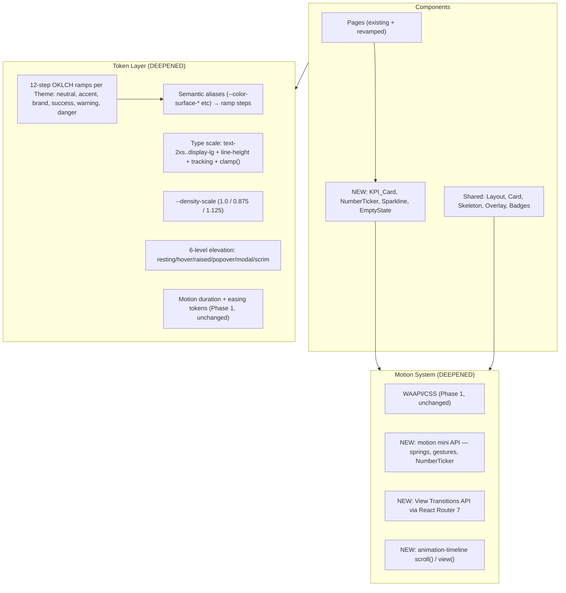

# Phase 1.5: Premium Tier Addendum

> This document extends `requirements.md`, `design.md`, and `tasks.md` for the
> `es-ui-revamp` spec. It is a **drop-in addendum**: it adds new requirements
> (numbered R26 onward), new design sections, new tasks (numbered 21 onward),
> and extends the existing dependency graph and correctness properties. All
> existing requirement numbers, task IDs, properties, and acceptance criteria
> remain valid and unchanged. The addendum slots in **between original wave 7
> (foundation complete) and wave 8 (page migrations 14–18)**: foundation
> already-done work continues forward, page migrations not-yet-done consume the
> deepened token system, motion stack, and dashboard primitives introduced
> here.

## Overview

Phase 1 delivered a correct, themeable, accessible refactor. Phase 1.5 closes
the gap to a *modern, premium* product without invalidating any of that work.
It adds five capability blocks layered on top of the existing Token Layer,
Theme System, and Motion System:

1. **Block A — Foundation Depth.** 12-step OKLCH color ramps per theme,
   a typographic scale, fluid sizing, Inter Variable with OpenType features,
   a six-step elevation system, and a density mode (`Comfortable` / `Compact` /
   `Spacious`). All existing semantic tokens (`--color-surface-raised`,
   `--color-text-primary`, etc.) become aliases over the new ramps, so every
   already-migrated component keeps rendering identically while gaining access
   to the deeper system.
2. **Block B — Motion Stack.** Adopts the [Motion](https://motion.dev/)
   library's mini API for spring physics, gestures, and orchestration that
   WAAPI cannot express. Replaces the custom `RouteTransition` with the
   browser-native View Transitions API via React Router 7, and adds
   shared-element transitions on list → detail navigations.
3. **Block C — Dashboard KPI Upgrade.** Adds Recharts and a KPI card primitive
   with sparkline, prior-period delta, and animated number ticker. This is the
   single highest-perception-impact change in the app.
4. **Block D — Polish.** A reusable `<EmptyState>` component with consistent
   microcopy voice, scroll-driven entrance animations (CSS
   `animation-timeline: view()`) for below-fold content, and a sticky-header
   shadow-on-scroll that uses zero JavaScript.
5. **Block E — Theme Refresh.** Replaces the too-similar stock Indigo/Emerald
   themes with a richer set of distinct colorful themes — `Lagoon` (in-house
   dark blue + green mix), plus PEBI-derived `Ocean`, `Aurora`, `Midnight`,
   `Forest`, `Frost`, and `Classic`. Preserves Light and Dark. Nine themes
   total (one light base, one dark base, seven colorful); PEBI's orange
   `sunset` and luxury-gold `gold` are explicitly excluded per user
   preference. Switcher UI unchanged.

The guiding constraints from Phase 1 carry forward unchanged:

- Zero functional regression. Routes, forms, calculations, and data displays
  remain byte-identical (R12 still holds).
- WCAG AA contrast across every theme (R5 extended to every new ramp pair).
- Token discipline (R1 extended: every new visual value resolves through a
  ramp step or semantic token).
- Reduced-motion respect (R6/R7 extended to spring, view transitions, and
  scroll-driven animations).
- Capacitor-friendly: all new motion sticks to `transform`/`opacity` on the
  compositor; new dependencies stay under a strict bundle budget (see Design).

### Sequencing relative to existing tasks

| Phase | Original tasks | Addendum tasks |
|-------|---------------|----------------|
| Done | 1–13 (foundation + Login/Register/Dashboard/EstimatesList migrated) | — |
| **Phase 1.5 inserts here** | — | **21 (Block A)** → **22 (Block B)** → **23 (Block C)** → **24 (Block D)** |
| Resume | 14–18 (EstimateEditor, TemplatePicker, StandardTemplates, Customers, MasterData/Settings, Layout chrome + overlays) — now consuming the deeper system | — |
| Final | 19–20 (checkpoint + regression) | — |

This sequence guarantees three things:

- Pages already migrated (Login, Register, Dashboard, EstimatesList, Settings
  switcher) need only a *light retouch* — they pick up the new ramps and type
  scale automatically through the semantic-token alias layer, plus an explicit
  pass to wire in NumberTicker/Sparkline (Dashboard) and EmptyState
  (EstimatesList).
- Pages not yet migrated (EstimateEditor, TemplatePicker, StandardTemplates,
  Customers, Library, Settings surface, Layout chrome, BottomSheet,
  LaminationFormulaModal) get migrated *once*, against the final system.
- No work already done is invalidated.

## Glossary additions

- **Color_Ramp** — a 12-step scale of related colors for a single hue family
  (neutral, accent, or state), defined in OKLCH so perceived lightness is
  uniform across hues. Step semantics follow the Radix Colors convention:
  steps 1–2 backgrounds, 3–5 component backgrounds (normal/hover/active), 6–8
  borders (subtle/normal/hover), 9–10 solid backgrounds (resting/hover), 11–12
  text (low/high contrast).
- **Density_Mode** — one of `Comfortable` (the new default), `Compact`, or
  `Spacious`. Materialized as a single CSS variable `--density-scale` (1.0 /
  0.875 / 1.125) that all spacing and typographic tokens multiply against. The
  `Comfortable` mode reproduces the Phase 1 visual density (the existing
  `html { font-size: 90% }` root) so behavior carries forward unchanged.
- **Type_Scale_Step** — a named typographic size token in the set
  `text-2xs | text-xs | text-sm | text-base | text-md | text-lg | text-xl |
  text-2xl | text-3xl | text-4xl | text-display-sm | text-display-lg`. Each
  step defines a font-size, a paired line-height, a paired tracking value, and
  (for display sizes) a fluid `clamp()` range.
- **View_Transition** — a route or state transition driven by the browser's
  [View Transitions API](https://developer.mozilla.org/en-US/docs/Web/API/View_Transitions_API),
  consumed in React via React Router 7's `unstable_viewTransition` flag on
  `<Link>` and the `useViewTransitionState` hook. Replaces the Phase 1 custom
  `RouteTransition` wrapper.
- **Shared_Element_Transition** — a View_Transition where a named element
  (e.g., an estimate row) is marked with a unique `view-transition-name`
  before and after navigation; the browser animates the element from its old
  position/size to the new one automatically.
- **Motion_Spring** — a physics-based animation produced by `motion`'s spring
  resolver, with stiffness/damping/mass parameters rather than a fixed
  duration. Used for hover lift, drag-release on the BottomSheet, and the
  NumberTicker.
- **KPI_Card** — a Dashboard card composed of a label, an animated numeric
  value (NumberTicker), a delta vs the prior period, and an optional inline
  sparkline. Replaces the Phase 1 "icon + number" stat card.
- **NumberTicker** — a component that animates an integer or decimal value
  from a starting number to a target number using a spring, with the final
  rendered value being the exact target (rounded per `precision`). Static
  under reduced motion (renders the target value immediately).
- **Sparkline** — a small inline chart (line or area) embedded inside a
  KPI_Card or table cell, with no axes/labels/legend, used to communicate
  trend at a glance. Implemented on Recharts.
- **EmptyState** — a reusable component with `title`, `body`, `primary`,
  `secondary`, and optional `illustration` slots, used wherever a list,
  filtered view, or search result would otherwise render nothing.


## Requirements

### Requirement 26: 12-Step Color Ramps per Theme

**User Story:** As a designer/developer, I want a deep color system with
defined steps for every UI role, so that hover states, selected washes,
borders, and subtle backgrounds are systematic rather than ad-hoc.

#### Acceptance Criteria

1. THE Token_Layer SHALL expose, for every available Theme, three Color_Ramps
   — `neutral`, `accent`, and a third `brand` ramp where the brand color
   differs from the accent — each containing exactly 12 steps named
   `--<family>-1` through `--<family>-12`, declared in OKLCH and resolved to
   the application as RGB channel triplets for Tailwind `<alpha-value>`
   compatibility.
2. THE Token_Layer SHALL expose, for every available Theme, 12-step ramps for
   each of the state colors `success`, `warning`, and `danger`, named
   `--success-1..12`, `--warning-1..12`, `--danger-1..12`.
3. WHEN a Theme is active, THE Token_Layer SHALL re-declare every ramp step as
   that Theme's OKLCH value, such that the existing semantic tokens
   (`--color-surface-base`, `--color-surface-raised`, `--color-text-primary`,
   `--color-text-secondary`, `--color-border`, `--color-border-strong`,
   `--color-brand`, `--color-accent`, `--color-accent-text`, `--color-focus-ring`,
   `--color-success`, `--color-warning`, `--color-danger`, every
   `--color-badge-*`) resolve to a defined ramp step rather than a literal
   value.
4. THE Token_Layer SHALL maintain backwards-compatible identity for every
   semantic token's resolved RGB value at the Light Theme; that is, on the
   Light Theme the alias mapping SHALL produce values byte-identical to the
   Phase 1 Light Theme tokens for the subset already used, except where
   accessibility substitution (R5.6) forces a deviation.
5. WHERE a component references a Color_Ramp step directly (rather than
   through a semantic token), THE ES_App SHALL resolve that reference through
   the same `var(--…)` mechanism, with the same literal fallback strategy
   defined in R1.6.
6. THE Token_Layer SHALL define the Color_Ramp step semantics consistently
   across all themes such that, for any ramp `R`, `R-1` and `R-2` are
   appropriate for app and subtle backgrounds, `R-3` through `R-5` for
   component backgrounds in normal/hover/active states, `R-6` through `R-8`
   for borders in subtle/normal/hover states, `R-9` and `R-10` for solid
   backgrounds in resting/hover states, and `R-11` and `R-12` for low and
   high contrast text.

### Requirement 27: Typography Scale and Variable Font

**User Story:** As a user, I want consistent, professional typography across
every screen, with numbers that line up in tables and headings that scale
gracefully on every device.

#### Acceptance Criteria

1. THE Token_Layer SHALL expose a complete Type_Scale comprising at least the
   steps `text-2xs` (10px equivalent), `text-xs` (12px), `text-sm` (13px),
   `text-base` (14px), `text-md` (15px), `text-lg` (16px), `text-xl` (18px),
   `text-2xl` (20px), `text-3xl` (24px), `text-4xl` (30px),
   `text-display-sm` (fluid 32–40px), and `text-display-lg` (fluid 40–64px),
   where each step defines a `font-size`, a paired `line-height`, and a
   paired `letter-spacing` (tracking).
2. THE Token_Layer SHALL define the `text-display-sm` and `text-display-lg`
   sizes using `clamp(<min>, <viewport-preferred>, <max>)` so that they scale
   fluidly with viewport width without media queries.
3. THE ES_App SHALL load `Inter Variable` (rather than the static Inter
   weights), `DM Sans Variable` (or static if a Variable file is unavailable),
   and `JetBrains Mono` (static is acceptable), preserving the three font
   families defined by Phase 1 (R1.3).
4. THE ES_App SHALL apply, on the root `html` element, the OpenType feature
   set `font-feature-settings: "cv11", "ss01", "cv02", "cv03", "cv04"` so
   that Inter renders its improved single-storey `a`, straight-leg `g`, and
   single-storey `l` glyphs, with `"tnum"` applied conditionally as defined
   in criterion 5.
5. WHERE numeric values represent currency amounts, totals, prices, or
   tabular data (in `.cell-num`, in `.data-table td` cells whose column header
   is numeric, in KPI_Card values, and in any element carrying the
   `[data-numeric="true"]` attribute), THE ES_App SHALL render with
   `font-variant-numeric: tabular-nums` so digits occupy uniform widths and
   align vertically across rows.
6. WHEN the Active_Theme changes, THE Type_Scale SHALL remain unchanged; the
   Type_Scale is theme-independent and SHALL resolve identically across all
   themes.
7. THE ES_App SHALL preserve the readable density of Phase 1: at the
   `Comfortable` Density_Mode (the new default), the resolved `text-base`
   computed size SHALL be visually equivalent (within 1 CSS pixel) to the
   Phase 1 default body size at `html { font-size: 90% }`.

### Requirement 28: Density Modes

**User Story:** As a power user, I want to compress the UI when scanning long
tables; as a new user, I want a generous default with room to breathe.

#### Acceptance Criteria

1. THE ES_App SHALL expose exactly three Density_Modes named `Comfortable`,
   `Compact`, and `Spacious`, with `Comfortable` as the default.
2. THE ES_App SHALL materialize the active Density_Mode as a single CSS
   variable `--density-scale` set on the root `html` element (`1.0` for
   `Comfortable`, `0.875` for `Compact`, `1.125` for `Spacious`).
3. THE Token_Layer SHALL multiply every spacing token (`--space-*`) and every
   relative typographic size by `--density-scale` so a single attribute
   change re-renders the entire app at the new density.
4. THE Settings page SHALL present a Density_Mode selector listing the three
   modes with the currently active mode marked.
5. WHEN a user selects a Density_Mode, THE ES_App SHALL apply it to every
   visible component within the `motion-theme-swap` budget without a full
   page reload (mirrors R3.4 for themes).
6. WHEN a Density_Mode is applied, THE Preference_Store SHALL persist the
   selection under the key `es.density` within 500ms (mirrors R4.1 for
   themes); on read failure or invalid persisted value the app SHALL fall
   back to `Comfortable` (mirrors R4.4/R4.5).
7. THE ES_App SHALL preserve all Tap_Target minimum sizes (≥ 48×48 CSS pixels
   on touch platforms, R11.2) under every Density_Mode by clamping
   touch-target hit areas independently of `--density-scale`.
8. THE pre-paint inline script SHALL read the persisted Density_Mode (in
   addition to the persisted Theme) and set `data-density` on `<html>` before
   first paint to prevent layout shift on load (mirrors R4.2 for themes).

### Requirement 29: Theme Refresh and Designed Themes

**User Story:** As a user, I want the theme choices to feel designed and
intentional, not like a developer picked them from a default palette.

#### Acceptance Criteria

1. THE Theme_System SHALL provide nine available Themes, deliberately
   dissimilar (two base + seven colorful):
   - `light` — clean editorial Light Theme (near-black brand + violet accent
     on warm white), decomposed onto 12-step ramps.
   - `dark` — Linear-esque deep-ink Dark Theme (violet accent), each surface
     step a distinct ramp step for visible depth.
   - `lagoon` — in-house colorful theme: emerald-green accent on a deep navy
     base (dark kind). Inspired by the dark-blue + green layer pills in the
     estimation editor cards. Replaces the Phase 1 `indigo` theme (and the
     orange `sunset` interim).
   - `ocean` — colorful PEBI-derived: teal/cyan accent on a deep-teal base
     (dark kind). Replaces the Phase 1 `emerald` theme.
   - `aurora` — colorful PEBI-derived: vibrant violet + pink on lavender
     white (light kind).
   - `midnight` — colorful PEBI-derived: deep indigo with violet accents
     (dark kind).
   - `forest` — colorful PEBI-derived: natural emerald & green (light kind).
   - `frost` — colorful PEBI-derived: indigo glassmorphism (light kind).
   - `classic` — colorful PEBI-derived: professional neutral gray (light kind).

   PEBI's orange `sunset` and luxury-gold `gold` themes are intentionally NOT
   imported (user preference against orange/gold accents).
2. THE Theme_System SHALL define, for every Theme in criterion 1, complete
   12-step ramps for `neutral` and `accent`, plus the semantic surface/text/
   brand/border/state tokens, with no token missing.
3. WHEN a user opens the Theme_Switcher (full or quick), THE ES_App SHALL
   list all nine themes with name + swatch + active indicator, in the order
   defined in criterion 1 (R3.1, R3.3 carry forward).
4. WHEN a previously-persisted Theme value `indigo`, `emerald`, or `sunset`
   is read at load (left over from a prior session), THE Theme_System SHALL
   treat it as an invalid persisted value (R4.5), apply the default Theme
   derived from `prefers-color-scheme`, and overwrite the persisted value.
5. THE Theme_System SHALL ensure that every Theme defined in criterion 1
   passes the WCAG AA contrast thresholds defined in R5 for every applicable
   foreground/background ramp-step pairing used by the application.

### Requirement 30: View Transitions API

**User Story:** As a user, I want page-to-page navigation to feel like a
single continuous surface, with related elements morphing rather than the
whole page swapping out.

#### Acceptance Criteria

1. THE ES_App SHALL implement route transitions using the browser's
   [View Transitions API](https://developer.mozilla.org/docs/Web/API/View_Transitions_API)
   via React Router's `unstable_viewTransition` flag on `<Link>` components
   and the `useViewTransitionState` hook for fine-grained styling.
2. WHEN a user navigates between routes, THE ES_App SHALL apply a default
   View_Transition consisting of a cross-fade between outgoing and incoming
   page content, with a total duration within the `motion-page` budget.
3. WHERE navigating from a list view to a detail view (specifically
   `/estimates` → `/estimate/:id`, `/customers` → `/customers/:id`, and
   `/templates` → `TemplateBuilder`), THE ES_App SHALL apply a
   Shared_Element_Transition that morphs the selected row/card from its list
   position into the detail view's header/title region by assigning a
   matching `view-transition-name` to the source and destination elements.
4. WHILE in Reduced_Motion_Mode (R7), THE ES_App SHALL set
   `::view-transition-group(*) { animation: none; }` so navigations complete
   instantly without intermediate frames; the destination is rendered in its
   final state immediately (mirrors R7.3).
5. WHERE the browser does not support the View Transitions API (detected at
   runtime), THE ES_App SHALL fall back to a JavaScript-driven cross-fade
   equivalent to the Phase 1 `RouteTransition` behavior, with identical
   timing and easing.
6. THE Phase 1 `RouteTransition` component SHALL be removed (or reduced to
   the fallback path defined in criterion 5) once View Transitions are wired
   in; no two route-transition mechanisms run concurrently.

### Requirement 31: Spring Motion and Gesture Support

**User Story:** As a user on a touch device, I want interactions that feel
physical — cards that lift like they have weight, sheets I can flick away,
numbers that settle into place.

#### Acceptance Criteria

1. THE Motion_System SHALL adopt the [Motion](https://motion.dev/) library
   via its mini animate API (`motion` package) for animations that require
   spring physics, gesture handling, or orchestration that WAAPI cannot
   express. The added gzipped bundle cost SHALL not exceed 8 KB.
2. THE Motion_System SHALL expose a `useSpring(target, options)` hook
   producing a Motion_Spring animation suitable for hover lift on interactive
   Cards (replacing the Phase 1 fixed-duration transform on `.card[data-interactive]`),
   parameterized by stiffness, damping, and mass; spring resolution SHALL
   remain on `transform`/`opacity` only.
3. THE BottomSheet (`<Overlay variant="sheet">`) SHALL support a
   gesture-driven dismiss: WHEN the user drags the sheet downward by more
   than 30% of its height OR with a release velocity above a configured
   threshold, THE Overlay SHALL animate the sheet off-screen via spring and
   call its `onClose` handler.
4. WHILE in Reduced_Motion_Mode (R7), THE Motion_System SHALL bypass spring
   animation entirely and render the target state immediately; gesture
   handlers remain active but produce instant state changes rather than
   animated ones (mirrors R7.5).
5. IF the Motion library fails to load or initialize, THEN THE Motion_System
   SHALL fall back to the Phase 1 WAAPI/CSS path for every affected component
   (mirrors R6.7), preserving interactivity in the final state.

### Requirement 32: Dashboard KPI Cards

**User Story:** As a user opening the Dashboard, I want to see at a glance
not just the current value of each metric, but also how it's trending and how
it compares to the prior period.

#### Acceptance Criteria

1. THE Dashboard page SHALL render each metric as a KPI_Card containing: a
   label, an animated numeric value via NumberTicker, a delta vs the prior
   period (expressed as a signed percentage or absolute count) with a
   semantic color cue (`success` ramp for positive deltas on
   higher-is-better metrics, `danger` ramp for negative; inverted for
   lower-is-better metrics), and an inline Sparkline showing the most recent
   period's trend.
2. WHEN a KPI_Card first renders, THE NumberTicker SHALL animate from `0` to
   the target value via Motion_Spring within `motion-enter` + a per-card
   stagger; the rendered text SHALL reach the exact target value at
   completion.
3. WHEN a KPI_Card first renders, THE Sparkline SHALL draw its line/area
   path along its width using a stroke-dashoffset reveal within
   `motion-enter`; static under Reduced_Motion_Mode (renders the full path
   immediately).
4. WHERE the backend cannot supply prior-period or time-series data for a
   given metric, THE KPI_Card SHALL render the value + label only (Phase 1
   compatible) and omit the delta and Sparkline; no broken or empty chart
   surface is shown.
5. THE Dashboard SHALL preserve the four metrics from Phase 1 (`This Month`,
   `Saved quotes`, `Sent Proposals`, `Won Orders`) and their semantics, and
   SHALL preserve the per-card error isolation behavior from R15.7.
6. WHEN the Active_Theme changes, THE Sparkline stroke and fill colors and
   the delta color cues SHALL re-resolve from theme ramps within the
   `motion-theme-swap` budget; KPI_Cards are themeable like every other Card
   (R15.2 carries forward).
7. THE KPI_Card SHALL apply `font-variant-numeric: tabular-nums` to its
   value so consecutive renders during the NumberTicker animation do not
   shift horizontally as digits change (R27.5).

### Requirement 33: Empty State Component

**User Story:** As a user encountering an empty list, search result, or
first-use screen, I want clear guidance on what should be there and how to
create it, not a blank space.

#### Acceptance Criteria

1. THE ES_App SHALL define a reusable `<EmptyState>` component with slots for
   `title` (required), `body` (optional), `primary` action (optional),
   `secondary` action (optional), and `illustration` (optional, defaults to
   none).
2. THE ES_App SHALL render `<EmptyState>` wherever a list, table, search
   result, filter result, or first-use screen would otherwise render nothing,
   specifically: Dashboard (no estimates), EstimatesList (no estimates / no
   filter match), CustomersList (no customers / no search match),
   CustomerDetail (no related estimates), Library / MasterLibrary / MasterData
   (no items), StandardTemplates (no templates), and TemplatePicker (no
   templates).
3. THE `<EmptyState>` component SHALL render with Design_Token values
   matching the Active_Theme, with no hardcoded color, spacing, or radius
   values.
4. WHEN an `<EmptyState>` first renders, THE Motion_System SHALL apply an
   entrance animation to the component within the `motion-enter` duration;
   no-op under Reduced_Motion_Mode (mirrors R6.1 / R6.6).
5. THE ES_App SHALL apply a consistent microcopy voice across every
   `<EmptyState>` usage: titles SHALL be concise statements of state (not
   error messages), bodies SHALL explain what will appear in that space, and
   primary actions SHALL be the single most useful next step.

### Requirement 34: Scroll-Driven Animations and Sticky Chrome

**User Story:** As a user, I want the app to feel responsive to scrolling —
content fades in as I reach it, headers gain a shadow when content scrolls
under them.

#### Acceptance Criteria

1. THE Motion_System SHALL use CSS `animation-timeline: view()` for
   below-the-fold entrance animation on long pages (Dashboard sections past
   the first viewport, EstimatesList rows beyond the initial visible set,
   CustomersList rows beyond the initial visible set, StandardTemplates grid
   items beyond the initial visible set), running the entrance via
   `transform`/`opacity` keyframes with no JavaScript driving each tick.
2. THE Motion_System SHALL use CSS `animation-timeline: scroll()` on the
   primary scroll container to apply a `box-shadow` transition on sticky
   page headers (and the desktop sidebar's top edge if applicable) when the
   scroll offset exceeds 8 CSS pixels, producing a visible separation
   between header and scrolled content.
3. WHILE in Reduced_Motion_Mode (R7), THE Motion_System SHALL disable
   `animation-timeline` based reveals (the affected elements render in
   their final state); sticky-header shadow MAY remain as a discrete
   on/off state but SHALL NOT animate.
4. WHERE the browser does not support CSS scroll-driven animations, THE
   ES_App SHALL fall back to the Phase 1 `useEntrance` IntersectionObserver
   path for reveal animations and to a static (no-shadow) sticky header.

### Requirement 35: Elevation System Expansion

**User Story:** As a designer, I want enough elevation levels to express the
real depth hierarchy of the app — resting surface, hover, raised, popover,
modal, scrim — without inventing shadow values inline.

#### Acceptance Criteria

1. THE Token_Layer SHALL define six elevation levels named `--elevation-0`,
   `--elevation-resting`, `--elevation-hover`, `--elevation-raised`,
   `--elevation-popover`, `--elevation-modal`, where `--elevation-0` is
   `none` and the remaining five form a monotonically increasing depth
   progression in y-offset, blur, and alpha.
2. THE Token_Layer SHALL define each elevation level per Theme so that on
   dark themes the shadow alpha is increased and the y-offset preserved,
   yielding equivalent perceived depth across light and dark surfaces.
3. THE existing `--elevation-1`, `--elevation-2`, `--elevation-3` tokens
   from Phase 1 SHALL remain as aliases (`--elevation-1 = --elevation-resting`,
   `--elevation-2 = --elevation-hover`, `--elevation-3 = --elevation-raised`)
   so every Phase 1 component class continues to resolve correctly.
4. THE `<Overlay variant="modal">` SHALL use `--elevation-modal`; popovers
   (Theme_Switcher quick popover, Density_Mode menu) SHALL use
   `--elevation-popover`; `.card[data-interactive]:hover` SHALL use
   `--elevation-hover`.


## Design

### Architectural deltas

Phase 1.5 introduces no new architectural layers; it deepens the three
existing ones (Token Layer, Theme System, Motion System) and adds two
component primitives (KPI_Card, EmptyState).



The semantic-token alias layer is the key compatibility mechanism: every
`--color-surface-*` / `--color-text-*` / `--color-border-*` / etc. that
existed in Phase 1 continues to exist, but its value is now declared as a
reference to a ramp step rather than a literal channel triplet. This means
every component class in `index.css` and every Tailwind utility from Phase 1
keeps resolving correctly without modification.

### Block A — Foundation Depth

#### A.1 12-step OKLCH ramps

Ramps are declared in OKLCH inside `@layer base` and resolved to RGB channel
triplets for Tailwind `<alpha-value>` compatibility. OKLCH gives perceptually
uniform lightness across hues so swapping themes does not produce uneven
visual weight ([smoothui — tokens][smoothui-tokens]).

[smoothui-tokens]: https://skills.smoothui.dev/docs/tokens

Step semantics (consistent across every ramp and every theme,
following [Radix Colors][radix-scale]):

[radix-scale]: https://www.radix-ui.com/docs/colors/palette-composition/understanding-the-scale

| Step | Lightness (light theme) | Lightness (dark theme) | Role |
|------|------------------------|------------------------|------|
| 1 | 0.99 | 0.13 | App background |
| 2 | 0.975 | 0.16 | Subtle background |
| 3 | 0.955 | 0.19 | Component bg (resting) |
| 4 | 0.93 | 0.22 | Component bg (hover) |
| 5 | 0.90 | 0.25 | Component bg (active / selected) |
| 6 | 0.87 | 0.29 | Subtle border / separator |
| 7 | 0.82 | 0.34 | Border / focus ring |
| 8 | 0.76 | 0.41 | Hover border |
| 9 | 0.58 | 0.58 | Solid bg (button fill) — equal lightness so accent works on both modes |
| 10 | 0.53 | 0.63 | Solid bg hover |
| 11 | 0.43 | 0.74 | Low-contrast text |
| 12 | 0.20 | 0.93 | High-contrast text |

Authoritative ramp values are generated via the [Radix custom-palette
generator][radix-custom] from a single reference color per theme, then
committed verbatim. The exact CSS is produced at implementation time;
the table below specifies the *anchor* (step 9, the solid color) for each
ramp per theme — every other step is interpolated in OKLCH.

[radix-custom]: https://www.radix-ui.com/colors/docs/overview/custom-palettes

| Theme | Neutral anchor (step 9) | Accent anchor | Brand anchor | Notes |
|-------|------------------------|---------------|--------------|-------|
| `light`    | warm stone gray   | violet-600 `#9333EA` | near-black `#0C0A09` | Clean editorial light |
| `dark`     | cool zinc gray    | violet `#B275F0`     | near-white `#F4F4F5` | Linear-esque deep ink |
| `lagoon`   | navy-blue         | green-500 `#22C55E`  | light emerald `#86EFAC` | Dark blue + green mix (in-house) |
| `ocean`    | teal-tinted       | teal-400 `#2DD4BF`   | light teal `#5EEAD4`    | PEBI Ocean Depths |
| `aurora`   | lavender          | violet-500 `#8B5CF6` | violet-700 `#6D28D9`    | PEBI Aurora Gradient |
| `midnight` | indigo            | violet-400 `#A78BFA` | lavender `#C4B5FD`      | PEBI Midnight Purple |
| `forest`   | mint              | emerald-600 `#059669`| forest dark `#14532D`   | PEBI Forest Green |
| `frost`    | indigo-tinted     | indigo-500 `#6366F1` | indigo-700 `#4338CA`    | PEBI Frosted Glass |
| `classic`  | neutral gray      | gray-700 `#374151`   | gray-900 `#111827`      | PEBI Classic Corporate |

Semantic-token aliases (every Phase 1 token gets a reference, no literals):

```css
@layer base {
  :root {
    /* ---- Phase 1 semantic tokens, now aliased onto ramp steps ---- */
    --color-surface-base:    var(--neutral-1);
    --color-surface-raised:  var(--neutral-2);    /* in dark, neutral-3 for elevation tint */
    --color-surface-sunken:  var(--neutral-3);
    --color-surface-overlay: var(--neutral-2);    /* in dark, neutral-4 */
    --color-text-primary:    var(--neutral-12);
    --color-text-secondary:  var(--neutral-11);
    --color-text-inverse:    var(--neutral-1);
    --color-text-on-accent:  var(--neutral-1);
    --color-brand:           var(--brand-9);
    --color-accent:          var(--accent-9);
    --color-accent-text:     var(--accent-11);
    --color-focus-ring:      var(--accent-8);
    --color-border:          var(--neutral-6);
    --color-border-strong:   var(--neutral-7);
    --color-success:         var(--success-9);
    --color-warning:         var(--warning-9);
    --color-danger:          var(--danger-9);
    /* Badge surfaces map onto state-ramp pairs */
    --color-badge-draft-bg:  var(--warning-3);  --color-badge-draft-fg:  var(--warning-11);
    --color-badge-quote-bg:  var(--neutral-3);  --color-badge-quote-fg:  var(--brand-11);
    --color-badge-sent-bg:   var(--accent-3);   --color-badge-sent-fg:   var(--accent-11);
    --color-badge-won-bg:    var(--success-3);  --color-badge-won-fg:    var(--success-11);
    --color-badge-lost-bg:   var(--danger-3);   --color-badge-lost-fg:   var(--danger-11);
  }
}
```

The Light theme alias mapping is calibrated so resolved channel triplets
match Phase 1 byte-for-byte for the existing tokens (R26.4), except where
R5.6 already forced a substitution.

#### A.2 Type scale, fluid sizing, Inter Variable, OpenType features

```css
@layer base {
  :root {
    /* ---- Type scale (multiplied by --density-scale at consume time) ---- */
    --text-2xs:      0.625rem;  --text-2xs-lh:      1rem;
    --text-xs:       0.75rem;   --text-xs-lh:       1.125rem;
    --text-sm:       0.8125rem; --text-sm-lh:       1.25rem;
    --text-base:     0.875rem;  --text-base-lh:     1.375rem;
    --text-md:       0.9375rem; --text-md-lh:       1.5rem;
    --text-lg:       1rem;      --text-lg-lh:       1.625rem;
    --text-xl:       1.125rem;  --text-xl-lh:       1.75rem;
    --text-2xl:      1.25rem;   --text-2xl-lh:      1.875rem;
    --text-3xl:      1.5rem;    --text-3xl-lh:      2rem;
    --text-4xl:      1.875rem;  --text-4xl-lh:      2.375rem;
    --text-display-sm: clamp(2rem, 1.6rem + 1.2vw, 2.5rem);
    --text-display-sm-lh: 1.15;
    --text-display-lg: clamp(2.5rem, 1.8rem + 2.4vw, 4rem);
    --text-display-lg-lh: 1.1;
    /* ---- Tracking ---- */
    --tracking-tight:  -0.015em;
    --tracking-normal:  0;
    --tracking-wide:    0.025em;
  }
  html {
    font-family: var(--font-sans);
    font-feature-settings: "cv11", "ss01", "cv02", "cv03", "cv04";
    font-optical-sizing: auto;
    text-rendering: optimizeLegibility;
    -webkit-font-smoothing: antialiased;
  }
  /* Tabular numerics globally on numeric contexts */
  .data-table td.num,
  .cell-num,
  .kpi-value,
  [data-numeric="true"] {
    font-variant-numeric: tabular-nums;
    font-feature-settings: "cv11", "ss01", "tnum";
  }
}
```

Inter Variable is loaded via the bundled `@fontsource-variable/inter` package
(MIT, self-hosted, no Google Fonts dependency). DM Sans Variable via
`@fontsource-variable/dm-sans`. JetBrains Mono via `@fontsource/jetbrains-mono`.
Self-hosting avoids the FOIT/FOUT flash on Capacitor's WKWebView (which
has limited HTTP/2 push) and keeps the app offline-capable.

#### A.3 Density modes

```css
@layer base {
  :root { --density-scale: 1; }
  [data-density="compact"]   { --density-scale: 0.875; }
  [data-density="spacious"]  { --density-scale: 1.125; }
}
```

Phase 1 spacing tokens are redefined to multiply by `--density-scale`:

```css
@layer base {
  :root {
    --space-1: calc(0.25rem * var(--density-scale));
    --space-2: calc(0.5rem  * var(--density-scale));
    --space-3: calc(0.75rem * var(--density-scale));
    --space-4: calc(1rem    * var(--density-scale));
    --space-6: calc(1.5rem  * var(--density-scale));
    --space-8: calc(2rem    * var(--density-scale));
  }
  /* html font-size now derived from density: the new "Comfortable" default
     equals the Phase 1 90% to preserve visual density (R27.7). */
  html { font-size: calc(90% * var(--density-scale)); }
}
```

Tap targets (`.tap-target`, `.btn-primary` `min-h-[48px]`, the bottom-nav
buttons) are written in fixed `px` rather than `rem`, so density does not
shrink them below the touch minimum (R28.7).

The pre-paint inline script is extended to read `es.density` and set
`data-density` before first paint:

```js
// in index.html, alongside the Phase 1 theme resolver
var DKEY = 'es.density', DVALID = ['comfortable','compact','spacious'];
var d = localStorage.getItem(DKEY);
document.documentElement.dataset.density = DVALID.indexOf(d) > -1 ? d : 'comfortable';
```

#### A.4 Elevation expansion

```css
@layer base {
  :root {
    --elevation-0:        none;
    --elevation-resting:  0 1px 2px 0 rgb(0 0 0 / 0.05);
    --elevation-hover:    0 4px 12px -2px rgb(0 0 0 / 0.10);
    --elevation-raised:   0 12px 28px -6px rgb(0 0 0 / 0.18);
    --elevation-popover:  0 16px 40px -8px rgb(0 0 0 / 0.20);
    --elevation-modal:    0 32px 72px -16px rgb(0 0 0 / 0.28);
    /* Phase 1 aliases preserved */
    --elevation-1: var(--elevation-resting);
    --elevation-2: var(--elevation-hover);
    --elevation-3: var(--elevation-raised);
  }
  [data-theme="dark"], [data-theme="ocean"] {
    --elevation-resting:  0 1px 2px 0 rgb(0 0 0 / 0.32);
    --elevation-hover:    0 4px 12px -2px rgb(0 0 0 / 0.42);
    --elevation-raised:   0 12px 28px -6px rgb(0 0 0 / 0.55);
    --elevation-popover:  0 16px 40px -8px rgb(0 0 0 / 0.60);
    --elevation-modal:    0 32px 72px -16px rgb(0 0 0 / 0.70);
  }
}
```

### Block B — Motion Stack

#### B.1 Motion library adoption

Add the `motion` package via npm. Use its mini animate API for spring
physics and gestures; keep CSS/WAAPI for everything else. Bundle budget
≤ 8 KB gzipped added (R31.1).

```ts
// packages/web/src/motion/spring.ts
import { animate, useMotionValue, useSpring } from 'motion/react';

export interface SpringOptions {
  stiffness?: number;  // default 300
  damping?: number;    // default 30
  mass?: number;       // default 1
}

export function useCardLift(active: boolean, opts: SpringOptions = {}) {
  const y = useSpring(active ? -2 : 0, { stiffness: 400, damping: 30, ...opts });
  const shadow = useSpring(active ? 1 : 0, { stiffness: 400, damping: 30, ...opts });
  return { y, shadow };
}
```

`Card[data-interactive]` is updated to consume `useCardLift` instead of the
Phase 1 fixed-duration CSS transition. Under reduced motion the spring is
short-circuited to set the target value immediately (R31.4).

#### B.2 View Transitions API

```tsx
// packages/web/src/components/AppLink.tsx
import { Link, LinkProps, useViewTransitionState } from 'react-router-dom';

export function AppLink(props: LinkProps & { transitionName?: string }) {
  const { transitionName, to, ...rest } = props;
  const isTransitioning = useViewTransitionState(to.toString());
  return (
    <Link
      {...rest}
      to={to}
      viewTransition
      style={transitionName && isTransitioning
        ? { viewTransitionName: transitionName }
        : undefined
      }
    />
  );
}
```

Shared-element transitions are wired by assigning matching
`view-transition-name` values to the source row in a list and the
destination element in the detail page. Example for EstimatesList →
EstimateEditor:

```tsx
// EstimatesList row
<AppLink to={`/estimate/${e.id}`} transitionName={`est-${e.id}`}>
  ...
</AppLink>

// EstimateEditor header
<h1 style={{ viewTransitionName: `est-${id}` }}>...</h1>
```

CSS controls the default cross-fade and the reduced-motion suppression:

```css
::view-transition-old(root),
::view-transition-new(root) {
  animation-duration: var(--motion-page);
  animation-timing-function: var(--ease-page);
}
@media (prefers-reduced-motion: reduce) {
  ::view-transition-group(*) { animation: none; }
}
:root[data-reduced-motion="true"] ::view-transition-group(*) { animation: none; }
```

A runtime check (`'startViewTransition' in document`) gates the
View_Transition path; on unsupported browsers, the Phase 1 `RouteTransition`
fallback runs (R30.5).

#### B.3 Gesture-driven BottomSheet dismiss

`<Overlay variant="sheet">` adds `motion`'s drag gesture wired to `y`
displacement with spring snap-back when below the threshold and spring
fall-through when above:

```tsx
<motion.div
  drag="y"
  dragConstraints={{ top: 0, bottom: 0 }}
  dragElastic={{ top: 0, bottom: 0.4 }}
  onDragEnd={(_, info) => {
    if (info.offset.y > height * 0.3 || info.velocity.y > 600) onClose();
  }}
  // ...spring transition props
>
  {children}
</motion.div>
```

### Block C — Dashboard KPI Upgrade

#### C.1 Dependencies

- `recharts` (~30 KB gzipped, MIT) — for Sparkline (Line/Area chart with no
  axes/legend) and any future charts.
- `motion` (already added in Block B) — for NumberTicker spring.

#### C.2 Component primitives

```tsx
// packages/web/src/components/NumberTicker.tsx
import { useEffect } from 'react';
import { animate, useMotionValue, useTransform } from 'motion/react';
import { useReducedMotion } from '../hooks/useReducedMotion';

export function NumberTicker({
  value,
  precision = 0,
  format = (n: number) => n.toLocaleString(),
  durationMs = 1200,
}: { value: number; precision?: number; format?: (n: number) => string; durationMs?: number }) {
  const reduced = useReducedMotion();
  const mv = useMotionValue(reduced ? value : 0);
  const display = useTransform(mv, (n) => format(Number(n.toFixed(precision))));
  useEffect(() => {
    if (reduced) { mv.set(value); return; }
    const controls = animate(mv, value, {
      duration: durationMs / 1000,
      ease: [0.16, 1, 0.3, 1],
    });
    return controls.stop;
  }, [value, reduced]);
  return <motion.span style={{ fontVariantNumeric: 'tabular-nums' }}>{display}</motion.span>;
}
```

```tsx
// packages/web/src/components/Sparkline.tsx
// Thin wrapper around Recharts <AreaChart> with no axes/grid/legend,
// stroke colored from --color-accent or --color-success/--color-danger
// based on the delta sign, fill at 12% alpha. Static under reduced motion.
```

```tsx
// packages/web/src/components/KPICard.tsx
interface KPICardProps {
  label: string;
  value: number;
  precision?: number;
  format?: (n: number) => string;
  delta?: { value: number; periodLabel: string; higherIsBetter?: boolean };
  trend?: number[]; // most-recent-period data points for Sparkline
  icon?: LucideIcon;
}
```

#### C.3 API extension

The `/dashboard/summary` endpoint is extended (or a new
`/dashboard/summary-with-trends` is added) to return prior-period values and
a 30-day trend array for each of the four metrics. Where the backend cannot
yet supply trend data, the KPI_Card renders the Phase 1 minimal form (label
+ value), preserving R32.4 / R15.7 isolation.

### Block D — Polish

#### D.1 `<EmptyState>` component

```tsx
// packages/web/src/components/EmptyState.tsx
interface EmptyStateProps {
  title: string;
  body?: string;
  primary?: { label: string; onClick?: () => void; to?: string };
  secondary?: { label: string; onClick?: () => void; to?: string };
  illustration?: React.ReactNode;  // optional SVG; defaults to a Lucide icon
  size?: 'sm' | 'md' | 'lg';
}
```

Microcopy voice rules (R33.5):

- **Title:** state, not error. "No estimates yet" / "No customers match this
  filter" / "Nothing to show here yet".
- **Body:** one line explaining what will appear. "Estimates you create will
  show up here, with their status and selling price."
- **Primary:** the single most useful next action. "Create your first
  estimate".
- **Secondary:** an escape hatch when relevant. "Clear filters" / "View all
  templates".

#### D.2 Scroll-driven entrance and sticky header

```css
@supports (animation-timeline: view()) {
  .reveal-on-scroll {
    animation: reveal linear both;
    animation-timeline: view();
    animation-range: entry 0% cover 30%;
  }
  @keyframes reveal {
    from { opacity: 0; transform: translateY(12px); }
    to   { opacity: 1; transform: translateY(0); }
  }

  .sticky-chrome {
    animation: sticky-shadow linear both;
    animation-timeline: scroll(root);
    animation-range: 0 8px;
  }
  @keyframes sticky-shadow {
    from { box-shadow: var(--elevation-0); }
    to   { box-shadow: var(--elevation-resting); }
  }
}
@media (prefers-reduced-motion: reduce) {
  .reveal-on-scroll { animation: none; opacity: 1; transform: none; }
  .sticky-chrome    { animation: none; box-shadow: var(--elevation-resting); }
}
@supports not (animation-timeline: view()) {
  /* Phase 1 useEntrance path applies; reveal-on-scroll class is a no-op marker */
}
```

## Data Models

### Theme registry update (replaces `theme/registry.ts`)

```ts
export type ThemeId =
  | 'light'
  | 'dark'
  | 'lagoon'
  | 'ocean'
  | 'aurora'
  | 'midnight'
  | 'forest'
  | 'frost'
  | 'classic';

export const THEMES: ThemeMeta[] = [
  { id: 'light',    name: 'Light',           kind: 'light', swatch: '#9333EA' },
  { id: 'dark',     name: 'Dark',            kind: 'dark',  swatch: '#B275F0' },
  { id: 'lagoon',   name: 'Lagoon',          kind: 'dark',  swatch: '#22C55E' },
  { id: 'ocean',    name: 'Ocean Depths',    kind: 'dark',  swatch: '#2DD4BF' },
  { id: 'aurora',   name: 'Aurora',          kind: 'light', swatch: '#8B5CF6' },
  { id: 'midnight', name: 'Midnight Purple', kind: 'dark',  swatch: '#A78BFA' },
  { id: 'forest',   name: 'Forest Green',    kind: 'light', swatch: '#059669' },
  { id: 'frost',    name: 'Frost',           kind: 'light', swatch: '#6366F1' },
  { id: 'classic',  name: 'Classic',         kind: 'light', swatch: '#374151' },
];

export const DEFAULT_LIGHT: ThemeId = 'light';
export const DEFAULT_DARK: ThemeId = 'dark';
export const LEGACY_REMAPPED_IDS = new Set<string>(['indigo', 'emerald']);
```

`resolveTheme` is extended to treat the legacy ids (`indigo`, `emerald`) as
invalid persisted values (R29.4), triggering the same `overwrite = true`
path as any other malformed input.

### Preference keys (extended)

| Key | Value | Requirement |
|-----|-------|-------------|
| `es.theme` | one of `ThemeId` (5 themes) | R3.5, R4.1, R4.7, R29 |
| `es.density` | one of `'comfortable' \| 'compact' \| 'spacious'` | R28.6 |

## Correctness Properties

These extend the Phase 1 properties (P1–P6) with three new ones, and extend
two existing ones to cover the new themes and ramps.

### Property 7: Color ramps are complete and ordered

*For any* theme `T` in the registry, and *for any* ramp family in
`{neutral, accent, brand, success, warning, danger}`, the resolved ramp
defines exactly 12 non-empty values; and for every step `i ∈ [1..11]`, the
OKLCH lightness of `step-i+1` is monotonically further from the perceived
background lightness than that of `step-i` (i.e., on a light theme each step
gets darker; on a dark theme each step gets lighter), so the ramp expresses
a true depth progression.

**Validates: R26.1, R26.2, R26.3, R26.6, R29.2**

### Property 8: Density resolution

*For any* `Density_Mode m ∈ {Comfortable, Compact, Spacious}` and *for any*
spacing token, the resolved spacing value equals the base `rem` value
multiplied by the `--density-scale` for `m` (`1.0 / 0.875 / 1.125`); and the
resolved `text-base` size at `Comfortable` is within 1 CSS pixel of the
Phase 1 default body size (R27.7); and Tap_Target minimum hit-area
constraints are independent of `--density-scale` (R28.7).

**Validates: R28.1, R28.2, R28.3, R28.7, R27.7**

### Property 9: NumberTicker terminates at exact target

*For any* numeric `target`, *for any* `precision ≥ 0`, and *for any*
non-zero `durationMs`, NumberTicker eventually renders the string
`format(round(target, precision))` and remains at that value once
animation completes; under Reduced_Motion_Mode the same final string is
rendered on the first frame.

**Validates: R32.2, R31.4**

### Extensions to existing properties

- **Property 3 (token completeness)** is extended: every theme in the new
  registry SHALL define a complete ramp set (R26.1, R26.2) and the
  semantic-token aliases SHALL each resolve to a defined ramp step (R26.3).
- **Property 4 (WCAG AA contrast)** is extended: the contrast assertions
  SHALL be evaluated against ramp-step pairings (step 11/12 text vs steps
  1–3 backgrounds, step 9 solid vs step 1 background for buttons, step 8
  focus ring vs step 1 background) for *every* theme in the new registry
  (R29.5).

## Error Handling additions

| Failure | Detection | Response | Requirement |
|---------|-----------|----------|-------------|
| Persisted density read fails / invalid value | `PreferenceStore.get` rejects / `resolveDensity` validation | Apply `Comfortable`, set status `fallback(density)`, continue | R28.6 |
| Persisting density fails | `PreferenceStore.set` rejects | Retain density for the session, surface "selection not saved" | R28.6 |
| Motion library load failure | dynamic import rejects | Fall back to Phase 1 WAAPI/CSS path; preserve interactivity | R31.5 |
| View Transitions API unsupported | runtime feature detect | Fall back to Phase 1 `RouteTransition` cross-fade | R30.5 |
| Recharts load failure | dynamic import rejects | KPI_Card renders without Sparkline (label + value + delta only) | R32.4 |
| Trend data unavailable from backend | response shape check | KPI_Card renders the Phase 1 minimal form (label + value) | R32.4, R15.7 |
| Scroll-driven animations unsupported | `@supports` query | `useEntrance` path applies; sticky header stays static | R34.4 |
| Legacy theme id `indigo`/`emerald` read from store | `resolveTheme` registry check | Treat as invalid; apply OS default; overwrite stored value | R29.4 |

## Testing Strategy additions

### Property-based tests (extending Phase 1's six)

| Property | Generators | Oracle |
|----------|-----------|--------|
| 7 — Ramp completeness & monotonic order | each theme × each family | 12 non-empty values; OKLCH lightness monotonic in step order |
| 8 — Density resolution | each mode × each spacing token | resolved = base × scale; tap targets independent |
| 9 — NumberTicker termination | arbitrary `target`, `precision`, `durationMs ≥ 1` | eventually equal to `format(round(target))`; instant under reduced motion |

Property 3 and Property 4 test generators are extended to enumerate the
nine themes and the ramp-step pairings.

### Example / unit tests

- Theme registry: exactly 5 themes (R29.1); legacy ids trigger `overwrite`
  (R29.4); each theme's ramp count equals 6 families × 12 steps (R26.1/2/3).
- Type scale: every step defines size + line-height + tracking (R27.1);
  `clamp()` bounds for display sizes (R27.2); Inter Variable + OpenType
  feature settings applied on root (R27.3, R27.4); tabular-nums applied on
  numeric contexts (R27.5).
- Density: pre-paint script sets `data-density` from `es.density` (R28.8);
  invalid persisted value falls back to `Comfortable` (R28.6);
  `Comfortable` text-base matches Phase 1 within 1 px (R27.7).
- View Transitions: link with `viewTransition` triggers `startViewTransition`
  when supported (R30.1, R30.2); reduced-motion CSS suppresses animation
  (R30.4); feature-detect fallback runs Phase 1 cross-fade (R30.5);
  shared-element name appears on source + destination during transition
  (R30.3).
- Motion spring: `useCardLift` returns Motion_Spring values with target
  reached at rest (R31.2); reduced-motion short-circuits to target (R31.4);
  failed `motion` import falls back to CSS path (R31.5).
- BottomSheet gesture: drag past 30% of height calls `onClose` (R31.3);
  release with velocity above threshold calls `onClose` (R31.3);
  below-threshold drag snaps back via spring.
- KPI_Card: NumberTicker reaches exact target (P9); Sparkline renders all
  trend points; delta color cue follows `higherIsBetter` (R32.1); missing
  trend data omits Sparkline cleanly (R32.4).
- EmptyState: renders title only when no slots; renders primary + secondary
  with correct `<Link>`/`onClick` wiring; entrance animation under normal
  motion / no-op under reduced motion (R33.4).
- Scroll-driven: `@supports` gate behavior; reveal class is no-op marker
  on unsupported browsers (R34.4).

### Structural / lint checks (additions)

- **Ramp-only color usage:** scan asserting `index.css` component classes,
  Tailwind config color mappings, and component source resolve every color
  through `var(--<ramp>-N)` or a semantic-token alias; no direct hex/RGB
  literals outside the ramp declaration block.
- **Type-token usage:** scan asserting font-size usages in component source
  resolve to `var(--text-*)` tokens or Tailwind utilities mapped to them;
  no raw `text-[16px]` / inline pixel sizes outside the token declaration
  block.
- **Tabular-nums coverage:** scan asserting every element rendering a
  currency, total, or price (regex: classes matching `cell-num|kpi-value`,
  components named `Sparkline|KPICard`, or `data-numeric="true"`) carries
  `font-variant-numeric: tabular-nums` either directly or via class.

### Spot-check tier (additions, not CI-gated)

- View_Transition start latency < 100 ms on supported browsers.
- Motion_Spring settle time within `motion-enter` range (150–400 ms).
- Sparkline draw completes within `motion-enter`.

