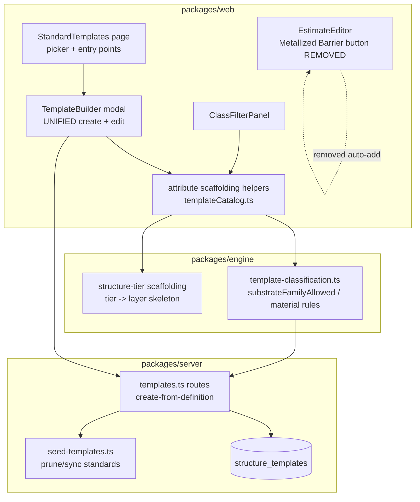
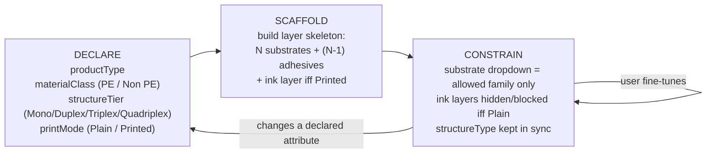

# Design Document: Smart Template Builder

## Overview

Estimation Studio templates carry the basic structure of a laminate quote: name, product type, material class, structure tier (number of substrate layers), and processes. Today the structure tier is **implicit** — it is back-derived from how many substrate layers happen to be present — and there is **no way to create a template from scratch**. The only "create" path (`POST /api/v1/templates`) clones an existing estimate, and the edit modal in `StandardTemplates.tsx` only opens for templates that already exist. Smart classification is also partial: PE-family substrate filtering only applies to Mono structures, and Plain vs Printed is never a declared attribute — it is sniffed from the template name or the presence of an ink layer.

This feature introduces an **attribute-driven template builder** built around a single principle: the user **declares** the defining attributes (product type, material class, structure tier, plain/printed), the system **scaffolds** the matching layer skeleton (substrates + adhesives, optional ink), and then **constrains** every downstream choice (which substrate families appear, whether ink layers are offerable) to stay consistent with those declarations. The user can fine-tune the scaffolded stack afterward.

Critically, the create flow and the edit flow share **one unified component and one rule set**. Whatever attribute-driven scaffolding and material/ink/structure constraints apply when building a new template apply identically when editing an existing one. This design also removes the hard-coded "+ Metallized Barrier" auto-add button from `EstimateEditor.tsx`; metallized/barrier layers become a normal manual layer addition the user makes when their structure tier calls for it.

Two further principles, added during design review, shape the rest of this document:

- **Ownership is tiered.** The platform admin (app owner) authors the **standard catalog**, which is deployed to every tenant and user by default. A tenant or an individual user may then create their **own add-on templates**, which are private to the creator and never visible to anyone else. The data model must express "global standard vs private add-on" cleanly (see Template Ownership & Visibility Model).
- **The scaffold is a smart default, not a fixed order.** A declared tier produces a sensible starting stack, but layer *order* is fully editable. Real structures vary: ink may be **reverse-printed** (under the top film), **surface-printed** (on top, above the first substrate), or sit between layers; a **top coating / matt varnish** may sit above everything (e.g. `Matt Varnish / PET / Ink / Adhesive / PE`). Every layer must be movable up/down — in the template builder and, consistently, in the estimate editor.

## Architecture

The classification rules live in `packages/engine` so the web UI (live scaffolding/filtering as the user edits) and the server (validation and persisted-class resolution on save) apply the **same** logic. The web builder is the interaction layer; the engine is the single source of truth for "what is allowed given these declared attributes."

### The Attribute → Scaffold → Constrain Model

This is the conceptual core of the feature. It applies identically in create and edit.

1. **Declare.** The user selects the defining attributes. These become the authoritative inputs.
2. **Scaffold.** The chosen structure tier generates a layer skeleton:

   | Tier | Substrates | Adhesives (between substrates) | Ink layer (if Printed) |
   |------|-----------|-------------------------------|------------------------|
   | Mono | 1 | 0 | optional 1 |
   | Duplex | 2 | 1 | optional 1 |
   | Triplex | 3 | 2 | optional 1 |
   | Quadriplex | 4 | 3 | optional 1 |

3. **Constrain.** Material class restricts which substrate families are offered in each substrate dropdown; print mode controls whether ink layers are scaffolded and offerable. `structureType` (`Mono`/`Multilayer`) is kept in sync with the declared tier automatically.

When the user changes a declared attribute (e.g. Duplex → Triplex, or Plain → Printed), the scaffold re-derives. Fine-tuning that contradicts a declaration (e.g. removing a substrate so the count no longer matches the tier) reconciles the declared tier to match the layers — declarations and layers must never silently disagree.

#### Scaffold order is a default, not a constraint

The scaffold produces a *conventional* starting order (e.g. reverse-print stack: substrate → ink → adhesive → substrate). It is explicitly **not** a fixed order. The builder provides **move up / move down** (and/or drag) on every layer, and the same reorder capability is mirrored in the estimate editor so a template's order can be further adjusted per job. This supports the real-world variants:

- **Reverse print** — ink printed on the underside of the top film; in the stack the ink layer sits *below* the top substrate.
- **Surface print** — ink on the outer surface; the ink layer sits *above* the first substrate (top of the stack).
- **Top coating / varnish** — a finish (matt/gloss varnish, lacquer) sits at the very top, e.g. `Matt Varnish / PET / Ink / Adhesive / PE`. The varnish is an ink-type layer linked to its existing Ink & Coating raw material — nothing hardcoded.

Because order is free, the scaffold seeds positions but never locks them; the only hard invariants are *counts* (substrate/adhesive per tier) and *family/ink constraints* — not sequence. A varnish/lacquer finish is an **ink-type layer linked to its raw-material row** (it already exists in the Ink & Coating catalog) and, like any ink, can be placed anywhere in the stack — typically the top.

## Components and Interfaces

### Component 1: TemplateBuilder (unified create + edit modal) — web

**Purpose**: One modal component drives both "create a new template from scratch" and "edit an existing template." It replaces the current edit-only `editing` modal embedded in `StandardTemplates.tsx`.

**Responsibilities**:
- Render the declared-attribute controls (product type, material class, structure tier, plain/printed) plus name and processes.
- On attribute change, call the engine scaffolding helpers to regenerate the layer skeleton, preserving user edits where they remain valid.
- Filter every substrate dropdown through the engine material rules for the current attribute context.
- Hide/disable ink layer addition when print mode is Plain.
- Provide **move up / move down** (and/or drag) reorder on every layer, so the scaffold's default order can be rearranged into surface-print, reverse-print, or top-coating stacks.
- Open in two modes: **create** (empty/scaffolded from defaults) and **edit** (seeded from an existing template's attributes and layers), with identical behavior thereafter.
- Submit to the appropriate server endpoint (create-from-definition vs update).

**Interface (conceptual)**:
- Inputs: `mode` (`create` | `edit`), optional `template` (for edit), `materials` library, master-data reference, `isAdmin`.
- Output: a saved template (created or updated), surfaced back to the picker for reload.

### Component 2: Attribute scaffolding helpers — `templateCatalog.ts` (web) + engine

**Purpose**: Translate a declared structure tier into a concrete layer skeleton, and keep the persisted `structureType` and derived catalog classification consistent with declarations.

**Responsibilities**:
- Map `structureTier` → layer skeleton (substrate/adhesive counts per the table above; ink layer iff Printed).
- Reconcile declared tier ↔ actual substrate count after manual edits.
- Continue to expose the catalog classification used by `ClassFilterPanel` and card badges, now reading declared attributes first and only falling back to derivation for legacy rows.

### Component 3: Classification rules — `packages/engine/template-classification.ts`

**Purpose**: Single source of truth for substrate-family allowance and material/ink layer filtering, consumed by both web (live) and server (validation/persist).

**Responsibilities**:
- Enforce PE family constraint across **all** tiers, not just Mono (see Classification Rule Changes).
- Resolve and persist `materialClass` / `structureType` consistently on save, honoring declared attributes.

### Component 4: Templates API — `packages/server/routes/templates.ts`

**Purpose**: Accept template creation from a declared definition (not only from an estimate) and continue to support attribute-aware updates.

**Responsibilities**:
- Validate the declared definition and the scaffolded layers against engine rules.
- Persist the template with correct `materialClass`, `structureType`, and (new) print-mode attribute.
- Preserve existing standard-vs-tenant-local semantics and seed-sync safety.

## Data Models

### Template Ownership & Visibility Model

Ownership has three tiers, and the data model must express them without leaking private templates across tenants or users:

| Tier | Author | Visible to | `isStandard` | `tenantId` | `createdByUserId` |
|------|--------|-----------|--------------|-----------|-------------------|
| **Platform standard** | App owner / platform admin | All tenants + all users (default catalog) | `true` | platform-owned (see below) | null |
| **Tenant add-on** | Tenant admin | All users in that tenant | `false` | the tenant | null |
| **User add-on** | Any user | Only that user | `false` | the tenant | the user |

A user's visible catalog is therefore: **platform standards ∪ own tenant's tenant-add-ons ∪ that user's own user-add-ons**. Other users' private add-ons are never returned.

**Two structural options for standards:**

- **Option A (recommended) — single table with a `visibility` discriminator + `createdByUserId`.** Keep one `structure_templates` table. Add `createdByUserId` (nullable) and treat the existing `isStandard` + `tenantId` as the scope key. User add-ons set `createdByUserId`; the list query filters `isStandard = true OR tenantId = :tenant AND (createdByUserId IS NULL OR createdByUserId = :user)`. This is the smallest change from today's schema (which already has `tenantId` + `isStandard` + per-tenant seeding) and keeps `templateKey`/material-resolution logic intact.

- **Option B — separate platform catalog table.** A global `platform_structure_templates` (no `tenantId`) for standards, plus the tenant-scoped `structure_templates` for add-ons, unioned at read time. Cleaner conceptual separation and no per-tenant duplication of standards, but a larger refactor: today standards are *seeded per tenant* (`ensureTemplatesForTenant`, `syncMissingStandardTemplates`) precisely so `templateKey` linking and material resolution work per tenant. Moving to a global catalog means reworking those routines and the instantiate path.

*Recommendation:* **Option A** — add `createdByUserId` to scope user-private add-ons, keep the per-tenant standard seeding that already works, and gate visibility in the list query. This delivers the exact ownership semantics the user described with minimal disruption. Revisit Option B only if per-tenant standard duplication becomes a maintenance problem.

### Layer types — no new type; varnish links to its raw material

Layer types stay as today: `layer_type ∈ { substrate, ink, adhesive }`. A matt/gloss varnish or lacquer is **already a raw material** under the **Ink & Coating** family (e.g. "Matt Varnish (Solvent Based)"), so it is modeled as an **`ink`-type layer that references that material row** — no new `coating` type, no schema change. Earlier this design proposed a distinct `coating` type; that is **dropped** in favor of reusing the existing material catalog.

**Core principle — nothing hardcoded; every layer links to a raw material.** A layer is defined by its `materialId` pointing at a `materials` row; the type, family, density, cost, and solvent flag all come from that row. The scaffold must pick its default materials by **querying the library by type/family** (e.g. first PE substrate, first solvent-based ink), never by hardcoded name matches. This explicitly replaces the current hardcoded lookups in `EstimateEditor.tsx` — `getTemplateLayers` (matches `'pe plain'`, `'pet'`, `'ink sb'` …) and the removed Metallized Barrier handler (matched `'aluminium'`, `'adhesive sb'`). If the library has no material of a needed type/family, the scaffold leaves the slot unresolved (existing "select material" empty state) rather than inventing one.

Like ink, a varnish layer is **position-free** — it can be reordered to the top of the stack (the common case) or anywhere else via move up/down.

### Material naming — family is duplicated in the name

In the raw-materials data the **Name** column embeds the family in parentheses (e.g. family `Solvent Based` → name `Common Colors (Solvent Based)`, `Matt Varnish (Solvent Based)`). The substrate/material dropdowns *also* prefix the family (`renderMaterialOptions` / the builder substrate options prepend `substrateFamily –`), so the user sees the family **twice**: `Solvent Based – Common Colors (Solvent Based)`.

This design treats it as a **display normalization** concern (not a destructive data rename):

- The picker shows the family once. Either (a) stop prefixing the family in the dropdown when the name already contains it, or (b) strip a trailing `(<family>)` suffix from the displayed name when the family is shown separately. Recommendation: **(b) strip the redundant `(<family>)` suffix at display time**, grouping options under a family `optgroup` so the family appears once as the group label and the option reads just `Common Colors` / `Matt Varnish`.
- The stored material `name` is left unchanged (no migration); only presentation is de-duplicated. A separate data-cleanup pass could later normalize the stored names, but that is out of scope and risk-bearing (names may be referenced elsewhere).

### structure_templates (existing table — changes)

Current relevant fields (unchanged): `name`, `pebiParentPg`, `productType`, `materialClass` (`PE`/`Non PE`), `structureType` (`Mono`/`Multilayer`), `displayOrder`, `isStandard`, `defaultDimensions` (jsonb), `defaultLayers` (jsonb array of `{layer_order, layer_type, materialId, ref_material_key, default_micron}`), `defaultProcesses`, `defaultPrintingWebClass`, `solventMixEnabled`, `templateKey`, `isActive`.

**Change required — declared print mode (Plain/Printed).** Today this is derived only. The builder needs it as a declared attribute so the scaffold can decide whether to include an ink layer and whether ink is offerable. Two viable storage approaches (see Open Trade-offs for the recommendation):
- **Option A (recommended):** Store inside the existing `defaultDimensions` jsonb blob (e.g. a `printMode` key) — no migration, symmetric with how estimate classification is already stashed in dimensions.
- **Option B:** Add a dedicated `print_mode` column — cleaner querying, but requires a migration and seed/back-fill.

**Note on `structureType`:** Remains `Mono`/`Multilayer` in storage for backward compatibility. The finer tier (Mono/Duplex/Triplex/Quadriplex) continues to be derived from substrate count for display and filtering, but the **declared** tier in the builder drives scaffolding and is reconciled into `structureType` on save (Mono → `Mono`, Duplex+ → `Multilayer`).

### Declared template definition (new request shape — conceptual)

A create-from-definition request carries: `name`, `productType`, `materialClass`, `structureTier`, `printMode`, the scaffolded `defaultLayers` (with chosen `materialId`s), and `defaultProcesses`. No estimate is required.

**Validation rules**:
- `structureTier` must be one of Mono/Duplex/Triplex/Quadriplex; substrate count in `defaultLayers` must match the tier.
- Every substrate `materialId` must belong to an allowed family for `materialClass` (+ product type) per engine rules.
- Ink layers are permitted only when `printMode = Printed`.
- Adhesive count must equal `substrates - 1` for multilayer tiers (auto-scaffolded; editable per trade-off below).

## Classification Rule Changes

### Web — `templateCatalog.ts`

- `getTemplateClassification` / `deriveTemplateCatalogKey` continue to work for legacy rows but prefer **declared** attributes (material class, print mode, tier) when present.
- `isPrintedTemplate` becomes a fallback: when a declared `printMode` exists, use it; otherwise derive from name/ink-layer as today.
- Structure tier for scaffolding comes from the **declared** tier; `deriveStructureTierFromSubstrates` remains for displaying legacy/derived rows.

### Engine — `template-classification.ts`

- **Extend PE enforcement to all tiers.** Today `substrateFamilyAllowed` only restricts to family `PE` when `materialClass === 'PE' && structureType === 'Mono'`, and `Multilayer` returns `true` for everything. The change: when `materialClass === 'PE'`, substrates are constrained to the `PE` family across **all** tiers (a PE Duplex/Triplex is an all-PE recyclable stack). Non-PE multilayer remains unconstrained (mixed families allowed). This keeps the rule symmetric with `inferMaterialClassFromSubstrateFamilies` (all-PE families ⇒ `PE`, otherwise `Non PE`).
- **Mono single-substrate enforcement.** A declared Mono template scaffolds exactly one substrate layer; the builder does not offer to add additional substrates while the tier stays Mono.
- **Ink gating.** `materialAllowedForTemplateLayer` continues to let ink/adhesive through, but the **builder** does not present ink layers (or the "add ink" action) when `printMode = Plain`. Gating lives in the scaffold/offer layer rather than as a blanket engine rejection so that legacy Printed-with-ink data is never retro-invalidated.

## Server API Changes

### Create-from-definition

`POST /api/v1/templates` currently accepts only `{name, estimateId}`. Two options (see Open Trade-offs):
- **Option A (recommended):** Extend `CreateTemplateSchema` into a **discriminated union** — `{ source: 'fromEstimate', name, estimateId }` (existing behavior) vs `{ source: 'fromDefinition', name, productType, materialClass, structureTier, printMode, defaultLayers, defaultProcesses }` (new). One endpoint, one mental model, backward compatible if `source` defaults to `fromEstimate`.
- **Option B:** Add a separate `POST /api/v1/templates/define` endpoint. Cleaner separation, but two endpoints to maintain and document.

On create-from-definition the server resolves `materialClass`/`structureType` via the existing `resolveTemplateStoreClassification`, persists the declared `printMode`, derives `defaultPrintingWebClass` and `solventMixEnabled` as today, and assigns a tenant-local `templateKey`.

### Update (edit path)

`PATCH /api/v1/templates/:id` already accepts layers/processes/class. It is extended to accept the declared `structureTier` and `printMode` (stored per the chosen persistence option) so the edit path persists the same declared attributes the create path does. Admin-only guard on standard templates is unchanged.

### Standard vs tenant-local on create

When a user creates a template, the server assigns its ownership tier per the Template Ownership & Visibility Model: a **platform admin** authoring in the standard catalog produces a platform standard (`isStandard = true`); a **tenant admin** produces a tenant add-on (`isStandard = false`, `createdByUserId = null`); any **other user** produces a private user add-on (`isStandard = false`, `createdByUserId = <user>`). Creating a cross-tenant standard from outside the seed source still risks being pruned/altered by the seed-sync routines (`pruneDuplicateStandardTemplates`, `syncMissingStandardTemplates`); see the recommendation in Open Trade-offs.

## Removal of the Metallized-Barrier Auto-Add

The "+ Metallized Barrier" button in `EstimateEditor.tsx` (≈ lines 963–971) hard-inserts adhesive + aluminium + adhesive in one click. Per the requirement this concept is **removed**. The user instead adds a metallized/barrier layer manually via the existing "+ Add Layer…" select (Substrate → choose aluminium/metallized material; add adhesive as needed), which is consistent with the attribute-driven model where the structure tier already scaffolds the right number of substrate+adhesive slots. The estimate editor already supports layer reorder (`moveLayer` / `reorderLayers`); that capability stays and is matched in the template builder so order is editable in both places. Removing the button is a small, self-contained deletion with no replacement control.

## Error Handling

### Tier / layer mismatch
**Condition**: Submitted substrate count does not match the declared `structureTier`.
**Response**: Server rejects with a validation error naming the expected vs actual substrate count.
**Recovery**: Builder reconciles tier to layers (or vice versa) before submit so this is normally caught client-side.

### Disallowed substrate family
**Condition**: A substrate material's family is not allowed for the declared `materialClass` (e.g. a non-PE film in a PE stack).
**Response**: Engine rule rejects; the builder never offered it, and the server validates as defense-in-depth.
**Recovery**: Builder prunes now-invalid material selections when the material class changes (mirrors existing `pruneInvalidLayerMaterials`).

### Ink layer on a Plain template
**Condition**: An ink layer is present while `printMode = Plain`.
**Response**: Builder does not offer ink; server validates definition payloads.
**Recovery**: Switching to Printed re-enables and scaffolds an ink layer.

### Seed-sync collision (admin-authored standard)
**Condition**: An admin-authored standard is pruned or overwritten by seed reconciliation.
**Response/Recovery**: Avoided by the recommended default (create tenant-local, not cross-tenant standard) — see trade-offs.

## Correctness Properties

These are the invariants the implementation must uphold, stated as universal properties over any declared attribute set. They apply identically in the create and edit paths.

### Property 1: Scaffold cardinality
For every declared `structureTier`, the scaffolded stack contains exactly `tier` substrate layers and exactly `max(tier - 1, 0)` adhesive layers.
**Validates: Requirements 2.1, 2.2**

### Property 2: Mono single substrate
A template declared Mono always has exactly one substrate layer; the builder never offers to add a second while the tier remains Mono.
**Validates: Requirements 2.3**

### Property 3: PE family closure
When `materialClass = PE`, every substrate offered or scaffolded belongs to the PE family, across all tiers (Mono through Quadriplex).
**Validates: Requirements 3.1**

### Property 4: Plain excludes ink
When `printMode = Plain`, the scaffold contains zero ink layers and no ink layer can be added; ink is offerable only when `printMode = Printed`.
**Validates: Requirements 3.2**

### Property 5: Tier/structureType consistency
Persisted `structureType` is `Mono` exactly when the declared tier is Mono, and `Multilayer` for Duplex/Triplex/Quadriplex; declared tier and actual substrate count never silently disagree.
**Validates: Requirements 2.4**

### Property 6: Create/edit parity
For identical declared attributes, the create path and the edit path produce the same scaffold, the same substrate-family constraints, and the same persisted classification.
**Validates: Requirements 4.1, 4.2**

### Property 7: Round-trip stability
Declaring attributes, scaffolding, saving, and reloading yields a template whose derived classification matches the originally declared attributes.
**Validates: Requirements 1.1, 4.2**

### Property 8: Order is free, counts are fixed
Reordering layers (moving any layer up/down) never changes the substrate or adhesive counts, the material class, or the print mode — only sequence. Any valid permutation of a scaffolded stack is itself valid (surface-print, reverse-print, and top-coating arrangements are all permitted).
**Validates: Requirements 2.5, 5.1**

### Property 9: Reorder parity (builder ↔ estimate)
A layer order achievable in the template builder is achievable and preserved in the estimate editor, and vice versa; instantiating a template into an estimate preserves the template's layer order.
**Validates: Requirements 5.1, 5.2**

### Property 10: Visibility isolation
A user's template list contains exactly: platform standards, their tenant's tenant-add-ons, and their own user-add-ons. It never contains another user's user-add-on or another tenant's templates.
**Validates: Requirements 6.1, 6.2, 6.3**

### Property 11: Every layer resolves to a raw material
Each scaffolded or saved layer either references a real `materials` row (by `materialId`) or is an explicit unresolved slot; the scaffold chooses defaults only from materials present in the library (by type/family) and never fabricates a material from a hardcoded name.
**Validates: Requirements 7.1, 7.2**

## Testing Strategy

### Unit / rule tests (engine)
- `substrateFamilyAllowed`: PE constrains to PE family across Mono/Duplex/Triplex/Quadriplex; Non-PE multilayer permits mixed families; sleeve Non-PE Mono permits SLEEVE/PET.
- Scaffold mapping: each tier yields the correct substrate/adhesive counts; Printed adds an ink layer, Plain does not.
- `structureType` reconciliation: declared tier ↔ stored Mono/Multilayer.

### Property-based testing
**Library**: fast-check (web/engine are TypeScript).
Candidate invariants to assert across randomly generated declared attributes:
- For any declared tier, the scaffold produces exactly `tier` substrates and `max(tier-1, 0)` adhesives.
- For any PE declaration, no scaffolded/offered substrate has a non-PE family.
- For any Plain declaration, the scaffold contains zero ink layers.
- Round-trip: declare → scaffold → save → reload yields the same classification.

### Integration tests (server)
- Create-from-definition persists correct `materialClass`/`structureType`/`printMode` and a tenant-local `templateKey`.
- Edit path persists the same declared attributes as create (parity test — the central requirement).
- Create-from-definition does not produce a row that seed-sync later prunes (guards the standard-vs-local decision).

### Manual / UI
- Create and edit produce identical scaffolding and constraint behavior for the same attribute selections.
- EstimateEditor no longer shows "+ Metallized Barrier" and a barrier layer can still be added manually.
- Material picker shows the family once (no `Common Colors (Solvent Based)` under a `Solvent Based` group); varnish is selectable as an Ink & Coating material and can be moved to the top of the stack.
- Layers can be reordered up/down in both the builder and the estimate editor; a surface-print / top-varnish order round-trips through save and instantiate.

## Open Trade-offs and Recommendations

1. **Ownership tiers and standard vs add-on.**
   *Recommendation:* Use **Option A — one `structure_templates` table with `isStandard` + `tenantId` + a new nullable `createdByUserId`** to express the three tiers (platform standard / tenant add-on / user-private add-on). Visibility is enforced in the list query. Platform standards continue to be authored by the app owner and seeded per tenant as today; tenant/user add-ons are created via the builder with `isStandard = false`. This avoids the seed-sync routines pruning UI-authored standards and delivers the exact "standard for all, add-ons private to the creator" semantics. Promoting an add-on to a platform standard, if ever needed, is a separate explicit action that updates the seed source — out of scope here.

2. **Persisting Plain/Printed.**
   *Recommendation:* Start with **Option A — store `printMode` in `defaultDimensions`** (no migration, symmetric with existing estimate-classification stashing). Promote to a dedicated column later only if catalog filtering needs to query it at scale. Keep name/ink-layer derivation as the fallback so legacy rows still classify.

3. **Adhesive auto-insertion between substrates.**
   *Recommendation:* Auto-scaffold one adhesive between each substrate pair (Duplex = 1, Triplex = 2, Quadriplex = 3) and keep them **editable** (material choice changeable, removable for special structures). The scaffold sets a sensible default; the user fine-tunes.

4. **Unified create/edit component.**
   *Recommendation:* **Yes — one `TemplateBuilder` component** for both paths. This directly satisfies the requirement that edit uses identical logic and prevents the two paths from drifting. The current edit-only modal in `StandardTemplates.tsx` is refactored into this shared component.

5. **Server endpoint shape.**
   *Recommendation:* **Option A — extend `POST /api/v1/templates` with a discriminated union** (`fromEstimate` | `fromDefinition`). One endpoint keeps the API surface small and is backward compatible by defaulting `source` to `fromEstimate`.

6. **Material name vs family redundancy.**
   *Recommendation:* Fix at **display time, not in the data** — strip a trailing `(<family>)` suffix from the option label and show the family once via the `optgroup` group label, so the picker reads `Solvent Based ▸ Matt Varnish` instead of `Solvent Based – Matt Varnish (Solvent Based)`. Leave stored `name` values untouched (no migration); a destructive rename of the catalog is out of scope and risk-bearing.

## Dependencies

- `packages/engine` — `template-classification.ts` (rule changes), printing-web/solvent helpers (reused).
- `packages/web` — `StandardTemplates.tsx`, `TemplateStructureCard.tsx`, `ClassFilterPanel.tsx`, `templateCatalog.ts`, `EstimateEditor.tsx` (button removal).
- `packages/server` — `routes/templates.ts`, `db/seed-templates.ts`, `db/schema.ts` (only if Option B column is chosen).
- fast-check — for property-based tests of scaffold/constraint invariants.
- No new third-party runtime dependencies anticipated.
