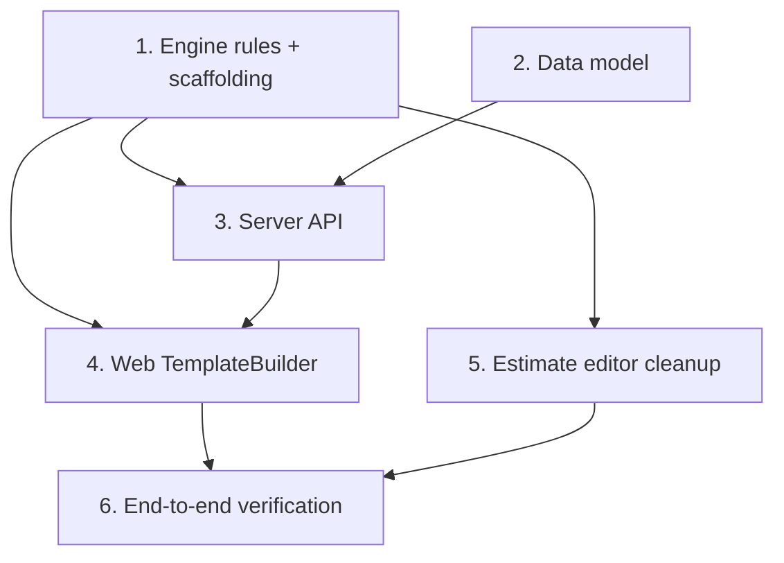

# Implementation Plan: Smart Template Builder

## Overview

This plan is incremental and bottom-up: engine rules first (single source of truth), then data model, then server, then the shared web builder, then estimate-editor cleanup, then end-to-end verification. Each task references the requirements it satisfies. Run `npm test` and the package builds after each engine/server task; verify the UI tasks in the browser.

## Task Dependency Graph

```json
{
  "waves": [
    { "wave": 1, "tasks": ["1", "2"], "dependsOn": [] },
    { "wave": 2, "tasks": ["3"], "dependsOn": ["1", "2"] },
    { "wave": 3, "tasks": ["4", "5"], "dependsOn": ["1", "3"] },
    { "wave": 4, "tasks": ["6"], "dependsOn": ["4", "5"] }
  ]
}
```



## Tasks

- [x] 1. Engine: scaffolding + classification rules (single source of truth)
- [x] 1.1 Add structure-tier → layer-skeleton scaffolding helper in `packages/engine`
  - Map tier (Mono/Duplex/Triplex/Quadriplex) → `tier` substrates + `max(tier-1,0)` adhesives; add an ink slot only when printMode = Printed.
  - Return skeleton as layer descriptors (type + order) with no hardcoded materialIds — material resolution happens against the library, not here.
  - Add a tier ↔ substrate-count reconciliation helper.
  - _Requirements: 2.1, 2.2, 2.3, 2.5_
- [x] 1.2 Extend PE family enforcement to all tiers in `template-classification.ts`
  - Change `substrateFamilyAllowed` so `materialClass === 'PE'` restricts substrates to the `PE` family for every tier (remove the Mono-only condition); keep Non-PE multilayer unconstrained; keep sleeve Non-PE Mono → SLEEVE/PET.
  - Keep symmetry with `inferMaterialClassFromSubstrateFamilies`.
  - _Requirements: 3.1_
- [x] 1.3 Keep `structureType` reconciliation honoring declared tier
  - Ensure `resolveTemplateStoreClassification` / `inferStructureTypeFromSubstrateCount` produce `Mono` for Mono and `Multilayer` for Duplex+.
  - _Requirements: 2.4_
- [x] 1.4 Unit + property tests for engine rules
  - Unit: PE constrains across Mono→Quadriplex; Non-PE multilayer mixes; sleeve rule; scaffold counts per tier; Printed adds ink, Plain does not.
  - Property (fast-check): for any tier → exact substrate/adhesive counts; for any PE declaration → no non-PE substrate; for any Plain → zero ink layers.
  - _Requirements: 2.1, 2.2, 2.3, 3.1, 3.2_

- [x] 2. Data model: ownership + declared print mode
- [x] 2.1 Add `createdByUserId` (nullable) to `structure_templates`
  - Migration + schema update; null = platform/tenant scope, set = user-private add-on.
  - _Requirements: 6.2, 6.3_
- [x] 2.2 Persist declared `printMode` in `defaultDimensions`
  - Store `printMode` ('Plain'|'Printed') in the `defaultDimensions` jsonb (no new column); fall back to name/ink-layer derivation for legacy rows.
  - _Requirements: 3.2, 1.3_

- [x] 3. Server API: create-from-definition + visibility + edit
- [x] 3.1 Extend `POST /api/v1/templates` with a `fromEstimate | fromDefinition` discriminated union
  - `fromDefinition` accepts name, productType, materialClass, structureTier, printMode, defaultLayers, defaultProcesses (no estimateId); default `source` to `fromEstimate` for backward compatibility.
  - Validate substrate count matches tier, substrate families allowed for class, ink only when Printed, adhesive count = substrates − 1.
  - Resolve `materialClass`/`structureType` via `resolveTemplateStoreClassification`; persist `printMode`; derive `defaultPrintingWebClass` + `solventMixEnabled`; assign tenant/user-local `templateKey`.
  - Set ownership: platform admin → standard; tenant admin → tenant add-on; other user → `createdByUserId` set.
  - _Requirements: 1.1, 1.2, 2.4, 3.1, 3.2, 6.1, 6.2, 7.1_
- [x] 3.2 Gate `GET /api/v1/templates` visibility by ownership tier
  - Return platform standards ∪ tenant add-ons ∪ caller's own user add-ons; never another user's private add-on or another tenant's rows.
  - _Requirements: 6.3_
- [x] 3.3 Extend `PATCH /api/v1/templates/:id` to accept declared `structureTier` + `printMode`
  - Persist the same declared attributes the create path does; keep admin-only guard on standards.
  - _Requirements: 4.1, 4.2_
- [x] 3.4 Server integration tests
  - Create-from-definition persists correct class/structureType/printMode + key; visibility isolation; edit/create parity; created row is not pruned by seed-sync.
  - _Requirements: 1.2, 4.2, 6.3_

- [x] 4. Web: unified TemplateBuilder component
- [x] 4.1 Build `TemplateBuilder` (create + edit modes) replacing the edit-only modal in `StandardTemplates.tsx`
  - Declared-attribute controls (name, product type, material class, structure tier, plain/printed) + processes.
  - On attribute change, call engine scaffolding to regenerate the skeleton, preserving valid edits.
  - Resolve scaffold defaults to real materials by querying the library by type/family; unresolved slots show "select material".
  - _Requirements: 1.1, 2.1, 2.2, 2.3, 2.5, 4.1, 7.1, 7.2_
- [x] 4.2 Material dropdown filtering + clean display
  - Filter substrate options via engine rules for the current attribute context; hide/disable ink add when Plain; varnish appears as an Ink & Coating material.
  - De-duplicate family: show family once via `optgroup`, strip trailing `(<family>)` from option labels; do not change stored names.
  - _Requirements: 3.1, 3.2, 7.3, 7.4_
- [x] 4.3 Layer reorder (move up/down + drag) in the builder
  - Reorder must not change counts/class/printMode; reconcile tier if a substrate is removed.
  - _Requirements: 5.1, 5.3_
- [x] 4.4 Add a "New template" entry point on `StandardTemplates.tsx`
  - Wire create mode; route admin vs user to the correct ownership tier on save.
  - _Requirements: 1.1, 6.1, 6.2_
- [x] 4.5 Update `templateCatalog.ts` to prefer declared attributes
  - Prefer declared printMode/tier when present; keep name/ink + substrate-count derivation as legacy fallback for card badges and `ClassFilterPanel`.
  - _Requirements: 1.3, 3.2_

- [x] 5. Web: estimate editor cleanup + ordering
- [x] 5.1 Remove the "+ Metallized Barrier" button from `EstimateEditor.tsx`
  - Delete the hardcoded adhesive+aluminium+adhesive insert; keep manual "+ Add Layer…".
  - _Requirements: 8.1, 8.2_
- [x] 5.2 Replace hardcoded `getTemplateLayers` name matching with library-driven resolution
  - Pick defaults by type/family from the loaded materials; leave unresolved when absent.
  - _Requirements: 7.1, 7.2_
- [x] 5.3 Verify estimate-editor reorder parity + instantiation order preservation
  - Confirm `moveLayer`/`reorderLayers` cover surface/reverse/top-varnish orders; instantiation preserves template order.
  - _Requirements: 5.1, 5.2, 5.3_

- [x] 6. End-to-end verification
- [x] 6.1 Build all packages and run the full test suite; fix regressions
  - _Requirements: all_
- [x] 6.2 Manual UI pass: create + edit parity, PE/Plain constraints, reorder, visibility isolation, clean material names, no metallized button
  - _Requirements: 3.1, 3.2, 4.2, 5.1, 6.3, 7.4, 8.1_

## Notes

- Engine is the single source of truth for scaffolding and material rules; web and server both consume it — do not duplicate the rules.
- No destructive data migrations: `printMode` lives in the `defaultDimensions` jsonb; material names are left unchanged (family de-dup is display-only).
- Ownership default: builder-created templates are add-ons (`isStandard = false`); only the platform admin authors standards. This avoids seed-sync pruning UI-authored standards.
- Layer order is free — only counts and family/ink rules are invariant. Reorder must exist in both the builder and the estimate editor.
- Verify with `npm test` and package builds after engine/server tasks; manual browser pass for UI tasks.
