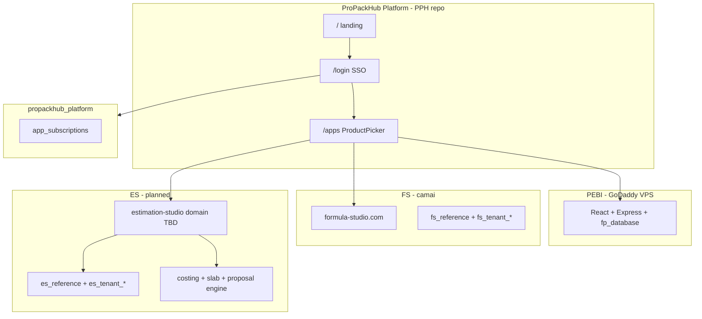

# ProPackHub Estimation Studio — Master Plan v1.0

**Date:** 2026-06-11  
**Status:** Approved direction — **build spec final**; see readiness below  
**Canonical PRD:** [ES_PRD_v3_FINAL_BUILD_SPEC.md](./ES_PRD_v3_FINAL_BUILD_SPEC.md) (`Approved for implementation`)  
**Superseded drafts:** [ES_PRD_v3.md](./ES_PRD_v3.md), [PRD_v3_Final.md](./PRD_v3_Final.md) (enterprise — scope rejected)  
**Laravel reference:** [legacy-laravel/COSTING_NOTES.md](./legacy-laravel/COSTING_NOTES.md)
**Owner context:** Non-DevOps; automate deploy and provisioning like FS  
**Companion docs:** [ES_PRD_v3.md](./ES_PRD_v3.md), [chatgpt chat details.txt](./chatgpt%20chat%20details.txt)  
**Legacy reference:** [PPH small.zip](./PPH%20small.zip) (Laravel 11 v1 estimator)  
**Platform context:** [PPH/docs/PROPACKHUB_PLATFORM_LANDING_AND_MULTIAPP_MASTER_PLAN.md](../PPH/docs/PROPACKHUB_PLATFORM_LANDING_AND_MULTIAPP_MASTER_PLAN.md)

---

## 0. TL;DR

1. **Estimation Studio (ES)** is the **third ProPackHub product**, alongside **PEBI** and **Formulation Studio (FS)**.
2. ES rebuilds the old Laravel flexible-packaging estimator as a **standalone SaaS** (separate repo, DB, domain) — same pattern as FS.
3. **Product name:** ProPackHub Estimation Studio. **Tagline:** Flexible Packaging Cost Estimator.
4. **Core workflow:** Customer → Structure → Estimate → Quantity Slabs → Proposal → Customer Response.
5. **Owner's core ask** (from [`chatgpt chat details.txt`](./chatgpt%20chat%20details.txt)): renew the Laravel app using the PRD — but fix **how it feels**, close **8 feature gaps**, and avoid **backend decisions that hurt at scale**. A React port alone is not enough.
6. **Locked decisions in that file:** Personal Costing Environment (#14), Quantity Slab Pricing (#15), functional positioning (#16).
7. **Do not conflate** ES with PEBI's internal `/estimator` MES wizard.
8. **Design identity is a Phase 2 gate** — no React feature UI until wireframes and tokens are approved.

---

## 0.1 Owner brief (source: chatgpt chat details.txt)

This is the request that started the ChatGPT PRD review session. Everything in the plan flows from it:

> Check this old project which I want to renew with the PRD explained. The PRD describes **what** to build but not **how it should feel**. There's no design identity, no emotional arc for the user, no signature element that makes this product memorable. The original Laravel app felt primitive because it had no design language — rebuilding with React without solving that gets you a slightly less primitive app.
>
> There are also **8 significant feature gaps** and several **backend decisions that will cause pain at scale**. Can you comment and give your direction, enhancement to the plan?

**What the text file contains:**

| In file | Not in file |
|---------|-------------|
| Owner opening brief (above) | ChatGPT **Questions #1–#13** and your answers (live session only — share export skips to Decision #14) |
| ChatGPT full PRD review + **10 weakness gaps** | The original uploaded PRD document |
| Locked Decision #14 — Personal Costing Environment | |
| Question #15 + slab answer → Decision #15 | |
| Question #16 + positioning answer → Decision #16 | |
| ES v3 module list + commercial workflow | |

**Why it looked missing:** The original txt export started at Decision #14. ChatGPT's first response (PRD review + 10 gaps) was behind **"Show more"** on the share page. That content is now in [`chatgpt chat details.txt`](./chatgpt%20chat%20details.txt).

The sections below are the **direction and enhancement** answer to that brief.

---

## 0.2 The 8 / 10 feature gaps (from ChatGPT PRD review)

The owner said **8 significant feature gaps**. ChatGPT's review identified **10 weaknesses** in the uploaded PRD. These are now captured in [`chatgpt chat details.txt`](./chatgpt%20chat%20details.txt).

| # | Gap (ChatGPT) | ES v3 response |
|---|---------------|----------------|
| 1 | No product vision — calculator not "engineering structure" | Estimation Studio positioning + Structure Canvas UX |
| 2 | Missing design language — screens not experience | Packaging Structure Canvas as signature UI |
| 3 | Missing cost intelligence layer — Input→Price only | Cost breakdown: material %, process %, waste %, margin % |
| 4 | No material price governance | Material Cost History (price trail by month) |
| 5 | Missing Formula Studio integration | FS → Structure → Template → Estimate → Quote pipeline |
| 6 | Missing multi-tenant architecture | `es_tenant_*` DB + tenant_id on all objects (Decision #14) |
| 7 | Missing audit & compliance | `activity_logs` for price/settings changes |
| 8 | Missing customer intelligence | Customer Workspace (quote history, margins, approval rate) |
| 9 | Missing approval intelligence | Approval Rules Engine (margin thresholds) |
| 10 | Missing analytics layer | Commercial Analytics dashboard |

**MVP priority:** 2, 3, 6, 8 (+ slabs via Decision #15, tenant model via Decision #14).  
**Phase 2:** 4, 5 (FS link), 7, 9. **Phase 3:** 10.

### Reconciling ChatGPT’s “Biggest Recommendation” with your locked decisions

ChatGPT proposed merging everything into one **ProPackHub Packaging Intelligence Platform** monolith. You chose a different — and already started — path:

| ChatGPT suggestion | Your locked direction |
|--------------------|----------------------|
| One mega-platform | **ProPackHub platform** with separate products: **PEBI**, **FS**, **ES** |
| “Packaging Intelligence Platform” headline | **“Flexible Packaging Cost Estimator”** (Decision #16) |
| FS + ES as internal modules | **FS** standalone (`propackhub-fs`); **ES** standalone (`propackhub-es`) |
| Single tenant_id everywhere | **Decision #14:** admin seed → `es_tenant_*` copy; platform entitlements in `propackhub_platform` |

**Gap #5 (FS integration)** — implement as a **cross-app pipeline**, not a merge:

```
Formulation Studio  →  (API) Material Structure  →  ES Template  →  Estimate  →  Quotation
```

Only when tenant has **both** `fs` and `es` entitlements. PEBI-only and FS-only tenants unaffected.

**Gaps #7, #9, #10** — valuable for enterprise ES tier; not MVP blockers.

### Questions #1–#13 (not in export)

ChatGPT numbered through **Question #16**, so **13 earlier strategic questions** were asked in the live session (likely locking Decisions #1–#13). The share link and original txt export **do not include** that middle section — only the review above and Decisions #14–#16. If you still have that part in ChatGPT, scroll up in the live chat and copy it, or re-export the full conversation.

---

## 0.3 Backend decisions that will cause pain at scale (Laravel → ES fix)

| Laravel pain | ES v3 decision |
|--------------|----------------|
| 690-line `FormController` mixing HTTP, validation, math, PDF | Split: `packages/engine` (pure math) + `packages/server` (API) + `packages/web` (UI) |
| Hyphenated column names in DB (`solid-input`, `cost-m-input`) | Normalized snake_case schema; engine uses typed DTOs |
| Four parallel array tables for one estimate | Single estimate model: `layers`, `processes`, `slabs` as proper 1:N relations |
| No tenant isolation | `es_tenant_{id}` DB per tenant; JWT tenant scope on every query |
| Calculation logic only in PHP views/JS | Unit-tested TypeScript engine with golden tests from legacy estimates |
| PDF inline in controller | Proposal service; template engine; async queue if slow |
| User approval workflow only | ProPackHub SSO + `app_subscriptions` entitlements |
| No API | REST `/api/v1` from day one (mobile and portal depend on it) |
| Shared material rows between users | Admin seed in `es_reference`; copy-on-provision (#14) |

---

## 0.4 Design direction — how it should feel (answer to owner brief)

The PRD says **what**. This section says **how it should feel**.

### Emotional arc

| Stage | User feeling | UX job |
|-------|--------------|--------|
| Signup | "I have a real starting point" | Seeded library visible immediately — not empty state |
| Build structure | "I see what I'm selling" | Layer canvas — not a spreadsheet |
| Calculate | "I trust these numbers" | Inline GSM/waste/margin breakdown |
| Slabs | "One quote answers every quantity question" | Table edit in place — not new estimates |
| Proposal | "I'm proud to send this" | Branded PDF preview before download |
| Customer response | "Deal closed" | Portal accept (Phase 2) |

### Signature element

**The vertical layer stack canvas** — drag-reorder films, live GSM sidebar, product-type switcher (Roll / Pouch / Laminate). This is what users remember. Every marketing screenshot leads with it.

### Design identity (draft — lock in Phase 2)

| Token | Value | Why |
|-------|-------|-----|
| Primary | Teal `#0d9488` | Cost/clarity; not PEBI blue |
| Accent | Amber `#f59e0b` | Slab highlights, CTAs |
| Surface | Warm off-white `#fafaf9` | Commercial calm, not factory HMI |
| Type UI | DM Sans | Modern SaaS |
| Type numbers | IBM Plex Mono | Costs and GSM feel precise |
| Motion | Layer add/remove animates ~200ms | Delight without distraction |

**Hard rule:** Do not reuse PEBI Ant Design skin. ES is a commercial product, not an ERP module.

---

## 1. ProPackHub product map

| Product | Code | Audience | Repo | Status |
|---------|------|----------|------|--------|
| **ProPackHub** | PPH | Platform brand, login, entitlements | `PPH/` | Live (GoDaddy VPS) |
| **PEBI** | PEBI | Enterprise: MIS, CRM, MES, AEBF | `PPH/` | Live, active dev |
| **Formulation Studio** | FS | Ink & paint formulation | `propackhub-fs/` | Live (camai / formula-studio.com) |
| **Estimation Studio** | ES | Flexible packaging cost estimation & proposals | `propackhub-es/` (planned) | **Not started** |

Brand hierarchy:

```
ProPackHub (platform)
├── PEBI          — Packaging Enterprise Business Intelligence
├── FS            — Formulation Studio
└── ES            — Estimation Studio
```

---

## 2. Problem statement

The original Laravel app (`PPH small.zip`) proved that flexible-packaging costing can be digitized, but:

- **No design language** — forms and tables without emotional arc or signature UX
- **No commercial workflow** — estimate-only; weak customer/proposal loop
- **No SaaS tenancy** — single-app user model, not platform-integrated
- **No slab pricing** — duplicate estimates for quantity changes
- **No shared library model** — materials exist but not as admin-seeded tenant copies
- **Monolithic Laravel** — does not fit ProPackHub multi-app SSO / entitlements

A React rebuild that only ports the forms repeats the same failure mode: **a slightly less primitive app**.

ES v3 must solve **how it feels** and **how it scales** at the same time.

---

## 3. Locked owner decisions (from ChatGPT Q&A)

### Decision #14 — Admin-Seeded Library + User Ownership

**Concept:** Personal Costing Environment

```
ProPackHub Admin → Creates Master Library
                 → User Registers → Receives Full Copy → User Owns Everything
```

Each tenant independently owns and edits:

- Currency and symbol
- Material prices, waste %, density, solids %
- Machine costs and margin defaults
- Quotation terms and proposal branding (logo, colors, footer, T&C)

**Rule:** User changes never affect other tenants.

**Starter library example:**

| Material | Admin seed | User override |
|----------|------------|---------------|
| PET 12µ | AED 8.50/kg | AED 9.20/kg |
| BOPP 20µ | AED 7.80/kg | AED 8.10/kg |

Each user also owns: My Materials, My Prices, My Templates, My Customers, My Proposals, My Settings.

### Decision #15 — Quantity Slab Pricing

**Rejected:** separate estimate per quantity (A), revision chains (B), multi-scenario estimates (C).

**Accepted:** multiple quantity tiers **inside one estimate**, e.g.:

| Quantity | Price/kg |
|----------|----------|
| 1 Ton | AED 12.50 |
| 2 Tons | AED 11.90 |
| 5 Tons | AED 11.20 |
| 10 Tons | AED 10.80 |

**Workflow:**

```
Estimate → Structure → Cost Calculation → Quantity Slabs → Proposal
```

**Enhancement:** Slab Templates — reusable presets (e.g. 1T/2T/5T/10T or 500/1000/2500/5000 kg).

### Decision #16 — Product positioning

**Headline / tagline:** Flexible Packaging Cost Estimator

**Rejected positioning:** Packaging Intelligence Platform, Commercial Workspace, Packaging OS.

**Rationale:** instant comprehension for sales reps, converters, consultants; better SEO; obvious value prop. Premium UX lives **inside** the product; marketing stays functional.

### End-to-end commercial workflow

```
Customer → Structure → Estimate → Proposal → Customer Response
```

---

## 4. Legacy Laravel app audit

**Source:** `PPH small.zip` → `propackhub-complete-backup 2/`  
**Stack:** Laravel 11, Breeze auth, DomPDF, DataTables, PHP 8.2+

### 4.1 Routes and features

| Area | Implementation |
|------|----------------|
| Estimates | `FormController` resource (`/forms`) — CRUD, duplicate, PDF, print |
| Layer costing | `array_fields` — solids, micron, density, GSM, waste, cost/kg per row |
| Dimensions | `secondary_table` — roll width, cut-off, lay-flat, pouch/zipper fields, order qty kg |
| Actuals | `second_array` — material consumption; `third_array` — process hours/cost |
| Materials | Categories, subcategories, CRUD, AJAX lookup |
| Branding | Logo upload/settings |
| Users | Admin approval workflow, feedback mail |

### 4.2 Data model (simplified)

```
users
main_table          — customerName, jobName, productType, orderQuantity, units, project_date
secondary_table     — 1:1 dimensions and calculated roll/pouch fields
array_fields        — 1:N layer stack rows
second_array        — 1:N actual material consumption
third_array         — 1:N process name / hours / cost
materials + categories + subcategories
```

### 4.3 What to preserve in ES engine

- Multi-layer GSM / density / solids math
- Waste and cost-per-kg roll-ups
- Roll vs pouch product-type branching (lay-flat, zipper, pieces/kg)
- Process hour costing
- PDF proposal output

### 4.4 What to replace

- Blade form UI → Packaging Structure Canvas
- Per-user DB rows without tenancy → `es_tenant_*` schema
- Admin-global materials only → admin seed + tenant copy
- Single quantity field → slab table
- No CRM → Customer Workspace
- Laravel monolith → `packages/engine` + `packages/server` + `packages/web`

---

## 5. ES vs PEBI `/estimator` — hard boundary

| Dimension | ES (planned) | PEBI MES Estimator (exists) |
|-----------|--------------|----------------------------|
| **Primary user** | Sales rep, consultant, small converter | Internal pre-sales / MES team |
| **Location** | Standalone app (`propackhub-es`) | `PPH/src/components/MES/Estimator/EstimatorConsole.jsx` at `/estimator` |
| **Workflow** | Customer → Structure → Slabs → Proposal | Inquiry → BOM2 → Routing → Machine AI → Quotation |
| **Master data** | Tenant-owned library (seeded) | Oracle ERP, MES items, BOM2, machines |
| **Depth** | Commercial quoting | Manufacturing feasibility, OEE, production routing |
| **Integration** | ProPackHub SSO + entitlements | PEBI roles, `mes_inquiries.estimator_draft` |

**Rule:** Never merge ES into PEBI MES. Optionally share a **costing math spec** or npm package later — not a shared UI or database.

---

## 6. Target architecture

### 6.1 Platform topology



### 6.2 Repo layout (mirror FS)

```
propackhub-es/
├── app/
│   ├── package.json              # npm workspaces root
│   ├── .env.example
│   ├── START-ES.cmd
│   ├── docker-compose.yml        # local Postgres
│   └── packages/
│       ├── engine/               # Pure costing + slab math (unit tested)
│       ├── server/               # API, tenancy, auth callback, PDF
│       └── web/                  # React SPA
├── deploy/
│   ├── nginx.conf
│   └── ecosystem.config.cjs
└── scripts/
    ├── deploy-home.sh
    └── verify-deploy.sh
```

**Suggested dev ports:** Web 5000, API 5001 (avoid collision with PPH 3000/3001 and FS 4000/4001).

### 6.3 Database strategy

| Database | Purpose |
|----------|---------|
| `es_reference` | Master library seeds, material templates, slab presets, community templates (moderated) |
| `es_tenant_{id}` | Per-tenant copy: materials, prices, customers, estimates, proposals, settings |
| `propackhub_platform` (on VPS) | Users, companies, `app_subscriptions` with `app_key = 'es'` |

**Tenant provisioning (Decision #14):** on signup or entitlement grant, server copies reference library rows into tenant DB in one transaction.

### 6.4 Auth and SSO

Follow [PROPACKHUB_PLATFORM_LANDING_AND_MULTIAPP_MASTER_PLAN.md](../PPH/docs/PROPACKHUB_PLATFORM_LANDING_AND_MULTIAPP_MASTER_PLAN.md) D8:

- HS256 shared secret, 120s TTL, single-use `jti`
- `aud=es` on callback
- Entitlement check on every token issue (`active | trial | suspended | expired | cancelled`)

**Phase 1 MVP:** ES-local auth (like FS today) with platform SSO wired in Phase 4.

### 6.5 Hosting (TBD — owner decision)

| Option | Notes |
|--------|-------|
| camai + Cloudflare (like FS) | Lowest incremental cost; reuse deploy scripts |
| Subdomain on GoDaddy (`estimation.propackhub.com`) | Same VPS as PEBI; simpler SSO latency |
| Separate domain | Strongest product identity |

**Recommendation:** start on camai mirroring FS until first paying ES customer, then revisit (same trigger as FS D15).

---

## 7. Functional modules

| # | Module | MVP | Phase 2+ |
|---|--------|-----|----------|
| 1 | Packaging Structure Canvas | Yes | Community import |
| 2 | Costing Engine | Yes | Shared npm pkg with PEBI spec only |
| 3 | Personal Costing Environment | Yes | — |
| 4 | Quantity Slab Pricing | Yes | Slab templates |
| 5 | Mini CRM (Customer Workspace) | Yes | Pipeline stages |
| 6 | Proposal Engine (PDF) | Yes | Email send |
| 7 | Interactive Proposal Portal | No | Phase 2 |
| 8 | Community Templates | No | Phase 3 |
| 9 | Settings (costing + branding + account) | Yes | Notifications |
| 10 | Mobile app | No | Phase 3 (responsive web first) |
| 11 | Subscription billing | Stripe hook | Full self-serve |

---

## 8. UX and design direction

The PRD described **what**; this plan requires **how it feels** before any UI code.

### 8.1 Design principles

1. **Structure is the hero** — the layer stack canvas is the signature element (not another data grid).
2. **Quote in minutes** — default path: pick customer → build layers → see price/kg → add slabs → send proposal.
3. **Numbers feel trustworthy** — show GSM, waste, and margin breakdown inline; no black-box totals.
4. **Commercial calm** — professional SaaS for B2B sales, not factory HMI (PEBI Operator) or lab bench (FS).
5. **Own your costs** — settings and library edits feel personal ("My Prices"), never shared accidentally.

### 8.2 Signature interaction — Structure Canvas

- Vertical layer stack (film icons + micron labels)
- Drag to reorder layers; click layer to edit solids/density/waste/price
- Live sidebar: total GSM, cost/m², cost/kg at reference quantity
- Product-type switcher: Roll / Pouch / Laminate (preserves Laravel branching logic)

### 8.3 Visual identity (draft — refine in Phase 2)

| Token | Direction |
|-------|-----------|
| Primary | Deep teal `#0d9488` (cost/clarity; distinct from PEBI blue `#3b82f6`) |
| Accent | Warm amber `#f59e0b` (slab highlights, CTA) |
| Surface | Off-white `#fafaf9` + soft shadows (not PEBI dark login gradient) |
| Typography | **DM Sans** (UI) + **IBM Plex Mono** (numbers/costs) |
| Iconography | Custom layer-stack motif in logo mark |

Deliverables before React build: mood board, 6 wireframes, component tokens in Figma or CSS variables doc.

---

## 9. Information architecture

```
ES App
├── Dashboard          — recent estimates, quick quote, pipeline snapshot
├── Customers          — mini CRM list + detail
├── Estimates
│   ├── New Estimate   — wizard: Customer → Structure → Slabs → Review
│   └── Estimate Detail
├── Proposals          — sent / draft / accepted
├── Library
│   ├── Materials
│   ├── Slab Templates
│   └── Structure Templates (Phase 2)
├── Community (Phase 3)
└── Settings
    ├── Costing
    ├── Proposal Branding
    ├── Account & Subscription
    └── Profile
```

**Platform admin (in PPH):** Master Library editor, tenant provisioning, ES app subscriptions.

---

## 10. User journeys

### 10.1 New tenant onboarding

1. User registers on ProPackHub (or ES direct trial)
2. Platform grants `es` entitlement
3. ES provisions `es_tenant_{id}` and copies master library
4. User sets currency + uploads logo in Settings
5. Dashboard shows "Create your first estimate" guided flow

### 10.2 Standard quote (MVP)

1. Select or create customer
2. Build structure on canvas (layers from My Materials)
3. Engine calculates base cost/kg at reference qty
4. Add quantity slabs (from template or ad hoc)
5. Apply margin defaults → preview proposal PDF
6. Download PDF or copy share link (portal in Phase 2)

### 10.3 Slab re-quote (Decision #15)

Customer asks "what about 10 tons?" — user adds/edits slab row in same estimate; proposal table updates; no duplicate estimate.

---

## 11. Subscription model (draft)

| Tier | Target | Limits (draft) |
|------|--------|----------------|
| **Trial** | Evaluator | 14 days, 5 estimates, watermark PDF |
| **Starter** | Solo consultant | 50 estimates/mo, 1 user, basic library |
| **Pro** | Sales team | Unlimited estimates, 5 users, slab templates, branding |
| **Business** | Converter | Pro + API access + priority support |

Billing: Stripe via `propackhub_platform.app_subscriptions` (same pattern as future PEBI SaaS tiers).

---

## 12. API surface (draft)

Prefix: `/api/v1`

| Group | Endpoints |
|-------|-----------|
| Auth | `POST /auth/login`, `POST /auth/callback` (SSO), `GET /auth/me` |
| Tenants | `POST /internal/provision` (platform only) |
| Library | `GET/POST/PATCH/DELETE /materials`, `/categories` |
| Customers | CRUD `/customers` |
| Estimates | CRUD `/estimates`, `POST /estimates/:id/calculate`, `POST /estimates/:id/slabs` |
| Proposals | `POST /estimates/:id/proposal`, `GET /proposals/:id/pdf` |
| Settings | `GET/PATCH /settings/costing`, `/settings/proposal` |
| Slab templates | CRUD `/slab-templates` |

Engine endpoints are internal (`packages/engine` imported by server) — not HTTP-exposed.

---

## 13. Implementation phases

### Phase 0 — Context recovery (1–2 days)

- [ ] Owner re-uploads PRD v1/v2 + ChatGPT decisions #1–13 + 8 feature gaps (optional — most locked in LOCKED_DECISIONS.md)
- [x] Extract `PPH small.zip` → `Estimator app/legacy-laravel/` (read-only reference)
- [x] Document costing formulas from `FormController.php` + blade JS → [legacy-laravel/COSTING_NOTES.md](./legacy-laravel/COSTING_NOTES.md)

### Phase 1 — PRD sign-off

- [x] **Scope locked** — [LOCKED_DECISIONS.md](./LOCKED_DECISIONS.md) + [ES_PRD_v3_FINAL_BUILD_SPEC.md](./ES_PRD_v3_FINAL_BUILD_SPEC.md)
- [ ] **Owner explicit “go build”** on build spec (or wireframes)
- [ ] Confirm ES domain/hosting choice
- [x] Default layer stacks for 11 parent PG templates → [ES_STANDARD_TEMPLATES_SEED.md](./ES_STANDARD_TEMPLATES_SEED.md) + [ES_STANDARD_TEMPLATES_SEED.json](./ES_STANDARD_TEMPLATES_SEED.json) **(awaiting owner review)**

### Phase 2 — Design (1–2 weeks, blocking)

- [ ] Wireframes: dashboard, canvas, slabs, proposal preview, settings
- [ ] Design tokens + component spec
- [ ] No React feature code until wireframes approved

### Phase 3 — Repo bootstrap (1 week)

- [ ] Create `propackhub-es/` monorepo from FS template
- [ ] `packages/engine` with unit tests ported from Laravel math
- [ ] `packages/server` skeleton + Postgres migrations
- [ ] `packages/web` shell + routing only

### Phase 4 — MVP build (4–6 weeks)

- [ ] Tenant provisioning + library seed/copy
- [ ] Structure canvas + costing engine integration
- [ ] Slab pricing + PDF proposal
- [ ] Mini CRM + settings
- [ ] Local auth; deploy to camai staging

### Phase 5 — Platform integration (1–2 weeks)

- [ ] `app_key = 'es'` in platform DB
- [ ] ProductPicker tile in PPH
- [ ] SSO callback + entitlement enforcement
- [ ] Platform admin: master library UI

### Phase 6 — Post-MVP

- [ ] Interactive proposal portal
- [ ] Community templates
- [ ] Stripe billing
- [ ] Mobile-responsive polish → optional native app

---

## 14. MVP definition (smallest shippable ES)

**In scope:**

- Register / login (local auth acceptable for beta)
- Admin-seeded library copied to tenant
- Customer CRUD
- Structure canvas with layer costing (roll + pouch paths from Laravel)
- Quantity slabs on one estimate
- Branded PDF proposal
- Costing + proposal settings

**Out of scope (defer):**

- Community templates
- Interactive customer portal
- Native mobile app
- PEBI / Oracle integration
- Machine routing / AI selection

**Success criteria:**

- A consultant can quote 4 quantity slabs for a 3-layer laminate in under 10 minutes
- PDF matches branding settings
- Tenant A price change does not affect Tenant B

---

## 15. Open questions

| # | Question | Owner input needed |
|---|----------|-------------------|
| 1 | ChatGPT decisions #1–13 (not in text file — were separate ChatGPT uploads) | Re-upload if they exist |
| 2 | Confirm the 8 gaps mapping in §0.2 matches what you meant | Yes / correct list |
| 3 | ES domain and hosting (camai vs GoDaddy vs new domain) | Choose option |
| 4 | Primary MVP persona | Sales rep / consultant / converter |
| 5 | Slab pricing math — auto-derive from base cost vs manual price per slab? | Business rule |
| 6 | Single-user tenant vs multi-seat from day one? | Subscription design |

---

## 16. References

| Resource | Path |
|----------|------|
| Legacy Laravel backup | `Estimator app/PPH small.zip` |
| ChatGPT Q&A (decisions 14–16) | `Estimator app/chatgpt chat details.txt` |
| Full PRD v3 | `Estimator app/ES_PRD_v3.md` |
| PEBI platform master plan | `PPH/docs/PROPACKHUB_PLATFORM_LANDING_AND_MULTIAPP_MASTER_PLAN.md` |
| FS repo pattern | `propackhub-fs/` |
| PEBI MES estimator (do not merge) | `PPH/src/components/MES/Estimator/EstimatorConsole.jsx` |
| Product picker | `PPH/src/components/platform/ProductPicker.jsx` |

---

*End of master plan v1.0*
