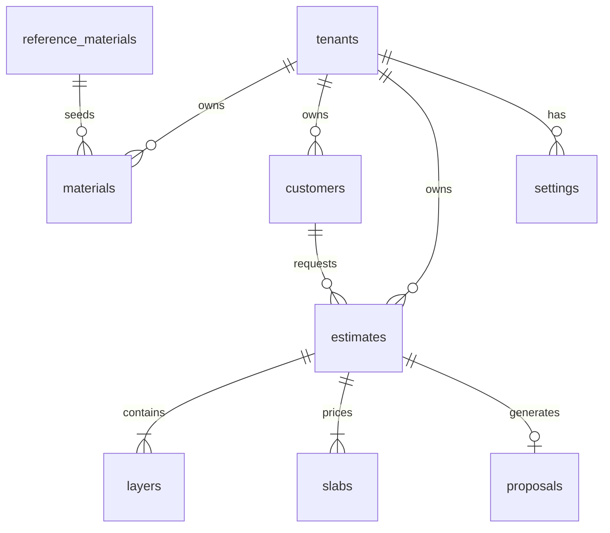

# ProPackHub Estimation Studio — Product Requirements Document v3.0

**Product:** ProPackHub Estimation Studio (ES)  
**Tagline:** Flexible Packaging Cost Estimator  
**Version:** 3.0 (draft)  
**Date:** 2026-06-11  
**Status:** **Superseded** — use [ES_PRD_v3_FINAL_BUILD_SPEC.md](./ES_PRD_v3_FINAL_BUILD_SPEC.md)  
**Parent platform:** ProPackHub  
**Implementation plan:** [ESTIMATION_STUDIO_MASTER_PLAN.md](./ESTIMATION_STUDIO_MASTER_PLAN.md)

---

## 0. Owner brief and scope of this document

This PRD answers the request captured in `chatgpt chat details.txt`:

> Renew the old Laravel project with the PRD explained. The PRD describes **what** to build but not **how it should feel** — no design identity, no emotional arc, no signature element. Rebuilding in React without solving that produces a slightly less primitive app. There are **8 significant feature gaps** and **backend decisions that will cause pain at scale**.

This document adds:

- **How it should feel** — UX philosophy, emotional arc, Structure Canvas as signature element (§8)
- **The 8 feature gaps** — explicit mapping vs Laravel v1 (§0.1)
- **Scale-safe backend** — engine/server/web split, tenant DBs (§12)
- **Locked decisions #14–16** from the same text file (§5, §3.2)

Decisions #1–13 from the earlier ChatGPT session are **not** in the text file; add them here when available.

### 0.1 The 8 feature gaps

| # | Gap | MVP? |
|---|-----|------|
| 1 | Packaging Structure Canvas | Yes |
| 2 | Customer Workspace (Mini CRM) | Yes |
| 3 | Proposal Engine (branded PDF) | Yes |
| 4 | Interactive Proposal Portal | Phase 2 |
| 5 | Community Templates | Phase 3 |
| 6 | Material Library — admin seed + tenant copy (Decision #14) | Yes |
| 7 | Quantity Slab Pricing (Decision #15) | Yes |
| 8 | Mobile strategy (responsive → PWA) | Phase 2 |

---

## 1. Executive summary

ProPackHub Estimation Studio is a standalone SaaS product for **flexible packaging professionals** — sales reps, consultants, and converters — who need to build multi-layer structures, calculate costs, and send commercial proposals quickly.

The product replaces a legacy Laravel estimator with a modern React application while expanding the workflow from "spreadsheet replacement" to a full **commercial loop**:

```
Customer → Structure → Estimate → Quantity Slabs → Proposal → Customer Response
```

**Product name:** ProPackHub Estimation Studio  
**Tagline:** Flexible Packaging Cost Estimator (Decision #16)

ES sits alongside PEBI (enterprise ERP/MES) and Formulation Studio (ink/paint) under the ProPackHub platform. It is **not** the same as PEBI's internal MES Estimator wizard.

---

## 2. Product vision

**Vision statement:** Every packaging sales professional can quote any flexible structure in minutes, with costs they trust and proposals their customers understand.

**Mission:** Make flexible packaging costing as fast and reliable as a calculator, and as professional as a CRM — without requiring ERP infrastructure.

**Success metrics (year 1 targets — draft):**

| Metric | Target |
|--------|--------|
| Time to first quote (new user) | < 15 minutes after signup |
| Estimates created per active user / month | ≥ 8 |
| Proposal PDF generation rate | ≥ 70% of completed estimates |
| Trial → paid conversion | ≥ 12% |
| NPS (Pro tier) | ≥ 40 |

---

## 3. Product positioning

### 3.1 Market-facing

- **Name:** ProPackHub Estimation Studio
- **Tagline:** Flexible Packaging Cost Estimator
- **One-liner:** Build packaging structures, calculate real costs, and send slab-priced proposals — all in one workspace.

### 3.2 Positioning choices (locked — Decision #16)

| Rejected | Accepted |
|----------|----------|
| Packaging Intelligence Platform | Flexible Packaging Cost Estimator |
| Commercial Workspace | |
| Packaging OS | |

**Why functional positioning wins:** instant comprehension, SEO, obvious value for reps/converters/consultants. Premium UX is delivered inside the product, not in abstract marketing language.

### 3.3 Competitive differentiation

| Alternative | ES advantage |
|-------------|--------------|
| Excel spreadsheets | Structured layers, reusable library, PDF proposals |
| Generic CRM | Packaging-native structure canvas + costing engine |
| PEBI / full ERP | Lightweight, no Oracle/MES setup; personal costing environment |
| Legacy Laravel app | Modern UX, SaaS tenancy, slab pricing, CRM loop |

---

## 4. Target users and personas

### Persona 1 — Packaging Sales Rep (primary MVP candidate)

- **Goal:** Respond to customer RFQs same day with professional slab pricing
- **Pain:** Rebuilding Excel for every structure; inconsistent margins
- **ES value:** Slab templates, branded PDF, customer history

### Persona 2 — Independent Packaging Consultant

- **Goal:** Maintain confidential cost libraries per client engagement
- **Pain:** Cannot share ERP access; needs own prices
- **ES value:** Personal Costing Environment (Decision #14)

### Persona 3 — Small Converter Owner

- **Goal:** Quote custom laminates/pouches without full MIS
- **Pain:** Too small for PEBI; too complex for spreadsheets
- **ES value:** Structure canvas + machine/process costing defaults

### Persona 4 — ProPackHub Platform Admin

- **Goal:** Seed starter libraries, manage ES subscriptions
- **ES value:** Master library editor, tenant provisioning

---

## 5. Core concepts

### 5.1 Personal Costing Environment (Decision #14)

Every tenant receives a **full private copy** of the admin master library at registration. All edits are tenant-scoped:

```
My Materials | My Prices | My Templates | My Customers | My Proposals | My Settings
```

No cross-tenant leakage. Consultant A and Converter B always have different costs.

### 5.2 Quantity Slab Pricing (Decision #15)

One estimate contains multiple quantity tiers. The proposal renders a table:

```
Quantity    | Price/kg
------------|----------
1 Ton       | AED 12.50
2 Tons      | AED 11.90
5 Tons      | AED 11.20
10 Tons     | AED 10.80
```

**Slab Templates:** reusable presets (metric or imperial quantities).

### 5.3 Packaging Structure Canvas

Visual multi-layer builder replacing Laravel form rows. Layers carry: material, micron, density, solids %, waste %, cost/kg. Live calculation of total GSM and unit cost.

### 5.4 Commercial workflow

```
Customer → Structure → Estimate → Quantity Slabs → Proposal → Customer Response
```

---

## 6. Functional requirements

### 6.1 Authentication and tenancy

| ID | Requirement | Priority |
|----|-------------|----------|
| AUTH-01 | User can register and log in (local auth for MVP) | P0 |
| AUTH-02 | Platform SSO via ProPackHub with `es` entitlement | P1 |
| AUTH-03 | On first login, tenant DB provisioned and library seeded | P0 |
| AUTH-04 | Subscription status enforced on every session/token issue | P1 |

### 6.2 Master library and materials

| ID | Requirement | Priority |
|----|-------------|----------|
| LIB-01 | Platform admin maintains master material library in `es_reference` | P0 |
| LIB-02 | New tenant receives copy of master library | P0 |
| LIB-03 | User can CRUD materials in tenant library | P0 |
| LIB-04 | Material fields: name, category, micron options, density, solids %, default waste %, default price/kg | P0 |
| LIB-05 | Categories and subcategories (preserve Laravel model) | P1 |

### 6.3 Structure canvas and costing engine

| ID | Requirement | Priority |
|----|-------------|----------|
| COST-01 | User builds ordered layer stack on visual canvas | P0 |
| COST-02 | Engine calculates total GSM, cost/m², cost/kg at reference quantity | P0 |
| COST-03 | Support roll/film product path (width, cut-off, trim, ups) | P0 |
| COST-04 | Support pouch/lay-flat path (open width/height, zipper optional) | P0 |
| COST-05 | Process rows: name, hours, cost/hour → rolled into total | P0 |
| COST-06 | Margin applied from tenant default or estimate override | P0 |
| COST-07 | Calculation breakdown visible (not black box) | P0 |
| COST-08 | Engine is pure TypeScript in `packages/engine` with unit tests | P0 |

### 6.4 Estimates and slabs

| ID | Requirement | Priority |
|----|-------------|----------|
| EST-01 | Create estimate linked to customer | P0 |
| EST-02 | Estimate stores structure snapshot + calculation result | P0 |
| EST-03 | Add/edit/remove quantity slabs on same estimate | P0 |
| EST-04 | Slab price/kg: manual entry or formula from base cost (owner rule TBD) | P0 |
| EST-05 | Duplicate estimate | P1 |
| EST-06 | Estimate list with search/filter by customer, date, status | P0 |
| EST-07 | Slab templates CRUD and apply-to-estimate | P1 |

### 6.5 Mini CRM — Customer Workspace

| ID | Requirement | Priority |
|----|-------------|----------|
| CRM-01 | CRUD customers: name, company, email, phone, notes | P0 |
| CRM-02 | Customer detail shows linked estimates and proposals | P0 |
| CRM-03 | Quick-create customer from estimate wizard | P0 |
| CRM-04 | Pipeline stages (lead / quoted / won / lost) | P2 |

### 6.6 Proposal engine

| ID | Requirement | Priority |
|----|-------------|----------|
| PROP-01 | Generate PDF from estimate with slab table | P0 |
| PROP-02 | Apply tenant branding: logo, brand color, footer, T&C | P0 |
| PROP-03 | Proposal metadata: number, date, validity period | P0 |
| PROP-04 | Download PDF | P0 |
| PROP-05 | Shareable public link (read-only) | P2 |
| PROP-06 | Customer accept / request change on portal | P2 |
| PROP-07 | Email proposal to customer | P2 |

### 6.7 Settings

| ID | Requirement | Priority |
|----|-------------|----------|
| SET-01 | Costing: currency, symbol, default margins, machine rates | P0 |
| SET-02 | Proposal: logo upload, brand color, footer, T&C text | P0 |
| SET-03 | Account: profile, password, subscription view | P0 |
| SET-04 | Notifications preferences | P2 |

### 6.8 Community templates (Phase 2+)

| ID | Requirement | Priority |
|----|-------------|----------|
| COM-01 | User publishes structure template to community | P3 |
| COM-02 | Admin moderates published templates | P3 |
| COM-03 | User imports community template into My Templates | P3 |

### 6.9 Platform admin (in PPH)

| ID | Requirement | Priority |
|----|-------------|----------|
| ADM-01 | Edit master library materials and categories | P0 |
| ADM-02 | View ES tenants and subscription status | P1 |
| ADM-03 | Re-seed or push library updates to tenants (opt-in) | P2 |

---

## 7. Non-functional requirements

| ID | Requirement |
|----|-------------|
| NFR-01 | API p95 < 300ms for calculate endpoint on typical 5-layer structure |
| NFR-02 | PDF generation < 5s |
| NFR-03 | Tenant data isolation — no cross-tenant queries |
| NFR-04 | All costing logic covered by unit tests (≥ 90% engine coverage) |
| NFR-05 | Responsive web — usable on tablet for sales floor |
| NFR-06 | WCAG 2.1 AA for primary flows |
| NFR-07 | Automated deploy script (mirror FS `deploy-home.sh`) |

---

## 8. UX philosophy

### 8.1 Emotional arc

1. **Confidence** — "I know my costs are mine" (personal library)
2. **Clarity** — layer stack makes structure visible
3. **Speed** — slab table answers the customer's next question without rework
4. **Pride** — branded PDF looks professional enough to send immediately

### 8.2 Signature element

The **vertical layer stack canvas** is the product's memorable interaction — not a generic Ant Design form clone.

### 8.3 What ES is not

- Not a factory HMI (see PEBI Operator Console)
- Not a lab formulation tool (see FS)
- Not a full ERP (see PEBI)

### 8.4 Design system (draft tokens)

See master plan §8.3. Final tokens locked in Phase 2 wireframes before React implementation.

---

## 9. Information architecture

```
/                           → marketing landing (or redirect to /app)
/app
├── /dashboard
├── /customers
│   └── /customers/:id
├── /estimates
│   ├── /estimates/new
│   └── /estimates/:id
├── /proposals
│   └── /proposals/:id
├── /library
│   ├── /library/materials
│   └── /library/slab-templates
├── /community          (Phase 3)
└── /settings
    ├── /settings/costing
    ├── /settings/proposal
    └── /settings/account
/p/:token                 → public proposal view (Phase 2)
```

---

## 10. User journeys

### Journey A — First quote (trial user)

1. Sign up → library seeded with PET/BOPP starter prices
2. Guided tour on Structure Canvas
3. Create customer "Acme Foods"
4. Build 2-layer laminate, see AED/kg
5. Add slabs 1T / 5T / 10T
6. Download watermarked PDF
7. Upgrade prompt to remove watermark

### Journey B — Returning consultant

1. SSO from ProPackHub product picker
2. Open customer from last week
3. Duplicate prior estimate, change PET 12µ → PET 10µ
4. Slabs auto-recalculate
5. Send updated PDF

### Journey C — Admin seeds new market

1. Platform admin adds `"MPET 12µ"` to master library at USD 1.10/kg
2. New signups receive MPET row
3. Existing tenants optionally import via "Library updates available"

---

## 11. Subscription model

| Tier | Price (TBD) | Users | Estimates/mo | Features |
|------|-------------|-------|--------------|----------|
| Trial | Free 14d | 1 | 5 | Watermarked PDF |
| Starter | $ | 1 | 50 | Full library, branding |
| Pro | $$ | 5 | Unlimited | Slab templates, no watermark |
| Business | $$$ | 20 | Unlimited | API, priority support |

Managed via `propackhub_platform.app_subscriptions` with `app_key = 'es'`.

---

## 12. Technical architecture

### 12.1 Stack

| Layer | Technology |
|-------|------------|
| Frontend | React 18, Vite 5, CSS modules or Tailwind (TBD in design phase) |
| Backend | Node 22+, TypeScript (mirror FS native strip-types pattern) |
| Engine | Pure TS package, no I/O |
| Database | PostgreSQL 14+: `es_reference` + `es_tenant_*` |
| PDF | Puppeteer or PDFKit (evaluate in Phase 3) |
| Deploy | pm2 + nginx + Cloudflare Tunnel (initial) |

### 12.2 Database schema (core entities)



**Key tables (tenant DB):**

- `materials` — tenant material library
- `customers` — mini CRM
- `estimates` — header: customer_id, product_type, status, reference_qty_kg
- `estimate_layers` — ordered stack with costing inputs
- `estimate_processes` — machine/process hour rows
- `estimate_slabs` — quantity_kg, price_per_kg, sort_order
- `proposals` — pdf_url, token, sent_at, status
- `tenant_settings` — JSONB costing + proposal branding
- `slab_templates` — name + JSON slab preset

**Reference DB:**

- `reference_materials`, `reference_categories`, `reference_slab_presets`

### 12.3 API design

REST JSON, `/api/v1`, JWT bearer auth.

See master plan §12 for endpoint list.

### 12.4 Security

- Tenant ID in JWT; all queries scoped by tenant
- SSO: HS256, 120s TTL, single-use jti, aud=es
- File uploads (logo): size/type validation, tenant-scoped storage
- Public proposal links: unguessable token, optional expiry, read-only

---

## 13. Mobile strategy

**Phase 1:** Responsive web — tablet-friendly estimate review and PDF share.

**Phase 2:** PWA with offline draft (structure saved locally, sync on reconnect).

**Phase 3:** Native app only if usage data justifies — not in initial scope.

---

## 14. ES vs PEBI boundary (mandatory)

| | ES | PEBI MES Estimator |
|--|----|--------------------|
| Repo | `propackhub-es` | `PPH` |
| User | External commercial | Internal manufacturing |
| BOM2 / Oracle | No | Yes |
| Machine AI routing | No | Yes |
| Slab pricing | Yes | No (different quotation model) |
| Personal library | Yes | ERP master data |

Shared artifacts (optional future): costing formula spec document only.

---

## 15. Legacy parity matrix (Laravel → ES)

| Laravel feature | ES module | Notes |
|-----------------|-----------|-------|
| `FormController` CRUD | Estimates | + slabs |
| `array_fields` layers | Structure canvas | Visual upgrade |
| `secondary_table` dimensions | Engine product paths | Roll + pouch |
| `second_array` / `third_array` | Processes tab | Same concept |
| Materials CRUD | Library | Tenant-scoped |
| `downloadPDF` | Proposal engine | Branded |
| Logo settings | Proposal settings | |
| User admin approval | Platform SSO + subscription | Different model |
| Categories/subcategories | Library taxonomy | |

---

## 16. Roadmap

| Phase | Deliverable | Timeline (est.) |
|-------|-------------|-----------------|
| 0 | Recover PRD #1–13, extract Laravel reference | 1 week |
| 1 | PRD + master plan sign-off | 1 week |
| 2 | Design wireframes + tokens | 2 weeks |
| 3 | Repo bootstrap + engine tests | 1 week |
| 4 | MVP feature build | 4–6 weeks |
| 5 | Platform SSO + ProductPicker | 1–2 weeks |
| 6 | Proposal portal + community | 8+ weeks |

---

## 17. Risks and mitigations

| Risk | Mitigation |
|------|------------|
| Costing math regression vs Laravel | Golden tests from legacy estimates; side-by-side validation |
| Scope creep into PEBI territory | Hard boundary doc (§14); separate repo |
| Missing PRD decisions #1–13 | Block final sign-off until recovered |
| Another "primitive UI" rebuild | Design phase gate before React features |
| SSO complexity | Local auth MVP first; SSO Phase 5 |

---

## 18. Open items

1. **Decisions #1–13** — not in `chatgpt chat details.txt`; add when available
2. **Confirm 8 gaps** in §0.1 match owner's intent
3. **Slab pricing formula** — auto-derive from base cost vs manual per slab
4. **ES domain name** — TBD
5. **Primary MVP persona** — recommend Packaging Sales Rep unless owner specifies otherwise

---

## 19. Glossary

| Term | Definition |
|------|------------|
| ES | Estimation Studio |
| FS | Formulation Studio |
| PEBI | Packaging Enterprise Business Intelligence |
| GSM | Grams per square meter |
| Slab | One quantity tier in a multi-tier quote |
| Personal Costing Environment | Tenant-private library and settings (Decision #14) |
| Master library | Admin-maintained seed data in `es_reference` |

---

*End of PRD v3.0 draft*
