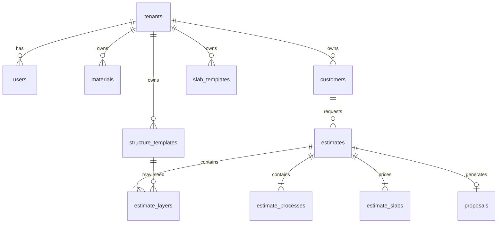

# ProPackHub Estimation Studio
## Strategic Product Requirements Document v3.0

**Version:** 3.0  
**Date:** 2026-06-11  
**Status:** Locked for architecture — ready to drive UI, DB, API, and implementation  
**Product:** ProPackHub Estimation Studio (ES)  
**Tagline:** Flexible Packaging Cost Estimator  
**Platform:** ProPackHub (PEBI · Formulation Studio · Estimation Studio)  
**Companion:** [LOCKED_DECISIONS.md](./LOCKED_DECISIONS.md) · [ESTIMATION_STUDIO_MASTER_PLAN.md](./ESTIMATION_STUDIO_MASTER_PLAN.md)

---

## Document purpose

This is **not** a functional spec that starts with tables and APIs. It is a **Strategic Product PRD** that starts with **business outcomes**, then derives architecture, UX, domain model, and technical design.

It replaces the original PRD (engineering-focused) and incorporates:

- Owner brief and ChatGPT PRD review (10 gaps)
- All locked strategic decisions (#2–#16, including #4 and #13)
- Answers to the 12-question strategic questionnaire

---

# Part 1 — Product Vision

## 1.1 Mission

Enable **packaging sales professionals** to design flexible packaging structures, calculate costs, generate slab-priced proposals, and track customer outcomes — from a single intelligent workspace.

## 1.2 What ES is — and is not

| ES is | ES is not |
|-------|-----------|
| A **standalone SaaS** anyone can register for | A module inside PEBI requiring a plant/ERP tenant |
| A **packaging sales platform** | A factory MES estimator |
| **Individual-first** (consultant, independent rep) with optional **company** tenant | Enterprise approval-heavy workflow in V1 |
| A **Flexible Packaging Cost Estimator** (public tagline) | “Packaging Intelligence Platform” as marketing headline |

**PEBI** retains its own internal `/estimator` wizard (inquiries, BOM2, routing, machine AI). **ES** serves external commercial users with personal costing libraries.

## 1.3 Long-term platform vision (Decision #1 — resolved)

```
ProPackHub Platform
├── Estimation Studio     ← this PRD (standalone SaaS)
├── Formulation Studio    ← standalone (existing)
└── PEBI                  ← enterprise ERP/MES (existing)
```

**Not V1:** Single monolith “Manufacturing Intelligence Platform.” Products stay **separate apps** with shared SSO and entitlements.

## 1.4 Product positioning

### Existing market tools

Most packaging estimators are Excel, legacy Access, ERP forms, or standalone calculators. They answer:

> *“How much does this structure cost?”*

### ProPackHub Estimation Studio answers

> *“What structure should I quote, at what slabs, with my costs, in a proposal I can send today?”*

**Public headline (Decision #16):** Flexible Packaging Cost Estimator  

**Internal richness:** Structure Canvas, pricing intelligence, branded slab proposals, customer tracking.

## 1.5 Target users (V1)

| Persona | Priority | Needs |
|---------|----------|--------|
| Independent packaging sales rep | Primary | Template → modify → slab quote → PDF in minutes |
| Independent consultant | Primary | Private cost library, branded proposals |
| Small converter sales desk | Secondary | Same as rep; optional company tenant |
| ProPackHub platform admin | Internal | Master library seed, subscriptions |

**Explicitly not V1 primary:** Enterprise managers, multi-level approval chains, plant MES operators.

## 1.6 Hero features (locked)

1. **Packaging Structure Canvas** — signature “Figma for Packaging” experience  
2. **Proposal Generator** — branded PDF with **quantity slab table**  
3. **Pricing Intelligence** — cost breakdown visible (material / process / waste / margin %)

## 1.7 End-to-end workflow (V1)

```
Design Structure → Calculate Price → Generate Proposal → Share → Track Customer Response → Win Business
```

Detailed:

```
Customer (simple record)
    ↓
New Estimate: Template OR Blank Canvas
    ↓
Structure Canvas (layers + dimensions)
    ↓
Cost Engine (real-time breakdown)
    ↓
Quantity Slabs (Decision #15)
    ↓
Branded Proposal PDF (Decision #12)
    ↓
Share (download / link Phase 2)
    ↓
Customer Response (manual status V1; portal Phase 2)
```

**No approval gate in V1 (Decision #13).**

---

# Part 2 — UX Philosophy & Design System

## 2.1 Design direction (Decision #11)

**Industrial Design Studio** — Figma for Packaging.

| Rejected | Chosen |
|----------|--------|
| A — ERP style (SAP) | |
| B — Generic modern SaaS (Notion) | |
| | **C — Industrial Design Studio** |

## 2.2 Core design principles

| # | Principle | Implementation |
|---|-----------|----------------|
| 1 | **Visual before numerical** | Structure Canvas is default view; numbers in sidebar |
| 2 | **Engineering before data entry** | Drag layers, edit in place — not spreadsheet rows |
| 3 | **Instant intelligence** | Every layer edit updates GSM, cost/kg, breakdown % |
| 4 | **Mobile-first sales** (Decision #8) | Rep can quote on tablet/phone via responsive PWA |

## 2.3 Signature experience — Packaging Structure Canvas

Instead of Layer 1 / Layer 2 / Layer 3 form fields:

```
┌─────────────────────────┐
│ PET 12µ                 │
├─────────────────────────┤
│ Gravure Ink             │
├─────────────────────────┤
│ Adhesive                │
├─────────────────────────┤
│ AL Foil 7µ              │
├─────────────────────────┤
│ Adhesive                │
├─────────────────────────┤
│ PE 60µ                  │
└─────────────────────────┘
```

Each layer: **color-coded · draggable · clickable · editable**

Live sidebar: total GSM, cost/m², cost/kg at reference quantity, breakdown widget.

## 2.4 Emotional arc

| Moment | User feeling |
|--------|--------------|
| Signup + library seed | “I can start immediately” |
| Pick template | “This is familiar” |
| Canvas edit | “I see what I’m selling” |
| Slab table | “One quote covers all quantities” |
| Proposal preview | “I’m proud to send this” |

## 2.5 Visual tokens (draft — finalize before React build)

| Token | Value |
|-------|-------|
| Primary | Teal `#0d9488` |
| Accent | Amber `#f59e0b` (slabs, CTAs) |
| Surface | Warm off-white `#fafaf9` |
| UI font | DM Sans |
| Numbers font | IBM Plex Mono |

**Do not** reuse PEBI Ant Design skin.

---

# Part 3 — Product Modules

## 3.1 Module map

| Module | V1 | Phase 2+ |
|--------|-----|----------|
| **Estimation Studio** (core) | Yes | — |
| **Formulation Studio link** | No (Decision #5) | Optional Formula → Template → Estimate |
| **Material Intelligence** | Current price only (#6) | History, forecasts, suppliers |
| **Customer Intelligence** | Simple customer table (#3) | Full Customer Workspace |
| **Approval Workflow** | **None** (#13) | Rule engine for Enterprise |
| **Quotation Engine** | Branded PDF + slabs (#12) | Interactive portal |
| **Analytics Hub** | Basic dashboard (#10) | Commercial analytics |
| **AI Assistant** | None (#9) | Structure/margin suggestions |
| **PEBI Integration** | None (#13 PEBI) | Optional product create |

## 3.2 Module 1 — Estimation Studio (V1 core)

**Primary costing workspace.**

| Feature | V1 |
|---------|-----|
| Packaging Structure Canvas | Yes |
| Real-time cost engine | Yes |
| Quantity slab pricing | Yes (Decision #15) |
| Slab templates | Yes |
| Cost breakdown widget | Yes |
| Process simulation (hours/cost) | Yes (port from Laravel) |
| Margin on estimate | Yes |
| Estimate duplicate | Yes |
| Template OR Blank Canvas entry | Yes (Decision #4) |
| My Templates (private) | Yes |
| Public template marketplace | **No** |

### Estimate creation (Decision #4)

```
New Estimate
  ○ Start from Template      → most users: Template → Modify → Quote
  ○ Start from Blank Canvas  → advanced: Canvas → Design → Quote
```

**My Templates:** Snack Pouch, Coffee Bag, Pet Food Pouch, Ice Cream Laminate, etc.

**Template tiers (architecture only in V1):**

| Tier | Phase |
|------|-------|
| Private (My Templates) | V1 |
| Shared workspace templates | Phase 2 |
| Marketplace templates | Future |

## 3.3 Module 2 — Formulation Studio (ecosystem)

**Decision #5:** V1 templates are **independent**. FS not required.

**Phase 2** (when tenant has ES + FS entitlements):

```
Formulation Studio → Material Structure → Template → Estimate → Quotation
```

## 3.4 Module 3 — Material Intelligence

**Decision #6 — V1:** Current `price_per_kg` only per material in tenant library.

**Phase 2:** `material_cost_history`, supplier prices, trends, volatility.

## 3.5 Module 4 — Customer Intelligence

**Decision #3 — V1:** Simple customer table.

| Field | Required |
|-------|----------|
| Name | Yes |
| Email | Optional |
| Phone | Optional |
| Notes | Optional |

Estimates link via `customer_id`. Quote history = filter estimates by customer.

**Phase 2:** Contacts, margin analysis, activities, approval rate, annual value.

## 3.6 Quotation Engine (Decision #12 + #15)

**Branded proposal PDF** including:

- Logo, brand color, footer, T&C (tenant settings)
- Customer name, estimate ref, date, validity
- Structure visual (canvas export)
- **Quantity slab pricing table**
- Cost summary optional (configurable hide for customer-facing)

**Phase 2:** Cover page, company profile, full tech spec pack, shareable link, customer accept/change.

## 3.7 Analytics (Decision #10)

**V1 basic dashboard:**

- Recent estimates
- Estimates this month
- Draft vs sent proposals
- Customer count

**Phase 2:** Top structures, margin erosion, material inflation, rep performance.

## 3.8 Approval Workflow (Decision #13)

**V1: Removed entirely.**

Do not build: manager role, approval queue, notifications, rejection, margin approval rules.

**Phase 2 (Enterprise tier only):** Rule engine (margin thresholds) if company tenants require it.

## 3.9 PEBI Integration (Decision #13 PEBI)

**V1: Option A — Nothing automatic.**

ES is fully standalone. No create-product-in-PEBI on approve/send.

**Phase 2+ (optional):** Manual or gated export for plant tenants with both entitlements.

---

# Part 4 — Multi-Tenant SaaS Design

## 4.1 Tenant model (Decision #2)

A **tenant** can be:

| Type | Example | V1 |
|------|---------|-----|
| **Individual** | Solo consultant | Default signup |
| **Company** | Interplast sales team | Supported |

**Not V1:** Corporate group hierarchy (holding company → multiple subsidiaries).

## 4.2 Personal Costing Environment (Decision #14)

```
ProPackHub Admin → Master Library (es_reference)
       ↓
User registers → tenant provisioned → full library copy
       ↓
User owns: materials, prices, waste, density, solids, machine costs, margins, terms, branding
```

Changes are **never** visible to other tenants.

## 4.3 Subscription tiers (draft)

| Tier | Audience | Includes |
|------|----------|----------|
| **Trial** | Evaluator | 14 days, watermarked PDF, estimate cap |
| **Starter** | Individual rep | Full V1 features, 1 user |
| **Pro** | Consultant / small team | Higher limits, no watermark, slab templates |
| **Enterprise** | Company tenant | Multi-user (Phase 2), approvals (Phase 2), analytics |

Managed via `propackhub_platform.app_subscriptions` with `app_key = 'es'`.

## 4.4 Entitlements

- ES accessible without PEBI or FS subscription
- FS → ES template import only when both entitlements active (Phase 2)
- PEBI internal estimator unaffected

---

# Part 5 — Domain Model

## 5.1 Core entities (tenant-scoped)

```
Tenant
├── User(s)
├── Settings (costing + proposal branding)
├── Materials (+ categories)
├── SlabTemplates
├── StructureTemplates (My Templates)
├── Customers
├── Estimates
│   ├── Layers
│   ├── Processes
│   └── Slabs
└── Proposals
```

## 5.2 Reference data (platform)

```
es_reference
├── reference_materials
├── reference_categories
└── reference_slab_presets (admin defaults)
```

## 5.3 Entity relationships



## 5.4 Key tables (tenant DB)

| Table | Purpose |
|-------|---------|
| `materials` | Tenant material library |
| `customers` | Simple CRM (#3) |
| `structure_templates` | My Templates (#4) |
| `slab_templates` | Reusable quantity presets (#15) |
| `estimates` | Header: customer, product_type, status, ref_qty |
| `estimate_layers` | Ordered stack |
| `estimate_processes` | Machine/process hours |
| `estimate_slabs` | quantity_kg, price_per_kg, sort_order |
| `proposals` | pdf_path, sent_at, status |
| `tenant_settings` | JSONB costing + branding |

## 5.5 Versioning

- **Template versioning:** structure templates versioned on save
- **Estimate snapshots:** layers/prices frozen on proposal generate (material price changes do not alter sent PDFs)
- **Material cost history:** Phase 2

## 5.6 Audit (Phase 2)

`activity_logs` for price/settings changes (gap #7). Not V1.

---

# Part 6 — User Workflows

## 6.1 Onboarding

1. Register (individual or company)
2. Platform grants ES entitlement / trial
3. Provision tenant DB + copy master library
4. Prompt: currency + logo in settings
5. Guided first estimate from template

## 6.2 Standard quote (sales rep)

1. New Estimate → **Start from Template** (e.g. Snack Pouch)
2. Adjust layers on Canvas
3. Review cost breakdown sidebar
4. Add slabs (1T / 2T / 5T / 10T) — apply slab template optional
5. Select customer (or quick-create)
6. Generate branded PDF → Share

**Target time:** credible customer-ready quote in **≤ 3 minutes** (mobile-capable).

## 6.3 Advanced quote (consultant)

1. New Estimate → **Blank Canvas**
2. Build structure from tenant material library
3. Same slab + proposal flow

## 6.4 Slab re-quote (Decision #15)

Customer asks “what about 10 tons?” — add/edit slab row; regenerate proposal. **Same estimate.**

## 6.5 Mobile (Decision #8)

Sales rep on site: responsive web / PWA — view estimate, adjust slabs, send PDF. No executive dashboard on mobile in V1.

---

# Part 7 — Technical Architecture

## 7.1 Product architecture

**Standalone monorepo** (mirror Formulation Studio):

```
propackhub-es/
├── packages/engine/    # Pure TS costing + slab math (unit tested)
├── packages/server/    # API, tenancy, PDF, auth
└── packages/web/       # React SPA — Industrial Design Studio UI
```

**Ports (dev):** Web 5000 · API 5001

**Database:** PostgreSQL — `es_reference` + `es_tenant_{id}` (or single DB + `tenant_id` — implementer choice; master plan recommends separate tenant DBs for isolation).

## 7.2 Cost engine

- Port Laravel `FormController` math: layers, GSM, waste, roll/pouch paths, process hours
- Single server-side source of truth
- Golden tests from legacy estimates

**Cost breakdown widget (V1):**

| Component | Example % |
|-----------|-----------|
| Material | 68% |
| Process | 18% |
| Waste | 9% |
| Margin | 5% |

## 7.3 API (REST `/api/v1`)

| Group | Endpoints |
|-------|-----------|
| Auth | login, callback (SSO Phase 2), me |
| Library | materials CRUD, categories |
| Templates | structure_templates CRUD, duplicate |
| Slab templates | slab_templates CRUD |
| Customers | CRUD |
| Estimates | CRUD, calculate, slabs |
| Proposals | generate PDF, download |
| Settings | costing, proposal branding |
| Dashboard | basic stats |

## 7.4 PDF generation

- Server-side template → PDF (PDFKit or Puppeteer — choose in implementation)
- Embed structure visual export from canvas
- Slab table required

## 7.5 Platform integration

| Integration | V1 | Phase 2 |
|-------------|-----|---------|
| ProPackHub login / SSO | Local auth OK for beta | HS256 SSO like FS master plan |
| ProductPicker tile | Yes | — |
| Master library admin (PPH) | Yes | — |
| FS import | No | API |
| PEBI product create | No | Optional |

## 7.6 Security

- JWT with `tenant_id` claim; every query scoped
- Tenant isolation enforced at DB connection or row level
- Proposal PDFs tenant-scoped storage
- Public proposal links: Phase 2 with unguessable tokens

## 7.7 Legacy Laravel parity

| Laravel | ES v3 |
|---------|-------|
| Form CRUD | Estimates + Canvas |
| array_fields | estimate_layers |
| secondary_table dims | engine product paths |
| second/third array | estimate_processes |
| Materials CRUD | Library (#14) |
| downloadPDF | Proposal engine (#12) |
| Single orderQuantity | estimate_slabs (#15) |

---

# Part 8 — V1 Scope Summary

## 8.1 In scope

- Individual + company tenants (#2)
- Admin-seeded library + tenant copy (#14)
- Template OR Blank Canvas (#4)
- My Templates (private)
- Structure Canvas (#11)
- Cost engine + breakdown
- Quantity slabs + slab templates (#15)
- Simple customers (#3)
- Branded PDF with slab table (#12)
- Basic dashboard (#10)
- Current material prices only (#6)
- Sales rep mobile/PWA (#8)
- No approvals (#13)
- No AI (#9)
- No PEBI auto-create (#13 PEBI)
- Independent of FS (#5)

## 8.2 Out of scope (V1)

- Approval workflow
- AI assistant
- Material cost history / forecasting
- Full Customer Workspace
- Commercial analytics
- Interactive proposal portal
- Template marketplace
- FS / PEBI integration
- Activity logs / compliance module
- React Native app
- Multi-user company teams (optional Phase 2)

---

# Part 9 — Roadmap

| Phase | Duration (est.) | Deliverables |
|-------|-----------------|--------------|
| **0** | 1 week | Laravel extract, costing golden tests, design wireframes |
| **1** | 1 week | Repo bootstrap, engine + migrations |
| **2** | 4–6 weeks | V1 features per §8.1 |
| **3** | 1–2 weeks | ProPackHub SSO, ProductPicker, admin library UI |
| **4** | 8+ weeks | Customer workspace, material history, portal, FS link, Enterprise approvals |

---

# Part 10 — Locked Decisions Index

| # | Decision |
|---|----------|
| 2 | Tenant = **individual OR company** |
| 3 | **Simple customer table** V1 |
| 4 | **Template OR Blank Canvas**; My Templates; no marketplace V1 |
| 5 | **Independent templates** V1; FS link Phase 2 |
| 6 | **Current cost only** V1 |
| 8 | **Mobile: sales reps only** (responsive/PWA) |
| 9 | **No AI** V1 |
| 10 | **Basic dashboards** V1 |
| 11 | **Industrial Design Studio** (Figma for Packaging) |
| 12 | **Branded proposal + slab pricing table** |
| 13 | **No approval workflow** V1 |
| 13b | **No PEBI auto-create** V1 |
| 14 | **Admin-seeded library + personal costing environment** |
| 15 | **Quantity slab pricing** |
| 16 | **Tagline: Flexible Packaging Cost Estimator** |

---

# Part 11 — Success Metrics (V1)

| Metric | Target |
|--------|--------|
| Time to first quote (new user) | ≤ 15 min after signup |
| Time to customer-ready PDF (rep) | ≤ 3 min from template |
| Estimates / active user / month | ≥ 8 |
| Proposal generation rate | ≥ 70% of completed estimates |
| Tenant library isolation | 0 cross-tenant leaks |

---

# Part 12 — Open implementation choices (non-blocking)

| Topic | Options | Recommendation |
|-------|---------|----------------|
| Tenant DB | Separate DB vs single DB + tenant_id | Separate `es_tenant_*` for isolation (FS pattern) |
| PDF engine | PDFKit vs Puppeteer | Puppeteer if canvas HTML fidelity matters |
| Frontend stack | Vite + React (match PPH/FS) | Vite 5 + React 18 — not Next.js unless SSR needed for marketing site |

---

*End of ProPackHub Estimation Studio — Strategic PRD v3.0*

**Download:** This file is `ES_PRD_v3_STRATEGIC.md` in `D:\PPH 26.4\Estimator app\`
