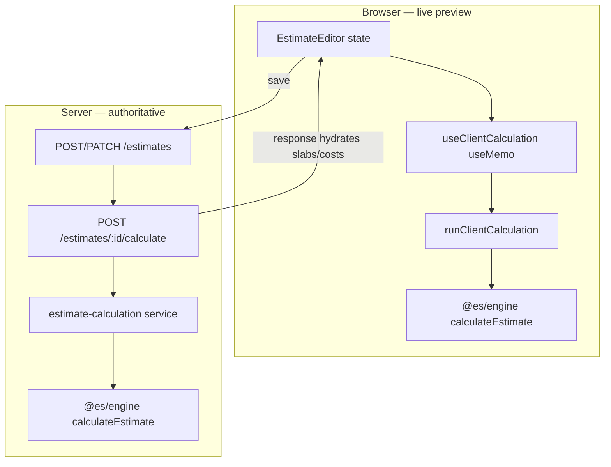
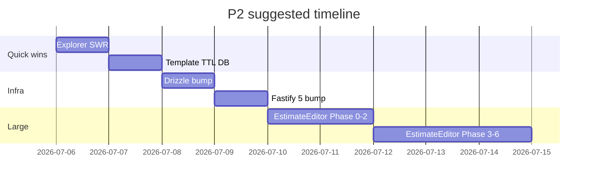

# P2 deferred work — implementation plan

**Created:** 2026-07-05  
**Scope:** Four items deferred from the perf/security bundle. This doc is the execution blueprint — order, file targets, calculation safety rules, and acceptance criteria.

| Item | Effort | Risk if rushed |
|------|--------|----------------|
| Split `EstimateEditor.tsx` | Multi-day | Pricing regressions, client/server calc drift |
| Fastify 5 / Drizzle major bumps | 1–2 days + CI | Plugin breakage, migration drift |
| Explorer stale-while-revalidate | ~2 hours | Stale UI if cache keys wrong |
| Multi-instance template TTL | Half day+ | Over-sync or missed invalidation |

**Recommended order:** Explorer SWR → Template TTL → Fastify/Drizzle → EstimateEditor split (largest, needs stable infra).

---

## 1. Split `EstimateEditor.tsx` (~3,822 lines)

### 1.1 What the file does today (responsibility map)

`packages/web/src/pages/EstimateEditor.tsx` is a **god component**. It owns:

| Concern | Lines (approx) | Notes |
|---------|----------------|-------|
| **State** | 148–320 | 40+ `useState` fields: layers, slabs, pricing v2, tooling, dimensions, accessories, UI chrome |
| **Derived / calc memos** | 193–1480 | 20+ `useMemo` blocks feeding live preview |
| **Data loading** | 639–1100 | `loadBaseData`, `fetchEstimate`, template/scratch hydration, offline draft flush |
| **Save / persist** | 1183–1850 | `buildSavePayload`, create vs patch, post-save `calculateEstimate` |
| **Layer mutations** | scattered | insert/remove/reorder, ink-only edits when `structureLocked` |
| **JSX — structure tab** | 2695–3400 | Layer grid, visualizer, solvent panel, processes |
| **JSX — slabs tab** | 3406–3460 | `PriceListPanel` |
| **JSX — sidebar / summary** | 3463–3820 | Production summary, cost tiles, proposals, MES hooks |

Already extracted (keep as-is):

- `@es/engine` — all math (`calculateEstimate`, waste bands, solvent mix, structure signature)
- `lib/estimateCalc.ts` — client preview adapter (`runClientCalculation`)
- `lib/estimateConfigure.ts` — process catalog, dimension validation
- `components/EstimateProcessesPanel`, `FilmStackVisualizer`, `PouchConfigurator`, `BagConfigurator`, `PriceListPanel`, `JobHeaderFields`

The monolith’s job is **orchestration + wiring**, not math. The split must not duplicate formulas.

### 1.2 Calculation architecture (must preserve)



**Golden rule:** Client preview is for **responsiveness**. Server `calculateEstimate` after save is **source of truth** for persisted slabs, snapshots, and PDFs.

#### Client calc pipeline (do not break)

1. **Inputs assembled** in `clientCalcResult` useMemo (~L1298):
   - Layers with optional per-layer price override (virtual material IDs)
   - Materials library + patched overrides
   - Dimensions JSONB (+ pouch accessories)
   - Processes, waste bands, pricing method v2, CoRM, tooling lump sums
   - Order quantity + unit definition from master data
   - Solvent / lamination / ink dilution overrides

2. **`runClientCalculation`** (`lib/estimateCalc.ts`):
   - Builds `Material` map, calls `derivePrintingWebClass`, `stackNeedsSolventMix`
   - Converts display currency charges → USD at engine boundary
   - Invokes `calculateEstimate` from `@es/engine`
   - Returns `{ estimate, slabs }` shape matching server

3. **Downstream memos** (all depend on `clientCalcResult`):
   - `solventCostLines`, `solventTotalPerKgUsd`, `rmTotals`, `structureMetrics`
   - `visualizerLayers`, order-quantity cross-unit metrics, sidebar stat tiles

4. **Server parity trigger points:**
   - After save: `apiClient.calculateEstimate(estimate.id)` (~L1784, L1813)
   - Slabs tab entry reloads master data (~L777)

#### Calculation-sensitive extraction rules

1. **One hook owns the calc input object:** `useClientCalculation(input)` — single `useMemo` with explicit dependency array copied verbatim from today. No splitting that memo across files until parity tests pass.

2. **No math in JSX** — sidebar tiles only format numbers from hook outputs.

3. **Layer price override logic stays with calc** — the virtual-material-id trick (L1303–1314) is easy to break.

4. **Waste band + print mode coupling** — `structureIsPrinted(layers)` drives `wastePrintMode` → `wasteBands` → engine. Keep in same hook as calc or pass as explicit prop.

5. **Process cost catalog sync** — `normalizeLoadedProcesses` effect (L216–230) must run before calc when master data loads.

### 1.3 Target folder structure

```
packages/web/src/features/estimate-editor/
  index.ts                          # re-export default for lazy route
  EstimateEditor.tsx                # ~150 lines: layout shell, providers, section router
  EstimateEditorContext.tsx         # shared state (useReducer recommended)
  types.ts                          # LayerItem, DimensionState, editor props

  hooks/
    useEstimateEditorState.ts       # useReducer: core fields + actions
    useEstimateLoader.ts            # loadBaseData, fetchEstimate, hydrate paths
    useEstimateSave.ts              # buildSavePayload, handleSave, post-save calculate
    useClientCalculation.ts         # THE calc memo + derived metrics (extract as unit)
    useEstimateLayers.ts            # CRUD, drag-drop, insertInkLayerAfter
    useEstimateNavigation.ts        # goToSection, ensureStructureReady, returnTo

  sections/
    EstimateHeader.tsx              # back, save, status, section tabs
    StructureSection.tsx            # layer table + visualizer + solvent + processes
    DimensionsSection.tsx           # roll/sleeve fields + Pouch/Bag configurators
    SlabsSection.tsx                # PriceListPanel wrapper
    EstimateSummarySidebar.tsx      # production summary + cost breakdown tiles

  __tests__/
    client-calculation.parity.test.ts   # client vs fixture
    estimate-editor.smoke.test.tsx        # render + tab switch
```

`pages/EstimateEditor.tsx` becomes a thin re-export for backward-compatible imports:

```tsx
export { default } from '../features/estimate-editor';
```

### 1.4 Phased execution (multi-day)

Each phase = one PR, manually tested on roll + pouch + price-check flows.

#### Phase 0 — Safety net (0.5 day)

**Before moving any UI:**

1. Add `client-calculation.parity.test.ts`:
   - Fixtures: Mono PE plain roll, Triplex printed, pouch with accessories, margin_per_kg user
   - Assert key outputs: `totalGsm`, `materialCostPerKg`, `salePricePerKg`, slab prices, solvent lines
   - Source fixtures from engine golden tests where possible (`packages/engine/src/*.test.ts`)

2. Add Playwright or Vitest browser smoke (optional but valuable):
   - Open known estimate ID → structure tab shows layers → slabs tab loads

3. Capture 3 manual baseline screenshots / JSON dumps from dev (roll, pouch, price check).

**Exit:** Tests green on current monolith; baseline recorded.

#### Phase 1 — Extract calc hook only (0.5 day)

Move L1295–1480 (+ dependencies L193–427, L267–289) into `useClientCalculation.ts`.

- Hook signature:

```ts
function useClientCalculation(deps: ClientCalculationDeps): {
  clientCalcResult: ClientCalcResult | null;
  solventCostLines: ...;
  structureMetrics: ...;
  visualizerLayers: ...;
  orderQtyMetrics: ...;
  // all derived values consumed by sidebar/structure
}
```

- `EstimateEditor.tsx` calls hook; JSX unchanged.

**Exit:** Zero visual diff; parity tests still pass.

#### Phase 2 — State reducer (1 day)

Replace 40 `useState` calls with `useEstimateEditorState` (`useReducer`).

- Action groups: `LOAD_ESTIMATE`, `SET_LAYERS`, `PATCH_DIMENSIONS`, `SET_PRICING`, `SET_PROCESSES`
- Loader hook dispatches `LOAD_ESTIMATE` instead of 15 setter calls
- Reducer file is pure — easy to unit test

**Exit:** Save/load flows work; no calc changes.

#### Phase 3 — Loader + save hooks (0.5 day)

Extract:

- `useEstimateLoader` — `loadBaseData`, `fetchEstimate`, `hydrateFromInstantiated`, init `useEffect`
- `useEstimateSave` — `buildSavePayload`, create/patch, `calculateEstimate` after save

Keep `createInFlightRef` guard in save hook.

**Exit:** New estimate, template instantiate, re-quote, price-check paths verified.

#### Phase 4 — Structure section JSX (1 day)

Move L2695–3400 → `StructureSection.tsx`.

- Props: slice of context + layer handlers from `useEstimateLayers`
- `structureColumns` definition moves with the table
- `renderInkControlsCell` moves with table

**Exit:** Structure tab pixel-identical; drag-drop + ink add/remove work.

#### Phase 5 — Sidebar + slabs (0.5 day)

- `EstimateSummarySidebar.tsx` — stat tiles, solvent expand, cost panels
- `SlabsSection.tsx` — existing `PriceListPanel` props unchanged
- `DimensionsSection.tsx` — configurators + dimension fields

**Exit:** All three tabs work; embedded mode in `QuoteWorkspace` unchanged.

#### Phase 6 — Header + context cleanup (0.5 day)

- `EstimateEditorContext` wraps children; remove prop drilling
- `EstimateHeader.tsx` — tabs, save button, back link
- Final line count target: shell < 200 lines, no file > 800 lines

**Exit:** ESLint max-lines per file passes (add rule at 600 warn / 800 error).

### 1.5 Regression checklist (every phase)

| Scenario | What to verify |
|----------|----------------|
| New scratch roll | Default layers, calc preview populates |
| Template → configure | `structureLocked`, ink-only edits |
| Triplex + SB ink | Solvent lines, dilution costs |
| Pouch + zipper accessory | Dimensions + accessory costing |
| margin_per_kg user | Slab prices use margin not markup |
| Save → reload | Server slabs match client preview ± rounding |
| Price check mode | No customer required; returnTo correct |
| Embedded in quote workspace | `hidePriceListTab`, `onSaved` fire |
| Visibility profile | `can('materialCostPerKg')` hides cost columns |

### 1.6 What we explicitly will NOT do in this split

- Re-write engine formulas in the web layer
- Introduce React Query mid-split (adds moving parts)
- Change API contracts
- Split `PriceListPanel` or engine package (separate initiative)

---

## 2. Fastify 5 / Drizzle major bumps

### 2.1 Current versions

| Package | Now | Target |
|---------|-----|--------|
| `fastify` | ^4.26.2 | ^5.x |
| `@fastify/jwt` | ^8.x | ^9.x (Fastify 5 compatible) |
| `@fastify/cors` | ^9.x | ^10.x |
| `@fastify/helmet` | ^11.x | ^12.x |
| `@fastify/compress` | ^7.x | verify 8.x |
| `@fastify/rate-limit` | present | verify major |
| `@fastify/swagger` + UI | present | verify majors |
| `drizzle-orm` | ^0.30.10 | ^0.38+ (latest stable) |
| `drizzle-kit` | ^0.20.14 | match ORM major |

### 2.2 Execution plan

#### Step A — Inventory (2 hours)

1. `npm outdated` in `packages/server`
2. Read Fastify 5 migration guide: [https://fastify.dev/docs/latest/Guides/Migration-Guide-V5/](https://fastify.dev/docs/latest/Guides/Migration-Guide-V5/)
3. Grep for deprecated APIs:
   - `reply.send` patterns with schema validation changes
   - `fastify-plugin` version compatibility
   - Logger / `request.id` changes
   - `TypeBoxTypeProvider` + `@fastify/type-provider-typebox` version pin

#### Step B — Branch + bump Drizzle first (4 hours)

Drizzle is independent of Fastify — ship separately if needed.

1. Bump `drizzle-orm` + `drizzle-kit`
2. Fix breaking changes:
   - `push:pg` → `push` (kit CLI rename in newer versions)
   - `generate:pg` → `generate`
   - Relation API / `$inferSelect` if moved
   - `db.execute(sql`...) typing
3. Run:
   - `npm run db:migrate`
   - `npm run test:migration`
   - `npm run test --workspace=packages/server`
4. CI: confirm fresh Postgres still provisions from migrations alone

#### Step C — Bump Fastify + plugins (4 hours)

1. Upgrade `fastify` to 5.x in one commit
2. Upgrade all `@fastify/*` to Fastify-5-compatible majors together (avoid mixed tree)
3. Fix `app.ts`:
   - Plugin registration order (helmet, cors, compress, jwt, rate-limit)
   - `buildApp()` test helper used by integration tests
4. Fix route files if request/reply generics changed
5. Run full server test suite + integration tests against `estimation_studio_test`

#### Step D — CI hardening (2 hours)

1. Add explicit `npm run typecheck` gate (already in CI)
2. Run integration tests in CI (already have Postgres service)
3. Smoke: `pdf:test` (continue-on-error ok)
4. Document any new env vars in `.env.example`

### 2.3 Rollback strategy

- One PR per ecosystem (Drizzle PR, Fastify PR) — never combine
- Tag pre-bump commit for quick revert
- No schema changes in Fastify PR

### 2.4 Acceptance

- [ ] CI green on Node 22
- [ ] `db:migrate` idempotent on empty DB
- [ ] Login + list templates + save estimate manual smoke
- [ ] No new TypeScript errors in server

---

## 3. Client explorer stale-while-revalidate (~2 hours)

### 3.1 Problem

`CustomerExplorer.tsx` refetches on every mount:

```ts
useEffect(() => {
  const t = setTimeout(() => { void load(); }, 200);
  return () => clearTimeout(t);
}, [load]);
```

`load()` sets `loading=true` → blank/spinner → 2–3s wait on back navigation even when data was fetched seconds ago.

Templates page feels slow for a similar reason (full reload, no cache).

### 3.2 Solution — lightweight cache (no new dependency)

No React Query in the project today. Add a tiny module cache instead of adopting TanStack Query for one screen.

**New file:** `packages/web/src/lib/explorerCache.ts`

```ts
type ExplorerCacheEntry = {
  customerId: string;
  search: string;
  data: CustomerExplorerResponse;
  fetchedAt: number;
};

const TTL_MS = 60_000; // 1 min stale-while-revalidate
const cache = new Map<string, ExplorerCacheEntry>();

function cacheKey(customerId: string, search: string) {
  return `${customerId}\0${search.trim().toLowerCase()}`;
}

export function getExplorerCached(customerId: string, search: string) {
  const hit = cache.get(cacheKey(customerId, search));
  if (!hit) return null;
  return hit;
}

export function setExplorerCached(entry: ExplorerCacheEntry) {
  cache.set(cacheKey(entry.customerId, entry.search), entry);
}

export function invalidateExplorer(customerId?: string) {
  if (!customerId) { cache.clear(); return; }
  for (const key of cache.keys()) {
    if (key.startsWith(`${customerId}\0`)) cache.delete(key);
  }
}

export function isStale(entry: ExplorerCacheEntry) {
  return Date.now() - entry.fetchedAt > TTL_MS;
}
```

### 3.3 Hook: `useCustomerExplorer`

```ts
function useCustomerExplorer(customerIdParam: string, search: string) {
  const [quotes, setQuotes] = useState<ExplorerQuote[]>(() =>
    getExplorerCached(customerIdParam, search)?.data.quotes ?? []
  );
  const [loading, setLoading] = useState(() => !getExplorerCached(...));
  const [revalidating, setRevalidating] = useState(false);

  const load = useCallback(async (opts?: { background?: boolean }) => {
    const cached = getExplorerCached(customerIdParam, search);
    if (cached && !opts?.background) {
      setQuotes(cached.data.quotes);
      setLoading(false);
    }
    if (cached && !isStale(cached) && !opts?.background) return;

    setRevalidating(true);
    try {
      const data = await apiClient.getCustomerExplorer(...);
      setExplorerCached({ customerId: customerIdParam, search, data, fetchedAt: Date.now() });
      setQuotes(data.quotes);
    } finally {
      setLoading(false);
      setRevalidating(false);
    }
  }, [customerIdParam, search]);
}
```

**UX:** Show cached cards immediately; subtle top bar pulse while `revalidating` (no full-page spinner).

### 3.4 Invalidation points

Call `invalidateExplorer(customerId)` when:

- Estimate saved/deleted from explorer
- Quote created/deleted
- Re-quote completes
- Customer renamed

Optional: `invalidateExplorer()` on logout in `AuthContext`.

### 3.5 Templates page (stretch +1 hour)

Same pattern for `StandardTemplates.tsx` → `templatesCache.ts` keyed by `tenantId + masterDataVersion`.

Server already has 5-min prepare TTL; client cache aligns with that (60s SWR, not 5min).

### 3.6 Acceptance

- [ ] Back from estimate → explorer shows previous list in <100ms
- [ ] Background refresh updates row if estimate changed elsewhere
- [ ] Search change bypasses stale entry (different cache key)
- [ ] Delete/create invalidates and shows fresh data

---

## 4. Multi-instance template TTL (Redis / DB flag)

### 4.1 Problem

`packages/server/src/routes/templates.ts`:

```ts
const TEMPLATE_PREPARE_TTL_MS = 5 * 60 * 1000;
const templatePrepareLastRun = new Map<string, number>(); // in-process only
```

With 2+ API instances behind a load balancer:

- Instance A runs heavy `prepareTemplatesForTenant` (seed, sync, prune, relink)
- Instance B has cold map → runs same passes again on next request
- Material/template writes call `invalidateTemplatePrepareCache(tenantId)` but only on **that** instance

Single-instance dev is fine; production horizontal scaling is not.

### 4.2 Options

| Approach | Pros | Cons |
|----------|------|------|
| **Redis TTL key** | Fast, native expiry, pub/sub invalidation | Needs Redis in prod |
| **Postgres flag** | No new infra; already have DB | Extra row read/write per list |
| **Sticky sessions** | Zero code | Uneven load; doesn't fix invalidation |

**Recommendation:** Postgres first (matches current stack), Redis adapter later if prepare latency matters.

### 4.3 Postgres design

**New table** (migration):

```sql
CREATE TABLE tenant_template_prepare (
  tenant_id UUID PRIMARY KEY REFERENCES tenants(id) ON DELETE CASCADE,
  prepared_at TIMESTAMPTZ NOT NULL DEFAULT NOW(),
  prepare_version INT NOT NULL DEFAULT 1  -- bump on invalidation
);
```

**Read path** (`prepareTemplatesForTenant`):

```ts
const TTL_MS = 5 * 60 * 1000;
const row = await db.select().from(tenantTemplatePrepare).where(eq(tenantId, ...));
if (row && Date.now() - row.preparedAt.getTime() < TTL_MS) return;

await runAllPreparePasses(tenantId);

await db.insert(tenantTemplatePrepare)
  .values({ tenantId, preparedAt: new Date(), prepareVersion: 1 })
  .onConflictDoUpdate({ set: { preparedAt: new Date() } });
```

**Invalidation** (replace in-memory Map):

```ts
export async function invalidateTemplatePrepareCache(tenantId?: string) {
  if (tenantId) {
    await db.delete(tenantTemplatePrepare).where(eq(tenantId, tenantId));
    // optional: INSERT with prepared_at = epoch to force immediate refresh
  } else {
    await db.delete(tenantTemplatePrepare); // platform-wide material sync
  }
}
```

Wire existing callers:

- `routes/materials.ts` — after material price sync
- `db/platform-master-data.ts` — after platform master bump

### 4.4 Concurrency guard

Two instances hitting expired TTL simultaneously could double-run prepare. Acceptable (idempotent passes) but wasteful.

**Optional advisory lock:**

```ts
await db.execute(sql`SELECT pg_advisory_xact_lock(hashtext(${tenantId}))`);
```

Only one instance runs prepare per tenant at a time.

### 4.5 Redis upgrade path (later)

If Redis is added for sessions/cache:

```ts
// SET es:template-prepare:{tenantId} 1 EX 300 NX
// DEL on invalidation
// Pub/sub channel for cross-instance invalidate without waiting for TTL
```

Keep `invalidateTemplatePrepareCache` as the single API; swap implementation behind interface:

```ts
// services/template-prepare-cache.ts
export interface TemplatePrepareCache {
  shouldSkip(tenantId: string): Promise<boolean>;
  markPrepared(tenantId: string): Promise<void>;
  invalidate(tenantId?: string): Promise<void>;
}
```

### 4.6 Acceptance

- [ ] Two server processes: second request within 5 min skips prepare (log line confirms)
- [ ] Material PATCH on instance A → instance B list triggers prepare on next request
- [ ] Integration test with mocked clock or short TTL (30s in test env)
- [ ] No regression in templates list latency on dev (single instance)

---

## 5. Cross-cutting dependencies



---

## 6. Files touched (summary)

| Task | Primary files |
|------|----------------|
| EstimateEditor split | `pages/EstimateEditor.tsx` → `features/estimate-editor/**`, tests |
| Fastify/Drizzle | `packages/server/package.json`, `app.ts`, `db/**`, CI workflow |
| Explorer SWR | `CustomerExplorer.tsx`, new `lib/explorerCache.ts`, `AuthContext` invalidate |
| Template TTL | `routes/templates.ts`, new migration, `materials.ts`, `platform-master-data.ts` |

---

## 7. Success metrics

| Metric | Before | Target |
|--------|--------|--------|
| `EstimateEditor.tsx` lines | 3,822 | <200 shell; no child file >800 |
| Explorer back-nav perceived load | 2–3s spinner | <100ms cached paint |
| Templates list (warm, single instance) | 5–10s | unchanged or better (TTL already 5min) |
| Multi-instance duplicate prepare | every request on cold instance | ≤1 per tenant per 5 min cluster-wide |
| Server major versions | Fastify 4, Drizzle 0.30 | Fastify 5, Drizzle latest stable |
