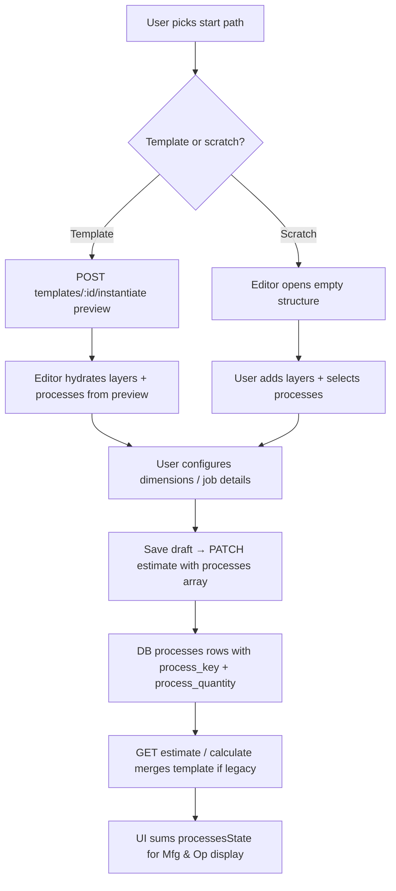

# Process costing & estimate flow — session handoff (2026-07-02)

> **Read this first** in the next session before changing process/Mfg & Operating logic or the estimate editor flow.
>
> **Audience:** Next agent / developer continuing Estimation Studio (`apps/estimation-studio`).
>
> **User context:** Owner validated **Laminates · Triplex** template configuration (extrusion ×1, printing ×1, lamination ×**2**, slitting ×1). UI still showed **USD 1.20/kg** Mfg & Operating instead of **USD 1.90/kg**. Scratch (“build from blank”) did not start with empty layers and did not enforce process selection before estimation.
>
> **➡️ APPROVED PLAN:** Sections 1–11 below are the *diagnosis* (why it broke). The **execution-ready implementation plan** (approved 2026-07-02) is at the bottom: **[Part B — Approved Implementation Plan](#part-b--approved-implementation-plan-smart-structure-driven-process-costing)**. Implementers should follow Part B; use 1–11 as background.

---

## 1. What we were trying to do

Estimation Studio quotes have a sidebar line **Manufacturing & Operating** (Mfg & Op), expressed as **USD/kg** (or display currency). It is the sum of enabled manufacturing processes, each with:

- A **master cost per kg** (`costPerKgUsd` in platform Master Data → Processes), and  
- A **quantity** (`process_quantity`) — how many times that step applies on the job (e.g. lamination ×2 for triplex).

### Two ways to start an estimate

| Path | Entry | Structure | Processes |
|------|--------|-----------|-----------|
| **From template** | Templates → pick e.g. *Laminates · Triplex* | Layer stack from template (structure locked for substrates/adhesives) | **Defined on the template** (`default_processes` JSON) — user/admin configured this in Template Builder |
| **From scratch** | New estimate → *Build from blank* | User builds layers freely | **User must define** which processes apply (and quantities) before pricing |

**Business rule (owner):** Process selection is **not** something to infer at quote time from layer count alone. For template quotes, the **template is the source of truth**. For scratch quotes, the **user explicitly selects** processes in Structure before moving to quantity slabs / pricing.

---

## 2. Manufacturing processes — business meaning

Master Data defines these process codes (USD/kg defaults as of 2026-07):

| Code | Label | Default USD/kg | Typical use |
|------|--------|----------------|-------------|
| `extrusion` | Extrusion | 0.40 | Blown/cast PE film — mono PE, or **in-house LDPE sealant** on laminates |
| `printing` | Printing | 0.80 | Flexo/gravure when ink layer present |
| `lamination` | Lamination | 0.30 | One bonding pass (adhesive + nip) |
| `slitting` | Slitting | 0.10 | Reel to finished width |
| `pouch_making` | Pouch Making | 0.80 | Converting roll → pouches |
| `bag_making` | Bag Making | 0.50 | Converting roll → bags |
| `seaming` | Seaming | 0.50 | Sleeves |

**`process_quantity`** multiplies the per-kg cost:

```
Mfg & Op (USD/kg) = Σ (enabled process costPerKgUsd × process_quantity)
```

### Laminates · Triplex — owner-approved template

**Layer stack (simplified):**  
`PET → Ink → Adhesive → Alu → Adhesive → LDPE`

**Template `default_processes` (as saved in DB, 2026-07-02):**

```json
[
  { "process_key": "printing",   "enabled": true, "process_quantity": 1 },
  { "process_key": "lamination", "enabled": true, "process_quantity": 2 },
  { "process_key": "slitting",   "enabled": true, "process_quantity": 1 },
  { "process_key": "extrusion",  "enabled": true, "process_quantity": 1 }
]
```

**Correct Mfg & Op:**

| Process | Qty | USD/kg | Subtotal |
|---------|-----|--------|----------|
| Extrusion | 1 | 0.40 | 0.40 |
| Printing | 1 | 0.80 | 0.80 |
| Lamination | **2** | 0.30 | **0.60** |
| Slitting | 1 | 0.10 | 0.10 |
| **Total** | | | **1.90** |

**Wrong number the user saw: 1.20** = printing (0.80) + lamination (0.30)×**1** + slitting (0.10), **no extrusion**, **lamination counted once**. That matches the **old seed template** (3 processes, all qty 1) or legacy DB rows, not the owner-configured template.

---

## 3. How the system is *supposed* to work (architecture)



### Template instantiate (preview)

- **File:** `packages/server/src/routes/templates.ts` → `instantiateTemplateRoute` (preview mode).
- Reads `template.defaultProcesses`, maps to API shape with `processKey`, `processQuantity`, master costs.
- **Nothing is written to DB** until user saves the estimate.

### Estimate save

- **File:** `packages/web/src/pages/EstimateEditor.tsx` → `buildSavePayload` includes `processes` from `processesState`.
- **File:** `packages/server/src/routes/estimates.ts` → `insertProcessCompat` (modern vs legacy schema).

### Estimate load + calculate

- **File:** `packages/server/src/utils/estimate-processes.ts` → `resolveEstimateProcesses()`.
- Used by `GET /estimates/:id` and `calculateAndPersistEstimate`.
- When `source_template_key` is set, should reconcile DB rows with template `default_processes` if data is missing or legacy.

### UI display

- **File:** `EstimateEditor.tsx` — sidebar reducer sums `processesState` with `resolveProcessPerKgUsd()` × `processQuantity`.
- **File:** `packages/web/src/lib/estimateConfigure.ts` — process cost catalog from Master Data.

---

## 4. What we changed in this session (partial fixes)

| Change | Intent | Files |
|--------|--------|-------|
| Template process reconcile on GET/calculate | Return template `default_processes` when DB rows empty or legacy (`process_key` null) | `utils/estimate-processes.ts`, `routes/estimates.ts`, `services/estimate-calculation.ts` |
| `EstimateProcessesPanel` in Structure tab | Show/edit processes on estimates (not only in Template Builder) | `components/EstimateProcessesPanel.tsx`, `EstimateEditor.tsx` |
| `validateConfiguredEstimate` requires ≥1 process | Block navigation to Quantity Slabs / Costs tabs | `estimateConfigure.ts`, `goToSection` in editor |
| Scratch opens Structure with `needsConfiguration` | Nudge user to configure first | `EstimateEditor.tsx` init branch |
| Mfg & Op catalog fix (earlier) | Master `costPerKgUsd` by name/code, not only extrusion hourly fallback | `estimateConfigure.ts`, `EstimateEditor.tsx` |
| `kill-es-ports.bat` | Fix PowerShell `$pid` read-only variable → `$listenerPid` | `scripts/kill-es-ports.bat` |
| React hooks order | Move `useCallback` before early `return` on loading | `EstimateEditor.tsx` |

**These fixes are incomplete.** User still sees **1.20** on Triplex and scratch flow is not correct.

---

## 5. Why Triplex still shows 1.20 (root causes)

### 5.1 Reconcile logic stops too early

`processesNeedTemplateReconcile()` in `estimate-processes.ts` returns **false** when:

- Every DB row has a non-null `process_key`, and  
- Every template process exists in DB (matched by key/name).

It does **not** compare `process_quantity` or `enabled` to the template.

**Scenario:** Draft was saved once with modern columns but wrong values (all qty = 1, or missing extrusion in an older save). Reconcile **skips** → GET returns stale DB rows → UI shows **1.20**.

**Fix needed:** Reconcile when `process_quantity` or `enabled` differs from template defaults, OR always treat template `default_processes` as authoritative for template-based quotes until user explicitly overrides (needs an “override template processes” flag).

### 5.2 Duplicate template rows in DB

Query on `2026-07-02` showed **multiple** `structure_templates` rows for `laminates-non-pe-triplex`:

- **Latest** (updated 2026-07-02): printing, lamination ×2, slitting, extrusion  
- **Older** rows: only printing, lamination, slitting (no qty, no extrusion)

`findFirst` by `templateKey` may return an **older** row depending on query order.

**Fix needed:** `findEstimateTemplate` should select **latest** `updated_at` (or use platform standard template table with unique `template_key`).

### 5.3 Seed file still outdated

`packages/server/src/db/structure-templates-seed.json` — Triplex `default_processes` still has only 3 entries, all implicit qty 1, **no extrusion**. New tenants or re-seeds can overwrite owner config.

**Fix needed:** Update seed to match owner template OR stop re-seeding processes on existing templates.

### 5.4 Client state vs server response

- Mfg & Op sidebar uses **`processesState`** in React, not a live re-fetch on every render.
- If user opened draft **before** reconcile fix, or save re-persisted wrong rows, UI keeps wrong state until reload.
- `normalizeLoadedProcesses` useEffect may not refresh `processQuantity` if only qty changed.

**Fix needed:** On `fetchEstimate`, always apply server `processes` including `processQuantity`. Consider dirty-flag if user edited processes.

### 5.5 `structure-templates-seed.json` vs admin-saved template

Owner configures processes in **Template Builder** (screenshot: Customise panel with lamination ×2). That writes to `structure_templates.default_processes` in DB. Runtime must read **that** row, not infer from tier rules.

`TemplateBuilder.deriveDefaultProcesses()` still sets **lamination qty = 1 always** — only admin manual override fixes triplex. New templates created via builder won’t get ×2 unless user sets it.

**Fix needed:** `deriveDefaultProcesses` should set `lamination` quantity = `TIER_ADHESIVE_COUNT[structureTier]` (Triplex → 2). Optionally add extrusion when LDPE substrate in stack.

---

## 6. Scratch flow — what’s wrong today

| Expected | Actual (2026-07-02) |
|----------|---------------------|
| Blank layer table on scratch | `getTemplateLayers()` always adds **substrate + ink** (2 rows) for `/estimate/new` |
| Must define processes before estimation | `EstimateProcessesPanel` visible but **optional** in practice — client calc runs without processes |
| Block slabs/pricing until structure + processes complete | Only **tab click** runs `ensureStructureReady`; Calculate / sidebar still work |
| Clear “step 1 / step 2” UX | Single Structure tab mixes layers, processes, production summary |

### Code pointers (scratch init)

```text
EstimateEditor.tsx ~587–618
  else branch (no id, no instantiated preview):
    defaultLayers = getTemplateLayers(...)  // NOT empty — 2 layers
    setLayers(defaultLayers)
    setNeedsConfiguration(true)             // dimensions only, not process gate
    processesState stays []                 // no prompt modal
```

### Code pointers (validation gap)

```text
clientCalcResult useMemo ~1058 — no check for hasConfiguredProcesses
persistEstimate mode 'draft' / 'silent' — no process validation
ensureStructureReady — only used by goToSection tab buttons
```

---

## 7. Recommended flow redesign (next session)

### Phase A — Structure configuration (mandatory gate)

**Single “Configure structure” step before any pricing:**

1. **Layers** — template-locked or scratch-built (scratch: **start with `layers = []`**).
2. **Processes** — required checklist (same UI as Template Builder / `EstimateProcessesPanel`).
3. **Dimensions** — reel width, cutoff, or pouch/bag fields per product type.

**Gate:** `structureConfigured = layersValid && processesValid && dimensionsValid`.

- Disable Quantity Slabs, Costs & Terms, and **live Mfg & Op in sidebar** until `structureConfigured`.
- Show banner: *“Complete structure and processes to see operating cost.”*
- Optional: explicit **Continue to estimation** button that validates and unlocks next phase.

### Phase B — Estimation (slabs, markup, sale price)

Only available after Phase A passes.

### Template quotes

- On instantiate preview: copy `default_processes` exactly (including `process_quantity`).
- On GET/calculate: **template `default_processes` wins** over DB when `source_template_key` set, unless estimate has `processes_customized: true` (future flag).
- On save: persist full process rows; run migration so `process_key`, `process_quantity`, `cost_per_kg_usd` always exist.

### Scratch quotes

- No template reconcile; user-defined processes only.
- Wizard or enforced panel; cannot proceed without ≥1 enabled process.

---

## 8. Test checklist (QT-2026-00007 · Laminates · Triplex)

1. DB: `SELECT default_processes FROM structure_templates WHERE template_key = 'laminates-non-pe-triplex' ORDER BY updated_at DESC LIMIT 1` — expect lamination qty **2** and **extrusion**.
2. Open draft `QT-2026-00007` → GET response `processes` array — expect 4 processes, lamination `processQuantity: 2`.
3. Sidebar **Mfg & Operating** → **USD 1.90/kg**.
4. Save draft → reload → still **1.90** (DB persisted correctly).
5. Scratch new estimate → **0 layers**, processes panel warns, cannot open Slabs until processes selected.
6. `RUN-ES.bat` step [1/5] kills ports 5000–5002 without PowerShell `$pid` error.

---

## 9. Key files map

| Area | Path |
|------|------|
| Process reconcile | `packages/server/src/utils/estimate-processes.ts` |
| Estimate GET | `packages/server/src/routes/estimates.ts` |
| Calculate | `packages/server/src/services/estimate-calculation.ts` |
| Template instantiate | `packages/server/src/routes/templates.ts` |
| Template builder processes | `packages/web/src/components/TemplateBuilder.tsx` (`deriveDefaultProcesses`) |
| Editor processes UI | `packages/web/src/components/EstimateProcessesPanel.tsx` |
| Editor validation | `packages/web/src/lib/estimateConfigure.ts` |
| Editor main | `packages/web/src/pages/EstimateEditor.tsx` |
| Template seed | `packages/server/src/db/structure-templates-seed.json` |
| Master process costs | platform DB `platform_reference_items` category `process` |
| Dev port kill | `scripts/kill-es-ports.bat` |

---

## 10. Related estimate IDs (debugging)

| Ref | Template | Expected Mfg & Op | Notes |
|-----|----------|-----------------|-------|
| QT-2026-00007 | `laminates-non-pe-triplex` | **1.90** | User report: shows **1.20** |
| QT-2026-46801 | Industrial printed PE mono | **1.30** | extrusion + printing + slitting |
| QT-2026-01905 | Commercial printed pouch | **2.10** | + pouch_making |

---

## 11. Open work (priority order)

1. **Fix reconcile** — compare `process_quantity` / full template defaults; pick latest template row by `updated_at`.
2. **Template wins on load** — for `source_template_key` estimates, merge template processes into `processesState` on every `fetchEstimate`.
3. **Redesign scratch init** — `setLayers([])`; block calc/sidebar Mfg & Op without processes.
4. **Unified configuration gate** — one `structureConfigured` flag; not only tab navigation.
5. **Update triplex seed** + `deriveDefaultProcesses` (lamination qty = adhesive count).
6. **DB migration** — ensure all environments have `process_key`, `process_quantity`, `cost_per_kg_usd` on `processes`.
7. **Backfill script** — one-shot fix for existing drafts from template defaults.

---

*End of diagnostic handoff — 2026-07-02*

---
---

# PART B — Approved Implementation Plan: Smart Structure-Driven Process Costing

> **Status:** Approved by advisor (owner) 2026-07-02. This is the actionable build plan.
> Sections 1–11 above explain *why*; this part is *what to build*.
> **Advisor:** owner (reviews, does not code). **Executors:** other agents in later sessions.

## B.0 Goal

Manufacturing & Operating cost (`Mfg & Op`, USD/kg) = `Σ(process.costPerKgUsd × process.process_quantity)`
for enabled processes. Make it correct **and** "smart" for variable structures. Admin templates
remain the locked source of truth; the moment the **user** builds a custom structure or edits a
template's layers, the app re-derives processes + quantities from the stack and asks the **user**
to confirm. This fixes Triplex showing **1.20** instead of **1.90** and the whole reconcile /
stale-seed bug class (§5).

## B.1 Three-state model (core idea)

Two booleans on the estimate drive everything:

- `structure_forked` — user took ownership of the stack (scratch, custom PG, or edited a template).
- `processes_customized` — user hand-edited a process quantity / toggle in the confirm modal.

| State | Trigger | Processes source |
|-------|---------|------------------|
| **Template-locked** | `source_template_key` set **and** structure signature == template signature | admin `default_processes` as-is (no prompt) |
| **User-owned (custom)** | scratch / custom product group | derive from stack → user confirms |
| **Forked** | user edited a template's layers (signature differs) | detach → derive → smart diff → user confirms |

**Snap-back:** if a forked estimate's structure signature returns to *exactly* match the template,
revert to **Template-locked** and re-adopt admin processes — **unless** `processes_customized` is
true, in which case keep the user's frozen set and offer a "Reset to template" action.

## B.2 Derivation rules — `deriveProcessesFromStructure(input, catalog)`

One **pure, shared** function (web + server, per Decision #23). This is the "smart thinking."

**Input:** `{ layers: [{ type: 'substrate'|'ink'|'adhesive' }], productType: 'roll'|'sleeve'|'pouch'|'bag', materialClass: 'PE'|'Non PE' }` + process catalog (master `costPerKgUsd` by code).
**Output:** ordered `ProcessRow[]` with `process_key`, `enabled`, `process_quantity`, `costPerKgUsd`, `label`.

Rules (every quantity is user-editable later in the modal):

| Process | Enabled when | Default qty | User can |
|---------|--------------|-------------|----------|
| `extrusion` | **always by default** (assumed in-house) | **1** | set **1 or 2**, or disable |
| `printing` | ≥1 ink layer | 1 | toggle |
| `lamination` | ≥1 adhesive layer | **= count of adhesive layers** | override qty |
| `slitting` | productType roll/sleeve | 1 | toggle |
| `pouch_making` | productType = pouch | 1 | toggle |
| `bag_making` | productType = bag | 1 | toggle |
| `seaming` | productType = sleeve | 1 | toggle |

`costPerKgUsd` for each comes from master data (`platform_reference_items` category `process`,
`metadata.costPerKgUsd`).

**Golden targets:**
- Triplex printed = **1.90** (extrusion .40×1 + printing .80 + lamination .30×2 + slitting .10)
- Mono PE printed = **1.30** (extrusion .40 + printing .80 + slitting .10)
- Commercial printed pouch = **2.10** (duplex + pouch_making .80)

## B.3 Phases

### Phase 0 — Shared derivation engine  · *strong reasoning model (Claude Sonnet/Opus)*
Foundation. Small, pure, well-tested.
- **NEW** `packages/engine/src/derive-processes.ts` — `deriveProcessesFromStructure(input, catalog)` + types `ProcessDerivationInput`, `DerivedProcess`. Pure, no IO.
- **NEW** `packages/engine/src/structure-signature.ts` — `computeStructureSignature(layers, productType)` stable hash (shared by web + server).
- `packages/engine/src/index.ts` — export both.
- **NEW** `packages/engine/src/derive-processes.test.ts` — golden 1.90 / 1.30 / 2.10 + edges (0 adhesives → no lamination, 3 adhesives → ×3, no ink → no printing, pouch/bag/sleeve steps, extrusion qty override).
- **Acceptance:** `npm run build --workspace=packages/engine` clean; all golden tests pass. Do **not** wire to web/server yet.

### Phase 1 — Data model + migration  · *cheap/fast model (GPT-4.1 / Sonnet)*
- `packages/server/src/db/schema.ts`: estimates += `structure_forked BOOLEAN DEFAULT FALSE`, `processes_customized BOOLEAN DEFAULT FALSE`, `structure_signature VARCHAR(128) NULL`.
- `packages/server/src/db/schema-patches.sql`: idempotent `ALTER TABLE ... IF NOT EXISTS`.
- **Acceptance:** `npm run db:patch` clean on fresh + existing DB; server tsc clean.
- Depends on: Phase 0 (imports `computeStructureSignature`).

### Phase 2 — Server authority  · *strong reasoning model*
The heart. Replaces buggy reconcile with the 3-way resolve.
- `packages/server/src/utils/estimate-processes.ts` — rewrite `resolveEstimateProcesses`:
  - `!structure_forked` → admin template `default_processes` (LATEST template via fixed `findEstimateTemplate`) → `buildProcessesFromTemplateDefaults`.
  - `structure_forked && !processes_customized` → `deriveProcessesFromStructure(layers, …)`.
  - `structure_forked && processes_customized` → raw DB rows (frozen).
  - Delete/retire `processesNeedTemplateReconcile` + `reconcileProcessesWithTemplate`.
- `packages/server/src/routes/estimates.ts` — `findEstimateTemplate` → `ORDER BY updated_at DESC LIMIT 1`; on PATCH compute `structure_signature`; set `structure_forked` when signature ≠ template signature; snap-back when it matches (unless `processes_customized`); persist both flags; `insertProcessCompat` always writes `process_key` + `process_quantity` + `cost_per_kg_usd`.
- `packages/server/src/services/estimate-calculation.ts` — feed new resolve into engine (no other change).
- `packages/server/src/routes/templates.ts` — instantiate stays template-locked (`structure_forked=false`).
- **Acceptance:** integration test — template GET returns admin processes; after PATCH removing an adhesive, GET returns re-derived processes with lower lamination qty; QT-2026-00007 → lamination `processQuantity` 2 (**1.90**). Server tsc + existing integration tests green.
- Depends on: Phase 0, 1.

### Phase 3 — Web: fork-on-edit + confirm modal + gate  · *strong reasoning model*
- `packages/web/src/pages/EstimateEditor.tsx`:
  - Scratch/custom init: `setLayers([])` (remove the `getTemplateLayers` 2-row default for `/estimate/new`).
  - `useEffect` on `[layers, productType]`: compute signature, compare to template signature.
    - template estimate, first structural change → `setStructureForked(true)`, re-derive, open `ConfirmProcessesModal` with a **diff** summary; snap back if signature matches template again.
    - scratch/custom → derive live; open modal on first valid structure.
    - if `processesCustomized` and structure changed → non-blocking banner "Structure changed — Re-derive processes?" (never silently overwrite).
  - On `fetchEstimate`: always apply server `processes` incl. `processQuantity`.
  - Sidebar Mfg & Op gated — hidden/blurred until `structureConfigured`.
- **NEW** `packages/web/src/components/ConfirmProcessesModal.tsx` — reuse `EstimateProcessesPanel` content; per-process enable toggle + editable quantity (esp. extrusion 1/2 and lamination); smart change summary ("added adhesive → lamination ×2, +0.30/kg"); Confirm sets `processesState` and, if edited vs derived, `processes_customized=true`.
- `packages/web/src/lib/estimateConfigure.ts` — client `deriveProcesses` wrapper (import engine); `structureConfigured = layersValid && processesValid && dimensionsValid`; require ≥1 enabled process; block `goToSection('slabs'|'costs')` until configured.
- **Visibility:** the estimate owner building/editing structure sees the modal (relax Decision #20 for this flow); a plain sales rep on an untouched template keeps price-only.
- **Acceptance:** Verification flows below pass; web build clean.
- Depends on: Phase 0, 2.

### Phase 4 — Template builder + seed  · *cheap/fast model* (parallel with Phase 3)
- `packages/web/src/components/TemplateBuilder.tsx` — `deriveDefaultProcesses` → call shared `deriveProcessesFromStructure` (lamination qty = adhesive count; extrusion default on qty 1).
- `packages/server/src/db/structure-templates-seed.json` — Triplex `default_processes` = printing 1, lamination 2, slitting 1, extrusion 1; only seed when `template_key` absent (don't clobber owner edits).
- **Acceptance:** new Triplex template in builder yields lamination ×2 automatically; re-seed does not overwrite edited templates.
- Depends on: Phase 0.

### Phase 5 — Backfill + verification  · *cheap model for script; Explore subagent to verify*
- **NEW** `packages/server/src/scripts/backfill-processes.ts` (one-shot): set `structure_signature`; set `structure_forked` where layers differ from template; recompute derived processes for forked + `!customized`; leave admin-locked untouched. Add `db:backfill-proc` npm script.
- **Acceptance:** run on dev DB → QT-2026-00007 = 1.90, QT-2026-46801 = 1.30, QT-2026-01905 = 2.10.
- Depends on: Phase 0–4.

## B.4 Key files index

- `packages/engine/src/derive-processes.ts` (NEW), `structure-signature.ts` (NEW), `index.ts`
- `packages/server/src/db/schema.ts`, `schema-patches.sql`, `structure-templates-seed.json`
- `packages/server/src/utils/estimate-processes.ts` (rewrite `resolveEstimateProcesses`)
- `packages/server/src/routes/estimates.ts` (latest template, fork/snap-back, persist)
- `packages/server/src/routes/templates.ts` (instantiate template-locked)
- `packages/server/src/services/estimate-calculation.ts`
- `packages/server/src/scripts/backfill-processes.ts` (NEW)
- `packages/web/src/pages/EstimateEditor.tsx`
- `packages/web/src/components/ConfirmProcessesModal.tsx` (NEW), `EstimateProcessesPanel.tsx` (reuse)
- `packages/web/src/lib/estimateConfigure.ts`
- `packages/web/src/components/TemplateBuilder.tsx`

## B.5 Verification (after Phase 5)

1. Untouched admin Triplex template estimate → sidebar **1.90**, no prompt.
2. Edit it: remove one adhesive → forks, lamination ×1, diff modal, confirm → sidebar drops.
3. Add adhesive back (signature matches template) → **snap-back** to template-locked → **1.90**.
4. Scratch/custom: 0 layers; build Triplex stack → derives **1.90**; confirm modal shown to user.
5. Set extrusion qty = 2 in modal → `processes_customized=true`; Mfg & Op reflects extra 0.40.
6. After #5, change a layer → stale banner, **no** silent overwrite.
7. Save → reload → forked/custom estimate keeps confirmed processes.
8. Engine golden 1.90 / 1.30 / 2.10 pass; server + web builds clean.

## B.6 Scope

**IN:** shared derivation engine, 3-state resolve, fork/snap-back, confirm modal with editable qty
(extrusion 1/2, lamination = adhesive count), structure signature, config gate, seed/builder align,
backfill, tests.
**OUT:** time/speed-based process costing (keep `costPerKgUsd` only — Laravel parity); per-slab
process loop (backlog A2); PEBI/MES depth; per-layer "produced in-house" flag (dropped per advisor —
extrusion is a normal derived process defaulting to enabled).

## B.7 Agent / model assignment (switching is MANUAL)

| Phase | Recommended model | Why |
|-------|-------------------|-----|
| 0 Derivation engine | strong (Claude Sonnet 4.5 / Opus) | logic-critical, pure fn + tests |
| 1 Schema/migration | cheap/fast (GPT-4.1 / Sonnet) | boilerplate |
| 2 Server authority | strong | replaces core resolve logic |
| 3 Web modal/gate | strong | stateful React |
| 4 Builder/seed | cheap/fast | small aligned edits |
| 5 Backfill script | cheap; verify via **Explore** subagent | one-shot + read-only checks |

> **Note:** VS Code Copilot does **not** auto-switch models from this plan. In each new session,
> select the recommended model manually and point the agent at the relevant Phase section here.

*End of Part B — approved plan 2026-07-02*
