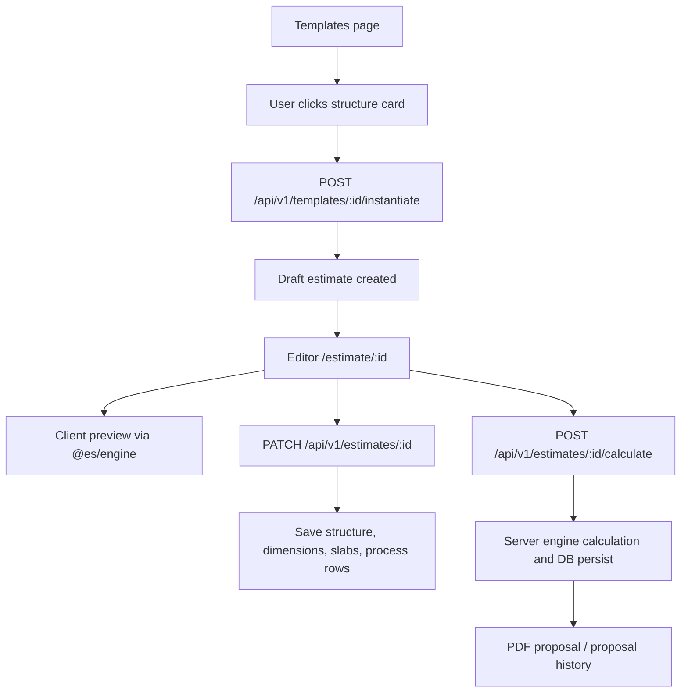

# ProPackHub ES Flexible Packaging Estimator Audit

Date: 2026-06-25  
Repo: `https://github.com/camsalloum/propackhub-es.git`  
Branch / commit audited: `main@1afb7ab`  
Audit type: static code and product-flow audit  
Focus: standalone flexible packaging estimator, webview/mobile readiness, estimator flow, bugs, gaps, feature recommendations

## 1. Executive Summary

The Estimation Studio is structurally sound as a standalone packaging estimator: it has a shared engine package, server-side persistence, template-to-estimate flow, responsive editor UI, PDF generation, visibility profiles, and early Capacitor/WebView preparation.

The biggest risks are not architectural direction; they are consistency and trust issues in the quote flow:

- Sales-rep cost visibility is currently leaky at layer level.
- Mobile layer editing can produce different GSM/cost results than desktop.
- Non-kg order units are displayed but not converted into canonical kg before calculation.
- Template instantiation is not transactional and can create partial drafts.
- Quote reference generation is count-based and not protected by a real unique DB index.
- Offline save is only a local write with no recovery/sync path.
- Native mobile readiness is incomplete: Capacitor is present, but native projects, secure token storage, share flow, offline queue, and API validation are not ready.

Recommended priority:

1. Fix price/cost visibility and mobile GSM parity immediately.
2. Build shared order-unit conversion before relying on `lm`, `sqm`, `kpcs`, or `roll_500_lm`.
3. Make template instantiation atomic and ref generation collision-safe.
4. Treat mobile app/WebView as a dedicated release track, not only a responsive skin.

## 2. Sources Reviewed

Repo guidance:

- `AGENT.md`
- `docs/ES_MEMORY.md`
- `docs/LOCKED_DECISIONS.md`
- `docs/LIVE_STATE.md`
- `archive/legacy-laravel/COSTING_NOTES.md`

Core implementation:

- `packages/engine/src/calculator.ts`
- `packages/engine/src/types.ts`
- `packages/engine/src/validator.ts`
- `packages/server/src/routes/estimates.ts`
- `packages/server/src/routes/templates.ts`
- `packages/server/src/services/estimate-calculation.ts`
- `packages/server/src/services/proposal-pdf.ts`
- `packages/server/src/utils/visibility.ts`
- `packages/server/src/db/schema.ts`
- `packages/web/src/pages/EstimateEditor.tsx`
- `packages/web/src/pages/StandardTemplates.tsx`
- `packages/web/src/components/LayerCard.tsx`
- `packages/web/src/components/BottomSheet.tsx`
- `packages/web/src/components/JobHeaderFields.tsx`
- `packages/web/src/lib/estimateCalc.ts`
- `packages/web/src/lib/api.ts`
- `packages/web/src/lib/tokenStore.ts`
- `packages/web/public/service-worker.js`
- `packages/web/capacitor.config.json`

Tests were not run because the cloned repo did not have `node_modules` installed.

## 3. Intended Product Rules From Docs

The documented product direction is clear:

- ES is a standalone product, not PEBI MES `/estimator`.
- Templates are structure blueprints.
- Estimates are saved customer/job documents.
- Web and server share the same `@es/engine`.
- Sales reps should see selling price, structure, dimensions, GSM, slabs, and PDF.
- Sales reps should not see raw material cost, markup, cost/kg, cost/m2, solvent cost, operation cost, plates, delivery, or breakdown unless enabled.
- Mobile V1 was originally defined as responsive web/PWA, not separate native app.
- Code now includes Capacitor dependencies/config, so native WebView delivery is possible but not complete.

## 4. Current Estimator Flow



### Template Flow

`StandardTemplates.tsx` now correctly treats templates as structure-only objects. Clicking a template calls `apiClient.instantiateTemplate(...)` and navigates to `/estimate/:id`. Legacy `/estimate/choose` redirects to `/templates`.

Relevant files:

- `packages/web/src/pages/StandardTemplates.tsx`
- `packages/web/src/pages/TemplatePicker.tsx`
- `packages/server/src/routes/templates.ts`

Assessment: product direction is correct. The main remaining issues are transaction safety and reference number generation.

### Editor Flow

The editor loads estimate data, materials, slabs, processes, and visibility profile. It supports:

- structure/layer editing
- dimensions
- slabs
- markup/additional costs for visible users
- live client preview
- save
- calculate
- PDF download
- save structure as My Template
- mobile layer cards and bottom sheets

Relevant files:

- `packages/web/src/pages/EstimateEditor.tsx`
- `packages/web/src/lib/estimateCalc.ts`
- `packages/server/src/routes/estimates.ts`
- `packages/server/src/services/estimate-calculation.ts`

Assessment: desktop admin flow is relatively complete. Sales-rep and mobile paths have correctness gaps.

## 5. Critical Findings

### P0-1: Sales-Rep Cost Visibility Leak

Severity: Critical  
Area: security/commercial confidentiality  
Impact: sales reps can see or infer internal cost/kg values that the locked decisions explicitly hide.

Evidence:

- Default sales profile sets `materialCostPerKg`, `costPerSqm`, `rmCostPerKg`, `markupPercent`, `platesPerKg`, `deliveryPerKg`, `operationCost`, `costBreakdown`, and `solventMixCost` to false.
- `GET /estimates/:id` still returns enriched layer fields including:
  - `unit_cost_snapshot_usd` from the layer row
  - `materialCostPerKgUsd` from the material row
- Desktop editor renders Cost/Kg and Cost/M2 columns unconditionally.
- Mobile card path uses `showCost={can('materialCostPerKg')}`, but desktop does not follow the same rule.

Files:

- `packages/server/src/utils/visibility.ts`
- `packages/server/src/routes/estimates.ts`
- `packages/web/src/pages/EstimateEditor.tsx`

Why it matters:

Cost visibility is a locked business rule. A sales rep viewing internal cost/kg breaks pricing confidentiality and creates customer-facing risk if the app is used on site.

Recommendation:

- Strip layer-level cost fields server-side unless profile allows them.
- Do not send `materialCostPerKgUsd`, `unit_cost_snapshot_usd`, `costPerM2`, or material price fields to hidden users.
- Hide desktop Cost/Kg and Cost/M2 columns behind `can('materialCostPerKg')` and `can('costPerSqm')`.
- Add API tests:
  - tenant admin receives layer costs
  - user does not receive layer costs
  - desktop UI does not render cost inputs for user profile

Suggested acceptance:

- A default `user` profile cannot find cost/kg in network response, DOM, PDF, or client state.

### P0-2: Mobile Ink/Adhesive GSM Calculation Differs From Desktop

Severity: Critical  
Area: pricing correctness  
Impact: editing the same ink/adhesive layer on mobile can produce a different estimate than desktop.

Evidence:

Desktop logic:

- substrate: `gsm = micron * density`
- ink/adhesive: user-entered value is dry GSM, so `gsm = value`

Mobile bottom sheet logic:

- material change sets `gsm = l.micron * density`
- value change sets `gsm = micron * densityForMaterial(...)`

This is correct for substrates but wrong for ink and adhesive under the 2026-06-24 dry-GSM model.

Files:

- `packages/web/src/pages/EstimateEditor.tsx`
- `packages/web/src/components/LayerCard.tsx`
- `packages/web/src/components/BottomSheet.tsx`

Why it matters:

The mobile use case is sales reps at customer sites. If mobile edits misprice ink/adhive GSM, proposals can be commercially wrong.

Recommendation:

- Create one helper, for example:

```ts
function calculateLayerGsm(layerType: LayerType, value: number, density: number): number {
  return layerType === 'substrate' ? value * density : value;
}
```

- Use it in:
  - desktop table
  - mobile sheet
  - add-layer flow
  - legacy scaffold flow
- Rename UI label from "Micron" to "Value" or dynamic "Micron / dry GSM" on mobile.
- Add regression tests for:
  - mobile edit ink 2.0 -> GSM 2.0
  - mobile edit adhesive 3.0 -> GSM 3.0
  - mobile edit PET 12.0 with density 1.4 -> GSM 16.8

### P0-3: Non-Kg Order Units Are Captured But Not Converted

Severity: Critical  
Area: pricing correctness  
Impact: `sqm`, `kpcs`, `lm`, and `roll_500_lm` orders are stored as if the number were kg.

Evidence:

- UI offers order quantity unit dropdown from master data.
- Server stores `orderQuantityKg` and `orderQuantityUnit`.
- Engine receives only `orderQuantityKg`.
- Server calculation uses stored numeric `orderQuantityKg` directly.
- Client preview uses `input.orderQuantityKg` directly.
- COSTING_NOTES defines required conversion:
  - `kgs`: order qty
  - `sqm`: `order_qty / square_meter_per_kg`
  - `kpcs`: `order_qty * grams_per_piece`
  - `lm`: `order_qty / linear_m_per_kg_reel`
  - `roll_500_lm`: `(order_qty / linear_m_per_kg_reel) * 500`

Files:

- `packages/web/src/components/JobHeaderFields.tsx`
- `packages/web/src/pages/EstimateEditor.tsx`
- `packages/web/src/lib/estimateCalc.ts`
- `packages/server/src/services/estimate-calculation.ts`
- `packages/engine/src/calculator.ts`

Why it matters:

Process cost per kg, order meters, order kpcs, and proposal totals depend on canonical kg. A 10,000 lm order can be interpreted as 10,000 kg.

Recommendation:

- Rename DB/input field split:
  - `orderQuantityInput`
  - `orderQuantityUnit`
  - `orderQuantityKgCalculated`
- Add shared conversion function in `@es/engine`:

```ts
convertOrderQuantityToKg({
  value,
  unit,
  totalGsm,
  piecesPerKg,
  linearMPerKgReel,
  sqmPerKg,
});
```

- Server and client must both call the same conversion before process-cost calculation.
- Slabs should also define whether quantities are always kg or support alternate units.

Suggested acceptance:

- Same quote in kg and equivalent lm produces same material/process cost.
- UI clearly shows entered quantity and calculated kg.

### P1-1: Template Instantiation Is Not Atomic

Severity: High  
Area: data integrity  
Impact: failed layer/process/slab insert can leave a draft estimate with missing children.

Evidence:

`instantiateTemplateRoute` inserts:

1. estimate
2. layers
3. processes
4. slabs

These writes are not wrapped in a transaction.

Files:

- `packages/server/src/routes/templates.ts`

Why it matters:

Mobile networks are less reliable. A timeout, DB error, or unresolved later write can create broken drafts that confuse users.

Recommendation:

- Wrap instantiate in `db.transaction`.
- Insert estimate and all children inside the transaction.
- Only return success after all child records are inserted.
- On error, no draft should remain.

### P1-2: Quote Reference Collision Risk

Severity: High  
Area: data integrity / commercial documents  
Impact: duplicate `QT-YYYY-XXXXX` references can be generated.

Evidence:

- `instantiateTemplateRoute` counts current estimates and builds `QT-${year}-${count + 1}`.
- `schema.ts` comment says unique ref per tenant, but implementation uses `index(...)`, not `uniqueIndex(...)`.
- `estimates.ts` has a safer retry-style `generateRefNumber`, but template instantiate does not use it.

Files:

- `packages/server/src/routes/templates.ts`
- `packages/server/src/routes/estimates.ts`
- `packages/server/src/db/schema.ts`

Why it matters:

Double taps, slow mobile connections, or concurrent users can create duplicate commercial references.

Recommendation:

- Create a real DB unique index on `(tenant_id, ref_number)`.
- Reuse one central `generateRefNumber` helper everywhere.
- Generate with retry on unique violation.
- Consider tenant-year sequence table for robust refs.

### P1-3: Offline Draft Save Has No Recovery Path

Severity: High  
Area: mobile reliability  
Impact: app says "Offline - draft saved locally", but the draft is not reloaded or synced.

Evidence:

- `persistEstimate` writes `localStorage.setItem("offlineDraft:...")`.
- No code reads `offlineDraft:*`.
- No sync queue exists.
- No conflict handling exists.

Files:

- `packages/web/src/pages/EstimateEditor.tsx`

Why it matters:

Offline behavior is especially visible in a mobile/WebView app. A fake offline save creates data-loss risk.

Recommendation:

- Either remove the offline-save message until sync exists, or build a real draft queue:
  - local draft schema
  - pending changes list
  - retry on reconnect
  - conflict detection by `updatedAt` or version
  - user-visible "pending sync" badge
- Prefer IndexedDB over localStorage for offline drafts.
- Add recovery on app start.

### P1-4: Native Mobile Token Storage Is Not Secure Enough

Severity: High  
Area: mobile security  
Impact: refresh/access tokens may be stored in non-secure native preferences.

Evidence:

- `tokenStore.ts` uses `@capacitor/preferences`.
- File comment claims Preferences uses Keychain / EncryptedSharedPreferences.
- Capacitor Preferences is not a dedicated secure secret store.

Files:

- `packages/web/src/lib/tokenStore.ts`
- `packages/web/package.json`

Recommendation:

- Replace native token storage with a secure storage plugin backed by iOS Keychain and Android Keystore.
- Keep web localStorage only for browser build if acceptable.
- Add token rotation and refresh revoke tests.
- Add app-lock/biometric later if enterprise customers need it.

## 6. Medium Findings

### P2-1: Service Worker Can Return Undefined on Cache Miss

Severity: Medium  
Area: PWA/dev reliability  
Impact: fetch handler can fail with "Failed to convert value to 'Response'".

Evidence:

`catch(() => cached)` returns undefined if there is no cached response.

Files:

- `packages/web/public/service-worker.js`
- `packages/web/src/main.tsx`

Recommendation:

- For failed asset fetch and no cache, return a proper fallback `Response`.
- Do not register service worker in dev.
- Add navigation fallback only for production builds.

### P2-2: Cancel Dirty Check Misses Important Edits

Severity: Medium  
Area: UX/data loss prevention  
Impact: user can leave after changing layers, dimensions, slabs, or cost overrides without warning.

Evidence:

Cancel checks only:

- `needsConfiguration`
- `jobName`
- `customerId`

Files:

- `packages/web/src/pages/EstimateEditor.tsx`

Recommendation:

- Track a serialized baseline after load/save.
- Mark dirty when any of these changes:
  - layers
  - dimensions
  - job/customer
  - product type/subtype
  - order qty/unit
  - slabs
  - processes
  - pricing overrides
- Add route-leave prompt and mobile back-button prompt.

### P2-3: Zero Cost Override Cannot Persist

Severity: Medium  
Area: pricing flexibility  
Impact: explicit zero-cost materials cannot be saved.

Evidence:

`unitCostSnapshotUsd: l.costPerKgUsd > 0 ? Number(l.costPerKgUsd) : undefined`

Files:

- `packages/web/src/pages/EstimateEditor.tsx`

Recommendation:

- Preserve explicit zero override separately from "no override".
- Use `hasUnitCostOverride` or compare against material library price.

### P2-4: Mobile Admin Parity Is Incomplete

Severity: Medium  
Area: mobile usability  
Impact: admins cannot fully edit the same estimator fields on mobile.

Evidence:

Mobile bottom sheet edits material and value only. It does not expose:

- family filter parity
- cost/kg override
- cost/m2 visibility
- solvent mix values
- advanced process settings

Files:

- `packages/web/src/pages/EstimateEditor.tsx`
- `packages/web/src/components/LayerCard.tsx`
- `packages/web/src/components/BottomSheet.tsx`

Recommendation:

- Define mobile personas:
  - sales rep mobile: quote and share only
  - admin mobile: full estimator parity
- If admin mobile is required, add a tabbed bottom sheet:
  - Material
  - Value/GSM
  - Cost
  - Notes/lineage

### P2-5: PDF Proposal Is Too Thin for Packaging Quotes

Severity: Medium  
Area: customer output  
Impact: proposal PDF lacks important product specs.

Current PDF includes:

- tenant header
- customer name
- job name
- product type
- selling price/kg
- optional material cost/markup
- laminate SVG
- slab table
- terms/footer

Missing or weak:

- reel/open dimensions
- bag/pouch dimensions
- printing web width
- layer stack table with micron/GSM
- validity date
- customer contact/address
- quote status/version
- proposal generated timestamp
- product subtype
- special notes
- WhatsApp/mobile share integration

Files:

- `packages/server/src/services/proposal-pdf.ts`
- `packages/server/src/utils/pdf-proposal-kit.ts`

Recommendation:

- Add customer-facing spec section.
- Keep hidden-cost rules strict.
- Include quote validity and frozen FX/currency info.
- For mobile app, add native share sheet for PDF.

### P2-6: Capacitor Setup Is Only Partial

Severity: Medium  
Area: native delivery  
Impact: app has Capacitor dependencies/config but no complete native app project.

Evidence:

- `@capacitor/core`, `@capacitor/app`, `@capacitor/network`, `@capacitor/preferences` installed.
- `capacitor.config.json` exists.
- No `ios/` or `android/` directory found in repo.
- `VITE_API_BASE_URL` warning exists, but no startup hard-fail on native if missing.

Files:

- `packages/web/package.json`
- `packages/web/capacitor.config.json`
- `packages/web/src/lib/api.ts`

Recommendation:

- Add native project scaffolding when ready to build mobile.
- Fail fast if native build has no `VITE_API_BASE_URL`.
- Add mobile environment config:
  - staging API
  - production API
  - app version/build number
  - deep-link domain
  - PDF share behavior

## 7. Low Findings / Cleanup

### P3-1: Legacy Template Scaffold Still Uses Old GSM Formula

Impact: low if legacy `?template=` routes are unreachable, but dangerous if reintroduced.

Evidence:

`getTemplateLayers` scaffolds ink layer GSM as `micron * density`, which conflicts with dry-GSM model.

File:

- `packages/web/src/pages/EstimateEditor.tsx`

Recommendation:

- Delete legacy scaffold path if unused.
- Otherwise use the same shared GSM helper.

### P3-2: Comments Do Not Match Current Code

Examples:

- schema comment says unique ref number, implementation is plain index.
- token storage comments claim native secure storage.
- some code comments refer to old "Micron" semantics while UI now uses dry GSM for liquids.

Recommendation:

- Treat comments around pricing/security as executable product contract.
- Update comments when model changes.

## 8. Positive Findings

These parts are directionally strong:

- Shared `@es/engine` is used by both client preview and server calculation.
- Template page now follows the correct rule: templates are structures, estimates are saved documents.
- Editor has mobile-specific layer cards and bottom sheets.
- Server PATCH for estimates is transactional for base/layers/processes/slabs.
- Visibility profile model exists and is close to the locked decisions.
- PDF generation respects top-level visibility for material cost and markup.
- Dry-equivalent ink/adhesive cost model is represented in engine.
- Bag is treated as first-class product type in engine path.
- `cache: 'no-store'` is applied to API requests to avoid stale estimate reads.

## 9. Mobile / WebView Readiness Assessment

Current state: early-to-mid readiness.

Ready:

- Responsive editor layout exists.
- Mobile layer cards exist.
- Bottom sheet component exists.
- Sticky mobile price/save bar exists.
- Capacitor config exists.
- API base resolver recognizes native platform.
- Network errors are typed as `NETWORK`.

Not ready:

- No native `ios/`/`android/` project in repo.
- No secure native token store.
- No real offline sync.
- No native PDF share integration.
- No mobile regression tests.
- Mobile layer GSM bug affects pricing.
- Non-kg unit conversion is missing.
- Service worker is not production-grade.
- No native back-button handling found.
- No device-safe API base validation.

Recommended mobile release gates:

1. Pricing parity: same quote edited on desktop and mobile yields identical engine payload/result.
2. Visibility parity: sales rep cannot receive hidden cost fields on web or native.
3. Offline behavior is either disabled honestly or fully synced.
4. Native auth tokens use secure storage.
5. PDF can be generated and shared from mobile.
6. API base is production/staging configured and validated at startup.
7. Android/iOS WebView keyboard behavior tested on dimension and layer edit sheets.

## 10. Recommended Fix Roadmap

### Phase 1: Commercial Safety

- Strip hidden layer cost fields server-side.
- Gate desktop cost columns by visibility profile.
- Fix mobile GSM helper for ink/adhesive.
- Add sales-rep API visibility tests.
- Add mobile/desktop engine parity tests.

### Phase 2: Calculation Correctness

- Implement shared order unit conversion in `@es/engine`.
- Store raw input quantity separately from calculated kg.
- Recalculate slabs and process costs from canonical kg.
- Add golden tests for kg/sqm/kpcs/lm/roll_500_lm.

### Phase 3: Data Integrity

- Wrap template instantiation in one transaction.
- Create a real unique index for `(tenant_id, ref_number)`.
- Centralize ref generation with retry.
- Add concurrency test for double template instantiate.

### Phase 4: Mobile App Foundation

- Decide: PWA only, Capacitor WebView, or true native companion.
- If Capacitor:
  - scaffold native projects
  - secure token storage
  - app versioning
  - native share sheet
  - network status banner
  - offline queue or explicit online-only mode

### Phase 5: Proposal Quality

- Add product dimensions and specs to PDF.
- Add layer table with customer-safe data.
- Add validity date and quote metadata.
- Add proposal version/history labels.
- Add mobile share flow.

## 11. Feature Recommendations

High impact:

- Quote compare view: compare saved estimates or re-quotes side by side.
- Customer quote history: customer page should show active drafts, sent proposals, won/lost.
- Proposal share link: not only PDF download; track opened/shared/sent status later.
- Estimate versioning: every calculate/send creates a frozen snapshot.
- Guided validation: show exactly which dimension/layer is missing before calculate.
- Product subtype visual: bag/pouch/roll/sleeve visual preview with key dimensions.

Mobile-specific:

- "Customer visit mode": minimal screen showing customer, structure, key dimensions, slabs, PDF/share.
- Big numeric controls for dimension and GSM entry.
- Draft autosave indicator.
- WhatsApp/email share button for PDF.
- Recent customer/template quick start.
- Offline pending-sync queue with visible status.

Admin-specific:

- Mobile admin cost edit only if explicitly enabled.
- Tenant visibility preview: "view as sales rep" in editor.
- Material price change impact report: list quotes affected by library changes.

## 12. Test Plan To Add

Engine:

- ink dry GSM remains GSM, independent of density
- adhesive dry GSM remains GSM, independent of density
- substrate micron uses density
- order conversion for kg/sqm/kpcs/lm/roll_500_lm
- bag and pouch dimension metrics
- printing web width vs reel width

Server:

- sales rep estimate GET strips all hidden cost fields
- tenant admin estimate GET includes allowed cost fields
- template instantiate rollback on layer insert failure
- ref number unique under concurrent instantiate
- calculate uses canonical kg from unit conversion
- PDF respects visibility and includes dimensions

Web:

- desktop cost columns hidden for sales rep
- mobile layer sheet uses same GSM result as desktop
- dirty prompt catches layer/dimension/slab changes
- offline save does not claim success unless recoverable
- native missing API base fails loudly

## 13. Final Recommendation

The product should continue with the current standalone ES direction. The foundation is good, but before releasing a dedicated mobile/WebView app, the estimator needs a pricing-consistency hardening pass.

The minimum safe release checklist is:

- no hidden costs leaked to sales reps
- mobile and desktop produce identical calculations
- non-kg units convert correctly
- template instantiate cannot create partial/duplicate drafts
- mobile auth storage is secure
- offline behavior is honest and recoverable
- PDF includes enough customer-facing packaging details

---

## 14. Owner Resolution — Authorization Tiers (2026-06-25)

> **Status:** Planning only — no code changes in this pass.  
> **Supersedes for remediation:** the binary “admin vs sales rep” framing in §5 P0-1 and Decision #20’s single sales-rep default. Implementation will use the four tiers below.

### 14.1 Tenancy model

- **Tenant** = one customer company on the SaaS (e.g. Interplast in PEBI: many users, one company, shared library and quotes).
- **Only four authorization categories exist** (see §14.2). There is no fifth role, no custom mix-and-match, and no per-field toggle grid in V1.
- **Every user** in a tenant — including sales reps — is assigned **exactly one** category by the **SaaS platform admin** on the ProPackHub platform. Tenant users do not pick their own category inside ES.
- ES remains a **standalone app** with its own auth; the assigned category is stored on the user record (synced from platform).

### 14.2 The four categories (only these exist)

| Tier code | Display name | Owner description |
|-----------|--------------|-------------------|
| `platform_admin` | **Platform Administrator** | SaaS admin / developer — can do and see **everything** (all tenants, platform master data, standard templates). |
| `tenant_manager` | **Tenant Manager** | Company **full** user — sees **everything** in their tenant (raw materials, margins, markups, operation cost, material cost, selling price). **Cannot** create or edit **Standard Templates**. **Can** create and edit **My Templates**. |
| `estimator` | **Estimator** | Company **mid** user — sees **everything except** margins, markups, and operation cost. **Can** see **material cost** (RM cost/kg, cost/m², library prices). |
| `sales_rep` | **Sales Representative** | Company **low** user — sees **only the final selling price** (and customer-facing slab prices / PDF). **No** raw materials, **no** material cost/kg, **no** internal breakdown. |

**Naming rationale:** `platform_admin` (SaaS operator), `tenant_manager` (full commercial user), `estimator` and `sales_rep` (job-function tiers). No “Level 1–4” labels in the product UI.

### 14.3 Capability matrix (locked — per owner 2026-06-25)

Rules:

1. **Only** the four columns below apply. Visibility is fully determined by the assigned category.
2. Platform admin assigns the category per user; ES enforces the matching preset on API, UI, and PDF.
3. Replace today’s `visibilityProfile` toggle UI with these fixed presets (no user-editable visibility grid in V1).

| Capability | Platform Admin | Tenant Manager | Estimator | Sales Rep |
|------------|:--------------:|:--------------:|:---------:|:---------:|
| **Platform master data** (global Raw Materials source) | edit | — | — | — |
| **Tenant raw materials / library** (prices, grades, solid %) | all tenants | view | view | **no access** |
| **Estimate editor** — structure, layers, microns/GSM, dimensions, product type | yes | yes | yes | yes (structure for quoting; no cost fields) |
| **Material cost/kg, cost/m², total RM cost** | yes | yes | **yes** | **no** |
| **Margin %, markup amount, plates/kg, delivery/kg** | yes | yes | **no** | **no** |
| **Operation / process cost** | yes | yes | **no** | **no** |
| **Solvent mix cost** | yes | yes | **no** | **no** |
| **Cost breakdown %** | yes | yes | **no** | **no** |
| **Selling price / kg, slab table (price column only)** | yes | yes | yes | **yes** (primary view) |
| **Proposal PDF** | full | full | no hidden commercial fields | customer-safe only (price + structure; no RM cost) |
| **Create / edit Standard Templates** | yes | **no** | **no** | **no** |
| **Create / edit My Templates** | yes | **yes** | **no** | **no** |
| **Use templates** (pick structure → create estimate) | yes | yes | yes | yes |
| **Assign user category** | yes (SaaS platform) | **no** | **no** | **no** |
| **Cross-tenant access** | yes | **no** | **no** | **no** |

**Sales Rep summary:** Assigned category `sales_rep`. Can build and share quotes from templates and edit customer-facing fields; sees **final price only** — never raw material library or internal costs.

**Tenant Manager summary:** Full commercial visibility in tenant; cannot touch platform Standard Templates; can maintain personal/company **My Templates**.

### 14.4 Mapping from current code (gap to close later)

| Today | Target |
|-------|--------|
| `user_role` enum: `user`, `tenant_admin`, `platform_admin` | Single field `authorization_tier`: `platform_admin`, `tenant_manager`, `estimator`, `sales_rep` only |
| Per-user `visibilityProfile` JSON + Settings toggle grid | **Removed** — replaced by fixed preset per tier (§14.3) |
| `DEFAULT_SALES_REP_PROFILE` + `DEFAULT_ADMIN_PROFILE` | Four presets: `PLATFORM_ADMIN`, `TENANT_MANAGER`, `ESTIMATOR`, `SALES_REP` |
| Legacy `tenant_admin` / generic `user` | Migrate each user to one of the four categories via platform admin |

### 14.5 Enforcement layers (planned architecture)

1. **Platform admin UI** — assign `authorization_tier` per user per tenant (ProPackHub SaaS console).
2. **JWT / user record** — tier carried on session (`users.authorization_tier` or mapped from platform sync).
3. **Server** — strip fields in `visibility.ts` for estimates, layers, materials, calculate result, PDF.
4. **Web** — `can(key)` driven by tier preset; desktop and mobile use the same rules.
5. **Tests** — matrix tests: one GET estimate + one PDF per tier; assert allowed fields only.

---

## 15. Planned Remediation Map (no implementation yet)

Each audit finding below is **accepted for fix** unless marked *defer*. Work is sequenced after authorization tiers (§14) where noted.

### P0-1 — Cost visibility leak → **Reframe + fix (blocked on §14)**

| Item | Plan |
|------|------|
| Problem | Layer costs leak via API and desktop UI regardless of profile. |
| Resolution | Implement §14.3 matrix: strip `unit_cost_snapshot_usd`, `materialCostPerKgUsd`, `costPerM2` server-side per tier; gate desktop Cost/Kg and Cost/M² with same `can()` as mobile. |
| Tenant Manager | Full material + margin visibility. |
| Estimator | Material cost yes; margin/markup/operation hidden. |
| Sales Rep | Selling price only; no library RM prices. |
| Tests | Four-tier API + DOM matrix; PDF spot-check per tier. |
| **Do not implement yet** | Implement when authorization tier schema + platform assignment are ready (§14). |

### P0-2 — Mobile ink/adhesive GSM → **Fix (independent of tiers)**

| Item | Plan |
|------|------|
| Problem | Mobile bottom sheet uses `micron × density` for ink/adhesive; desktop uses dry GSM. |
| Resolution | Shared `calculateLayerGsm(layerType, value, density)` in engine or web util; use in desktop table, mobile sheet, add-layer, legacy scaffold. |
| Tests | Engine or web tests: ink 2.0 → GSM 2.0; PET 12 µ × 1.4 → 16.8. |
| Priority | High — pricing correctness for all tiers. |

### P0-3 — Order unit conversion → **Fix (independent of tiers)**

| Item | Plan |
|------|------|
| Problem | `lm`, `sqm`, `kpcs`, `roll_500_lm` stored as if they were kg. |
| Resolution | Shared `convertOrderQuantityToKg()` in `@es/engine`; persist `orderQuantityInput` + `orderQuantityUnit` + calculated `orderQuantityKg`; server + client both call engine before process cost. |
| UI | Show entered qty + unit and calculated kg (Estimator+ see breakdown; Sales Rep may see kg only if needed for slabs). |
| Tests | Golden rows per unit per COSTING_NOTES. |
| Priority | High — affects all tiers equally. |

### P1-1 — Template instantiate not atomic → **Fix**

| Item | Plan |
|------|------|
| Problem | Estimate + layers + processes + slabs not one transaction. |
| Resolution | Wrap `instantiateTemplateRoute` in `db.transaction()`; rollback on any child failure. |
| Tests | Integration: force layer insert failure → no orphan estimate row. |

### P1-2 — Quote ref collision → **Fix / verify**

| Item | Plan |
|------|------|
| Problem | Template instantiate may use count-based ref; unique index may be missing on instantiate path. |
| Resolution | Confirm `UNIQUE (tenant_id, ref_number)` in DB; route all ref creation through `generateRefNumber()` with retry; remove duplicate logic from `templates.ts`. |
| Tests | Concurrent double-instantiate → distinct refs. |

### P1-3 — Offline draft no recovery → **Fix (honest UX)**

| Item | Plan |
|------|------|
| Problem | “Offline — draft saved locally” with no reload/sync. |
| Resolution | **Option A (V1):** Remove offline-success message; show “connection required to save”. **Option B (mobile track):** IndexedDB queue + sync on reconnect. |
| Tier note | Sales Rep mobile is primary beneficiary; plan Option A unless mobile release is imminent. |

### P1-4 — Native token storage → **Defer**

| Item | Plan |
|------|------|
| Problem | `@capacitor/preferences` is not a dedicated secret store. |
| Resolution | Adopt secure storage plugin before native App Store release; keep web localStorage for browser. |
| **Defer** | Until `ios/` / `android/` scaffold and mobile release gate. |

### P2-1 — Service worker undefined Response → **Fix (low effort)**

| Item | Plan |
|------|------|
| Resolution | Skip SW registration in dev; return proper fallback `Response` on cache miss in production. |

### P2-2 — Cancel dirty check → **Fix**

| Item | Plan |
|------|------|
| Resolution | Baseline snapshot after load/save; `isDirty` for layers, dimensions, customer, slabs, processes, overrides; confirm on Cancel and route leave. |
| Same as | SC-7 in `SAVE_AND_CALCULATE_AUDIT`. |

### P2-3 — Zero cost override → **Fix**

| Item | Plan |
|------|------|
| Resolution | Distinguish “no override” vs “override = 0” (`null` vs `0` or `hasUnitCostOverride` flag). |
| Same as | SC-8 in `SAVE_AND_CALCULATE_AUDIT`. |
| Tier note | Tenant Manager + Estimator need explicit zero; Sales Rep should not edit cost/kg. |

### P2-4 — Mobile admin parity → **Plan by tier**

| Item | Plan |
|------|------|
| Resolution | **Sales Rep mobile:** quote, dimensions, slabs, PDF/share — no cost edit. **Tenant Manager / Estimator mobile:** extend bottom sheet when tier allows material cost edit. **Platform Admin:** full parity or “desktop only” for master data. |
| **Defer** detailed UI | Until P0-2 GSM parity done. |

### P2-5 — Thin PDF → **Enhance (phased)**

| Item | Plan |
|------|------|
| Resolution | Add dimensions, printing web width, layer table (customer-safe), validity, subtype, timestamp; respect §14.3 per tier on hidden costs. |
| Mobile | Native share sheet when Capacitor track starts. |

### P2-6 — Capacitor incomplete → **Defer**

| Item | Plan |
|------|------|
| Resolution | `cap add ios/android`, `VITE_API_BASE_URL` hard-fail on native, staging/prod config. |
| **Defer** | Dedicated mobile release track. |

### P3-1 — Legacy GSM scaffold → **Fix with P0-2**

| Item | Plan |
|------|------|
| Resolution | Delete unused `?template=` scaffold or wire to shared GSM helper. |

### P3-2 — Stale comments → **Fix on touch**

| Item | Plan |
|------|------|
| Resolution | Update schema comments (unique ref), tokenStore comments, dry-GSM docs when implementing §14–15. |

---

## 16. Revised execution order (plan only)

1. **§14 Authorization tiers** — schema + platform assignment UI + four presets (blocks P0-1).
2. **P0-2** mobile/desktop GSM parity.
3. **P0-3** order-unit conversion in engine.
4. **P0-1** enforce tier matrix on API + UI + PDF.
5. **P1-1, P1-2** data integrity (transaction + ref).
6. **P2-2, P2-3** editor UX (dirty + zero override).
7. **P2-1** service worker hygiene.
8. **P1-3** offline honesty or queue (mobile decision).
9. **P2-5** PDF enrichment.
10. **P1-4, P2-4, P2-6** mobile/native track when product commits to app stores.

---

*§14–§16 added 2026-06-25 per owner resolution: four authorization tiers assigned by SaaS platform admin; remediation planned but not implemented.*

